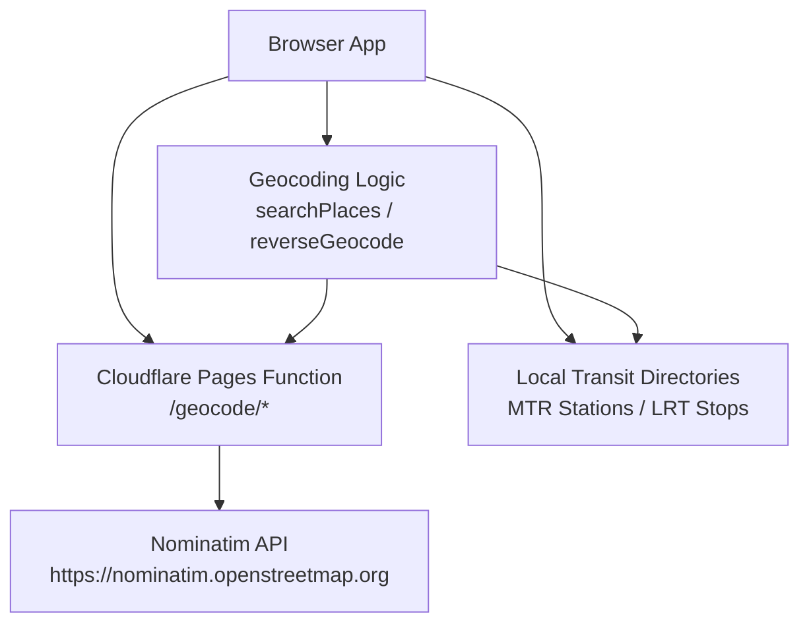
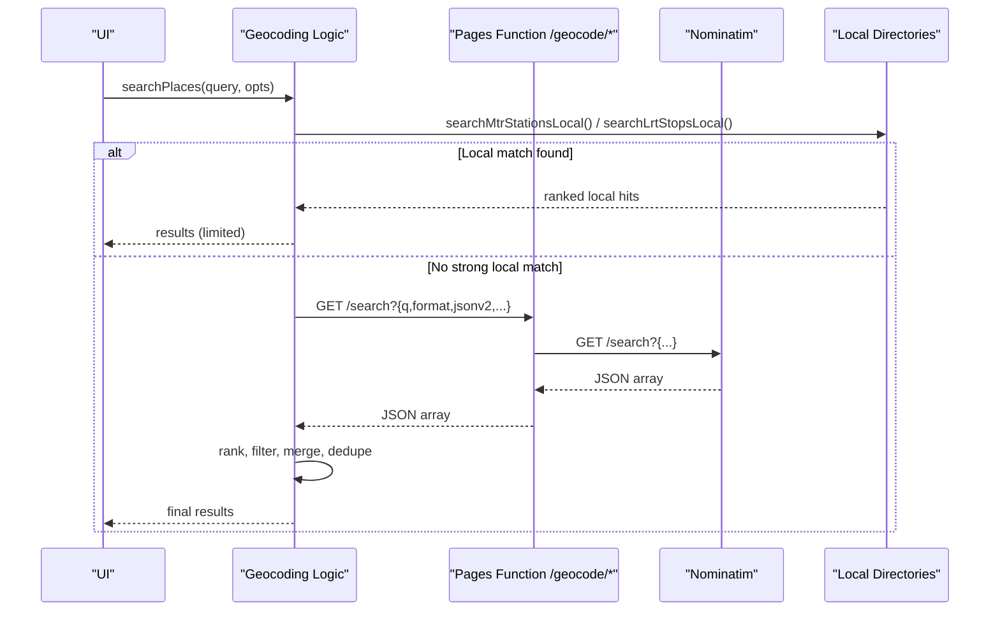
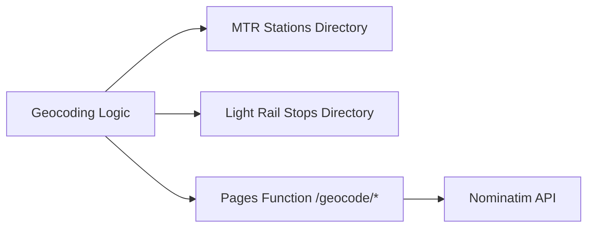

# Geocoding Services

<cite>
**Referenced Files in This Document**
- [functions/geocode/[[path]].js](file://functions/geocode/[[path]].js)
- [src/geocode.js](file://src/geocode.js)
- [src/mtrStations.js](file://src/mtrStations.js)
- [src/lrtStops.js](file://src/lrtStops.js)
</cite>

## Table of Contents
1. [Introduction](#introduction)
2. [Project Structure](#project-structure)
3. [Core Components](#core-components)
4. [Architecture Overview](#architecture-overview)
5. [Detailed Component Analysis](#detailed-component-analysis)
6. [Dependency Analysis](#dependency-analysis)
7. [Performance Considerations](#performance-considerations)
8. [Troubleshooting Guide](#troubleshooting-guide)
9. [Conclusion](#conclusion)

## Introduction
This document describes the geocoding services that power location search and reverse geocoding for the application. It covers:
- HTTP endpoints exposed by the serverless function proxy
- Request/response schemas for forward and reverse geocoding
- Supported location formats and result structures
- Integration with OpenStreetMap Nominatim and local transit directories (MTR and Light Rail)
- Caching strategy and rate-limiting considerations
- Common query examples, error handling, and fallback behavior when upstream services are unavailable

## Project Structure
The geocoding feature is implemented as a combination of:
- A Cloudflare Pages Function that proxies requests to Nominatim while adding CORS and short-lived caching headers
- Browser-side logic that builds queries, merges results from local transit directories, ranks and filters hits, and calls the proxy for additional data

**Diagram sources**
- [functions/geocode/[[path]].js:5-28](file://functions/geocode/[[path]].js#L5-L28)
- [src/geocode.js:194-496](file://src/geocode.js#L194-L496)
- [src/mtrStations.js:13-118](file://src/mtrStations.js#L13-L118)
- [src/lrtStops.js:11-81](file://src/lrtStops.js#L11-L81)

**Section sources**
- [functions/geocode/[[path]].js:1-28](file://functions/geocode/[[path]].js#L1-L28)
- [src/geocode.js:1-10](file://src/geocode.js#L1-L10)

## Core Components
- Forward geocoding: search free-text queries into places, stations, bus stops, and light rail stops with Hong Kong bias and mode filtering
- Reverse geocoding: convert coordinates to a human-readable label or fall back to formatted coordinates
- Local directory integration: MTR heavy rail and Light Rail stop lists used to prioritize authoritative locations and avoid misclassification
- Proxy layer: same-origin endpoint that forwards to Nominatim with appropriate headers and caching

Key responsibilities:
- Query building and parameterization for Nominatim
- Ranking and deduplication across multiple sources
- Mode-based filtering (@mtr, @lrt, @bus)
- Error handling and graceful fallbacks

**Section sources**
- [src/geocode.js:194-496](file://src/geocode.js#L194-L496)
- [src/geocode.js:501-521](file://src/geocode.js#L501-L521)
- [functions/geocode/[[path]].js:5-28](file://functions/geocode/[[path]].js#L5-L28)

## Architecture Overview
The system uses a hybrid approach:
- Fast, accurate matches against local transit directories first
- Fallback to Nominatim via a same-origin proxy for broader place coverage
- Result merging, ranking, and filtering to produce final suggestions

**Diagram sources**
- [src/geocode.js:194-496](file://src/geocode.js#L194-L496)
- [functions/geocode/[[path]].js:5-28](file://functions/geocode/[[path]].js#L5-L28)

## Detailed Component Analysis

### HTTP Endpoints (Forward and Reverse Geocoding)
- Endpoint base: /geocode
- Forward search: GET /geocode/search?q=...&format=jsonv2&addressdetails=1&limit=...&viewbox=...&bounded=0
- Reverse lookup: GET /geocode/reverse?lat=...&lon=...&format=jsonv2&zoom=17&addressdetails=1

Behavior:
- The function strips the /geocode prefix and forwards the remainder to Nominatim
- Adds Accept: application/json and a User-Agent header
- Returns the upstream response body with:
  - Content-Type preserved or defaulting to application/json
  - Cache-Control: public, max-age=300
  - Access-Control-Allow-Origin: *
  - Cross-Origin-Resource-Policy: cross-origin

Request parameters:
- Forward search
  - q: free-text query; client app augments with “Hong Kong” context and mode-specific terms
  - format: jsonv2
  - addressdetails: 1
  - limit: number of results requested by client
  - viewbox: HK bounding box string
  - bounded: 0
- Reverse
  - lat, lon: numeric coordinates
  - format: jsonv2
  - zoom: 17
  - addressdetails: 1

Response bodies:
- Forward search: JSON array of place objects with fields such as name, display_name, lat, lon, type, category, importance
- Reverse: single place object with display_name and/or address fields; if unavailable or error, the client falls back to a formatted coordinate string

CORS:
- All responses allow cross-origin access, enabling browser usage without proxy restrictions

Rate limiting:
- No explicit rate limiting is enforced in the proxy; it passes through upstream status codes and bodies

**Section sources**
- [functions/geocode/[[path]].js:5-28](file://functions/geocode/[[path]].js#L5-L28)
- [src/geocode.js:297-322](file://src/geocode.js#L297-L322)
- [src/geocode.js:501-521](file://src/geocode.js#L501-L521)

### Forward Geocoding: Place Search
Responsibilities:
- Parse optional mode filters (@mtr, @lrt, @bus) from the query
- Short-circuit with local directory matches for MTR and Light Rail
- Build Nominatim queries with Hong Kong bias and mode-specific phrasing
- Merge and rank results, prioritizing railway stations when station intent is detected
- Deduplicate and apply mode filters before returning

Key behaviors:
- Local directory priority:
  - MTR stations matched by normalized names and Chinese names
  - Light Rail stops matched by name proximity and exact matches
- Nominatim augmentation:
  - Additional targeted searches when station intent is present
  - Bus-focused searches when mode is bus
  - Light Rail focused searches when mode is lrt
- Ranking factors:
  - Location within Hong Kong bounds
  - Railway station classification and labels
  - Name matching tokens after stripping station-related words
  - Importance score from upstream
- Filtering:
  - Exclude bus facilities when station intent is active unless explicitly requested
  - Enforce mode constraints (@mtr, @lrt, @bus)

Result structure (selected fields):
- lat, lon: numeric coordinates
- name: primary place name
- label: human-friendly label combining name and context
- type, category: OSM-derived classification
- isMtr, isLrt, mode: transport mode flags
- source: origin of the hit (e.g., mtr-local, lrt-local, or upstream)

Error handling:
- Non-OK responses throw an error including status and truncated body
- Invalid JSON throws an error indicating proxy issues

Fallbacks:
- If no local matches, rely on Nominatim
- If Nominatim fails or returns invalid data, return empty results or handle gracefully at caller level

**Section sources**
- [src/geocode.js:20-40](file://src/geocode.js#L20-L40)
- [src/geocode.js:194-496](file://src/geocode.js#L194-L496)
- [src/mtrStations.js:136-200](file://src/mtrStations.js#L136-L200)
- [src/lrtStops.js:156-199](file://src/lrtStops.js#L156-L199)

### Reverse Geocoding: Coordinates to Address
Responsibilities:
- Call the proxy with lat, lon and parameters to request detailed address information
- Format a concise label from display_name or address fields
- On failure or non-OK response, return a formatted coordinate string as fallback

Parameters:
- lat, lon: numeric coordinates
- format: jsonv2
- zoom: 17
- addressdetails: 1

Response:
- Human-readable label string derived from upstream data
- If unavailable, formatted coordinates like “lat, lon”

Error handling:
- Network errors or non-OK responses do not throw; they return the formatted coordinate fallback

**Section sources**
- [src/geocode.js:501-521](file://src/geocode.js#L501-L521)

### Integration with Mapping Providers
- Primary provider: OpenStreetMap Nominatim
- Proxy ensures same-origin access and adds CORS headers
- Hong Kong bias achieved via viewbox and client-side filtering
- Local transit directories supplement and override upstream ambiguity for MTR and Light Rail

**Section sources**
- [functions/geocode/[[path]].js:5-28](file://functions/geocode/[[path]].js#L5-L28)
- [src/geocode.js:42-58](file://src/geocode.js#L42-L58)
- [src/geocode.js:281-296](file://src/geocode.js#L281-L296)

### Caching Strategy
- Edge cache: The proxy sets Cache-Control: public, max-age=300 for all geocode responses
- Browser cache: Browsers may cache based on standard HTTP rules; the proxy enables cross-origin sharing
- Application-level caching: Not implemented in the geocoding module; callers can implement their own memoization if needed

Implications:
- Frequent identical queries may be served from edge cache within 5 minutes
- For dynamic or user-specific queries, ensure unique parameters to avoid unintended reuse

**Section sources**
- [functions/geocode/[[path]].js:18-27](file://functions/geocode/[[path]].js#L18-L27)

### Rate Limiting Policies
- No explicit rate limiting is applied in the proxy; it forwards requests to Nominatim unchanged
- Upstream rate limits and throttling policies are controlled by Nominatim
- Best practices:
  - Debounce rapid user input
  - Limit concurrent requests per session
  - Respect upstream error responses and back off on failures

**Section sources**
- [functions/geocode/[[path]].js:5-28](file://functions/geocode/[[path]].js#L5-L28)

### Examples of Common Queries
- Forward search examples:
  - “Central Station” → expects railway station results
  - “@mtr Admiralty” → restricts to MTR stations
  - “@lrt Tin Shui Wai” → restricts to Light Rail stops
  - “@bus Mong Kok” → focuses on bus stops near Mong Kok
  - “Tuen Mun Hospital” → avoids resolving to Tuen Mun MTR due to specific qualifiers
- Reverse geocoding example:
  - lat=22.28495, lon=114.15835 → returns a short label or formatted coordinates if unavailable

Note: These examples describe typical inputs and expected behaviors; actual query construction and parameters are handled by the geocoding logic.

**Section sources**
- [src/geocode.js:194-496](file://src/geocode.js#L194-L496)
- [src/geocode.js:501-521](file://src/geocode.js#L501-L521)

### Error Handling and Fallback Mechanisms
- Forward search:
  - Non-OK upstream response throws an error with status and truncated body
  - Invalid JSON throws an error indicating proxy issues
  - Empty or insufficient results may occur for very short queries or unsupported modes
- Reverse geocoding:
  - Non-OK or network errors return a formatted coordinate string instead of failing
- Local directory fallbacks:
  - Strong local matches (MTR/LRT) are returned early, reducing reliance on upstream
  - When upstream is slow or down, local directories still provide useful results

**Section sources**
- [src/geocode.js:297-322](file://src/geocode.js#L297-L322)
- [src/geocode.js:501-521](file://src/geocode.js#L501-L521)

## Dependency Analysis
The geocoding module depends on:
- Local transit directories for authoritative MTR and Light Rail data
- Cloudflare Pages Function proxy for same-origin access to Nominatim
- Browser APIs for geolocation (optional)

**Diagram sources**
- [src/geocode.js:194-496](file://src/geocode.js#L194-L496)
- [src/mtrStations.js:13-118](file://src/mtrStations.js#L13-L118)
- [src/lrtStops.js:11-81](file://src/lrtStops.js#L11-L81)
- [functions/geocode/[[path]].js:5-28](file://functions/geocode/[[path]].js#L5-L28)

**Section sources**
- [src/geocode.js:194-496](file://src/geocode.js#L194-L496)
- [src/mtrStations.js:13-118](file://src/mtrStations.js#L13-L118)
- [src/lrtStops.js:11-81](file://src/lrtStops.js#L11-L81)
- [functions/geocode/[[path]].js:5-28](file://functions/geocode/[[path]].js#L5-L28)

## Performance Considerations
- Local directory lookups are fast and reduce upstream calls
- Viewbox and bounded parameters focus Nominatim results to Hong Kong, improving relevance and speed
- Result merging and deduplication minimize redundant entries
- Short-lived edge caching reduces repeated upstream requests for identical queries
- Debouncing user input and limiting concurrent requests helps manage upstream load

[No sources needed since this section provides general guidance]

## Troubleshooting Guide
Common issues and resolutions:
- Upstream errors:
  - Non-OK responses include status and truncated body; check network tab and retry with adjusted query
  - Invalid JSON indicates proxy or upstream formatting issues; verify proxy availability
- No results:
  - Very short queries may be rejected; increase query length or add mode tags
  - Mode filters may narrow results too much; remove or adjust @mtr/@lrt/@bus
- Incorrect classification:
  - Bus facilities may appear when searching for stations; use station intent keywords or mode filters
  - Light Rail vs MTR disambiguation relies on name matching and proximity; refine query or use @lrt
- Reverse geocoding fallback:
  - If upstream fails, formatted coordinates are returned; verify coordinates and try again later

Operational tips:
- Monitor proxy logs for upstream status codes
- Implement client-side retries with exponential backoff for transient errors
- Use debounced search to reduce unnecessary requests

**Section sources**
- [src/geocode.js:297-322](file://src/geocode.js#L297-L322)
- [src/geocode.js:501-521](file://src/geocode.js#L501-L521)

## Conclusion
The geocoding services combine local transit directories with Nominatim via a secure, cached proxy to deliver fast, accurate location search and reverse geocoding tailored to Hong Kong. The design prioritizes railway stations, supports mode filtering, and includes robust fallbacks when upstream services are unavailable. By following the documented endpoints, schemas, and best practices, developers can integrate reliable geocoding into the application while managing performance and resilience.

[No sources needed since this section summarizes without analyzing specific files]