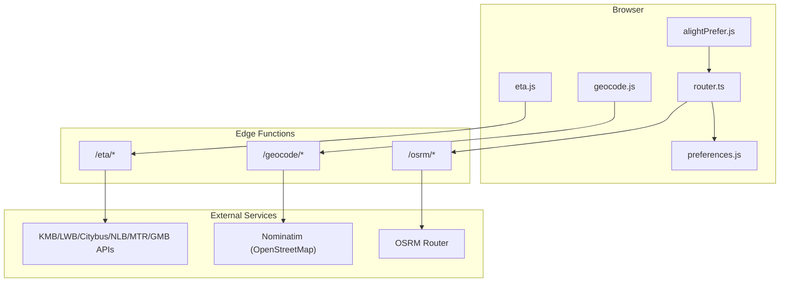
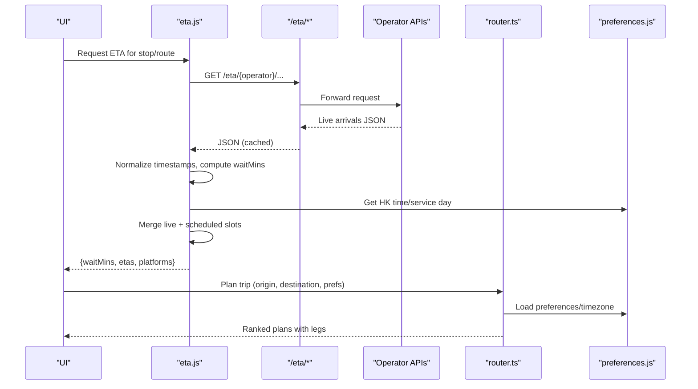
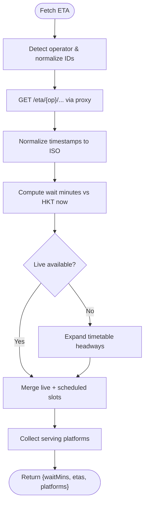
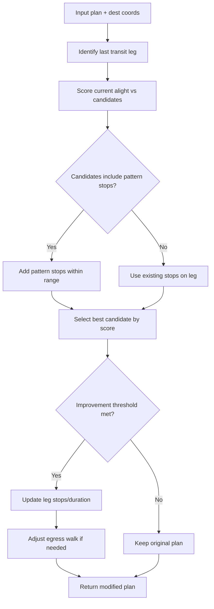
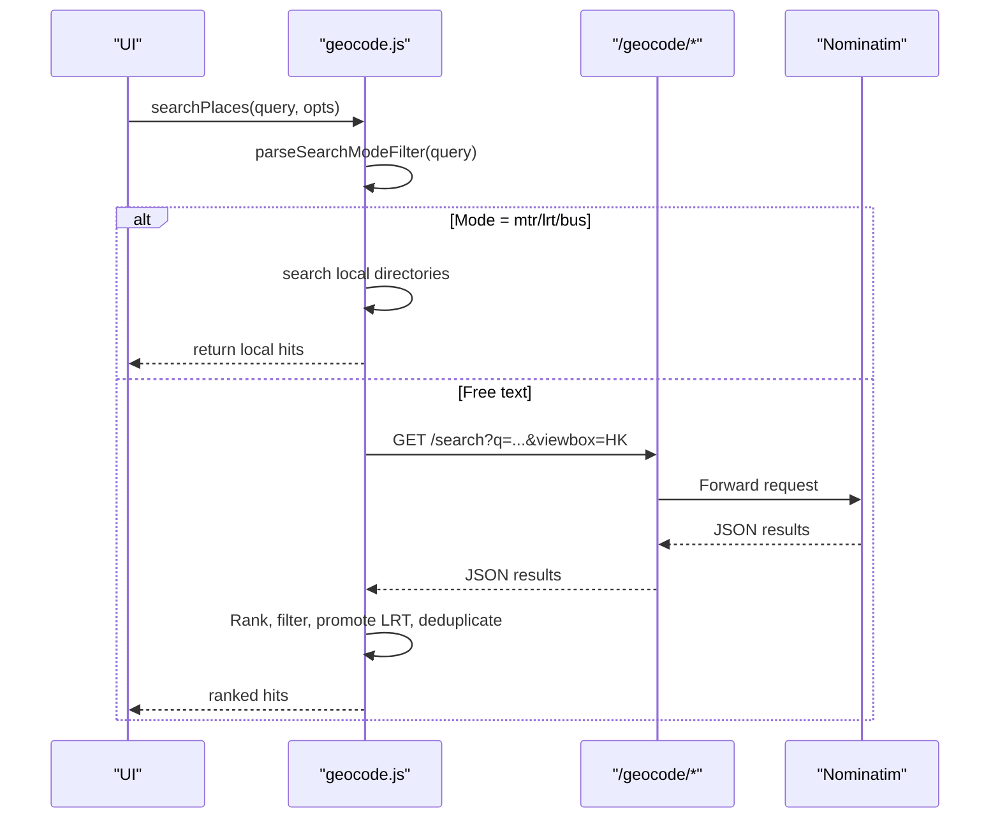
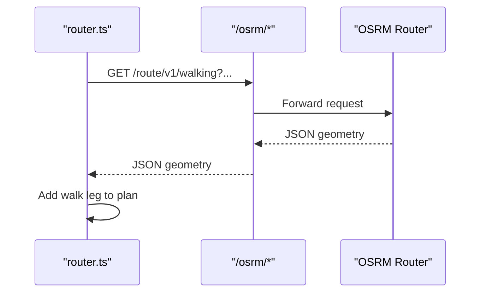
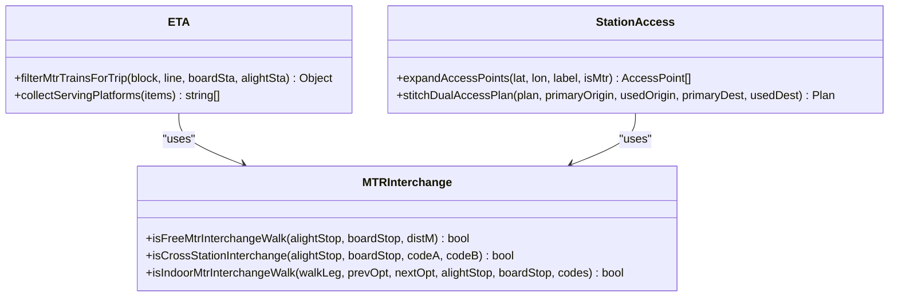
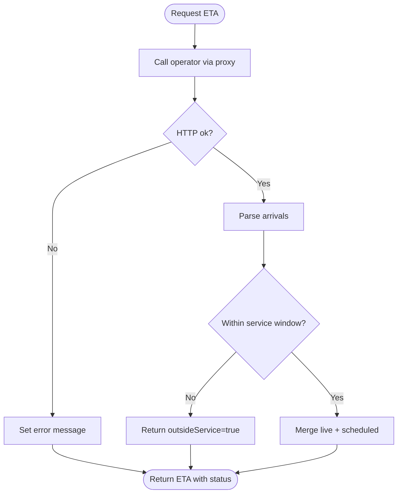
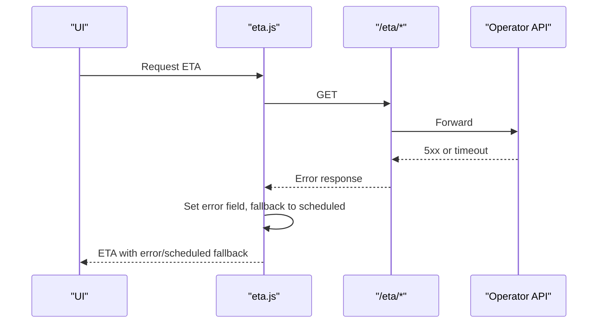
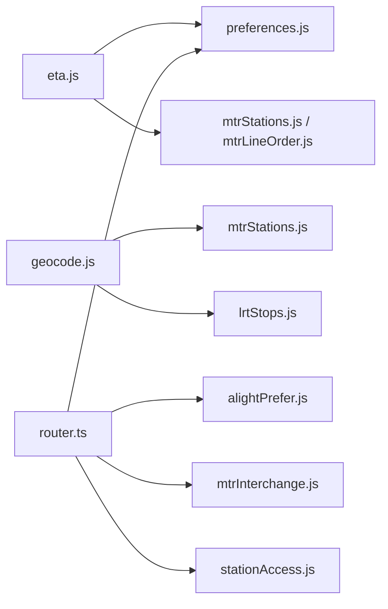

# Real-time Information System

<cite>
**Referenced Files in This Document**
- [eta.js](file://src/eta.js)
- [[[path]].js (ETA proxy)](file://functions/eta/[[path]].js)
- [geocode.js](file://src/geocode.js)
- [[[path]].js (Geocode proxy)](file://functions/geocode/[[path]].js)
- [[[path]].js (OSRM proxy)](file://functions/osrm/[[path]].js)
- [alightPrefer.js](file://src/alightPrefer.js)
- [router.ts](file://src/router.ts)
- [preferences.js](file://src/preferences.js)
- [mtrInterchange.js](file://src/mtrInterchange.js)
- [stationAccess.js](file://src/stationAccess.js)
- [main.js](file://src/main.js)
</cite>

## Table of Contents
1. [Introduction](#introduction)
2. [Project Structure](#project-structure)
3. [Core Components](#core-components)
4. [Architecture Overview](#architecture-overview)
5. [Detailed Component Analysis](#detailed-component-analysis)
6. [Dependency Analysis](#dependency-analysis)
7. [Performance Considerations](#performance-considerations)
8. [Troubleshooting Guide](#troubleshooting-guide)
9. [Conclusion](#conclusion)

## Introduction
This document explains MorganTraveler’s real-time information system for accurate arrival predictions and live schedule integration across Hong Kong transit modes. It covers how the application ingests real-time vehicle positions, aligns them with schedules, handles service disruptions, and presents platform-specific guidance to optimize transfers. It also documents the geocoding services for place search, OSRM-based walking directions between stops, and the alighting preference system that tailors route suggestions to passenger behavior patterns. Finally, it details error handling and fallback strategies when live data is unavailable or network conditions are poor.

## Project Structure
The real-time system spans client-side logic and serverless proxies:
- Client modules compute ETA slots, merge live and scheduled departures, optimize alighting stops, and format platform labels.
- Serverless functions proxy external APIs (operator ETAs, Nominatim, OSRM) to ensure CORS-safe, cache-friendly access from the browser.
- Routing preferences and time-zone utilities support consistent scheduling and user control.

**Diagram sources**
- [eta.js:1-800](file://src/eta.js#L1-L800)
- [[[path]].js (ETA proxy):1-86](file://functions/eta/[[path]].js#L1-L86)
- [geocode.js:1-586](file://src/geocode.js#L1-L586)
- [[[path]].js (Geocode proxy):1-29](file://functions/geocode/[[path]].js#L1-L29)
- [[[path]].js (OSRM proxy):1-25](file://functions/osrm/[[path]].js#L1-L25)
- [router.ts:1-800](file://src/router.ts#L1-L800)
- [preferences.js:1-555](file://src/preferences.js#L1-L555)

**Section sources**
- [eta.js:1-800](file://src/eta.js#L1-L800)
- [geocode.js:1-586](file://src/geocode.js#L1-L586)
- [router.ts:1-800](file://src/router.ts#L1-L800)
- [preferences.js:1-555](file://src/preferences.js#L1-L555)

## Core Components
- ETA engine: Normalizes operator feeds, computes wait minutes, merges live arrivals with timetable headways, and formats platform info.
- Geocoding: Place search with mode filters (@MTR/@LRT/@Bus), local MTR/LRT directories, and Nominatim proxy.
- Alighting preference: Extends bus legs to better-matched stops near destinations using name similarity and distance scoring.
- Routing and ranking: WASM RAPTOR wrapper with human-centric penalties and free interchange detection.
- Preferences: Localized time handling, service day selection, and persistent routing preferences.
- Proxies: Edge functions for ETA, geocoding, and OSRM to bypass CORS and enable caching.

**Section sources**
- [eta.js:1-800](file://src/eta.js#L1-L800)
- [geocode.js:1-586](file://src/geocode.js#L1-L586)
- [alightPrefer.js:1-561](file://src/alightPrefer.js#L1-L561)
- [router.ts:1-800](file://src/router.ts#L1-L800)
- [preferences.js:1-555](file://src/preferences.js#L1-L555)
- [[[path]].js (ETA proxy):1-86](file://functions/eta/[[path]].js#L1-L86)
- [[[path]].js (Geocode proxy):1-29](file://functions/geocode/[[path]].js#L1-L29)
- [[[path]].js (OSRM proxy):1-25](file://functions/osrm/[[path]].js#L1-L25)

## Architecture Overview
The system composes real-time ETA, schedule alignment, and routing into a cohesive experience:
- ETA module fetches live data via a same-origin proxy, caches responses, and merges with timetable-derived headways.
- Geocoding combines local station directories with Nominatim results, filtering by mode and location bias.
- Routing uses a WASM RAPTOR engine with human ranking rules, including penalties for transfers and bonuses for direct routes.
- Platform and transfer guidance leverages MTR interchange knowledge and dual-access stitching to present optimal doors and walks.

**Diagram sources**
- [eta.js:1-800](file://src/eta.js#L1-L800)
- [[[path]].js (ETA proxy):1-86](file://functions/eta/[[path]].js#L1-L86)
- [preferences.js:205-325](file://src/preferences.js#L205-L325)
- [router.ts:207-249](file://src/router.ts#L207-L249)

## Detailed Component Analysis

### ETA Engine and Live Schedule Integration
- Operator detection and normalization: Identifies KMB/LWB, Citybus, NLB, MTR, LRT, GMB; strips operator prefixes from stop IDs; infers direction and service type where possible.
- Live data fetching: Uses a same-origin proxy to call operator endpoints safely; supports POST forwarding for specific endpoints; caches responses with TTL.
- Time normalization: Converts various timestamp formats to ISO with offsets; computes wait minutes relative to current HKT time; formats clocks for display.
- Timetable expansion: When live data is missing or sparse, expands scheduled departures using default headways per operator and mode; respects typical service windows and overnight routes.
- Merging strategy: Prioritizes live arrivals; fills gaps with scheduled slots while avoiding close duplicates; limits output rows for clarity.
- Platform extraction: Parses platform tokens from stop objects and API fields; collects unique serving platforms; formats labels consistently.

**Diagram sources**
- [eta.js:1-800](file://src/eta.js#L1-L800)
- [[[path]].js (ETA proxy):1-86](file://functions/eta/[[path]].js#L1-L86)

**Section sources**
- [eta.js:1-800](file://src/eta.js#L1-L800)
- [[[path]].js (ETA proxy):1-86](file://functions/eta/[[path]].js#L1-L86)

### Alighting Preference System
- Goal: Extend bus rides to stops that best match the destination label and proximity, reducing unnecessary walks after alighting.
- Scoring: Combines name similarity (token recall/precision, CJK chunking, penalties/bonuses for station/cable car/fire station) with distance bonus.
- Pattern matching: For certain NLB routes approaching Tung Chung Station, uses predefined pattern stops with offsets to propose later alights.
- Leg modification: Updates route options’ stop lists and durations; adjusts egress walk segments if beneficial; marks improvements for downstream use.

**Diagram sources**
- [alightPrefer.js:1-561](file://src/alightPrefer.js#L1-L561)

**Section sources**
- [alightPrefer.js:1-561](file://src/alightPrefer.js#L1-L561)

### Geocoding Services and Location Search
- Mode-filtered search: Supports @MTR/@LRT/@Bus tags to narrow results; builds queries tailored to each mode.
- Local directories: MTR stations and LRT stops are prioritized with authoritative coordinates; promotes LRT matches even when OSM returns rail hits.
- Nominatim proxy: Same-origin proxy ensures CORS safety; biases search to Hong Kong bounds; enriches queries with mode hints.
- Ranking and deduplication: Boosts railway stations when “station” intent detected; filters out bus facilities when appropriate; deduplicates by name and coordinates.

**Diagram sources**
- [geocode.js:1-586](file://src/geocode.js#L1-L586)
- [[[path]].js (Geocode proxy):1-29](file://functions/geocode/[[path]].js#L1-L29)

**Section sources**
- [geocode.js:1-586](file://src/geocode.js#L1-L586)
- [[[path]].js (Geocode proxy):1-29](file://functions/geocode/[[path]].js#L1-L29)

### OSRM Integration for Walking Directions
- Purpose: Provides walking routes between transit stops for access/egress and interchanges.
- Proxy usage: Edge function forwards requests to OSRM public router with CORS headers and caching.
- Usage context: Integrated with routing to compute walk legs and distances; used to refine egress walks when alighting preferences change.

**Diagram sources**
- [[[path]].js (OSRM proxy):1-25](file://functions/osrm/[[path]].js#L1-L25)
- [router.ts:1-800](file://src/router.ts#L1-L800)

**Section sources**
- [[[path]].js (OSRM proxy):1-25](file://functions/osrm/[[path]].js#L1-L25)
- [router.ts:1-800](file://src/router.ts#L1-L800)

### Platform Information and Optimal Transfers
- MTR direction and platform filtering: Determines travel direction based on line order; filters trains for UP/DOWN; shows all platforms when flexible, locks to fixed platform otherwise.
- Free interchange links: Recognizes official free links (Central↔Hong Kong, Tsim Sha Tsui↔East Tsim Sha Tsui, Mong Kok↔Mong Kok East) and treats them as station transfers rather than street walks.
- Dual-access stitching: Expands origin/destination pins to nearby stations or paired complexes; stitches indoor/outdoor walks to reflect actual user path without misleading “start at another station”.

**Diagram sources**
- [mtrInterchange.js:212-285](file://src/mtrInterchange.js#L212-L285)
- [stationAccess.js:1-419](file://src/stationAccess.js#L1-L419)
- [eta.js:1073-1162](file://src/eta.js#L1073-L1162)

**Section sources**
- [eta.js:1073-1162](file://src/eta.js#L1073-L1162)
- [mtrInterchange.js:1-544](file://src/mtrInterchange.js#L1-L544)
- [stationAccess.js:1-419](file://src/stationAccess.js#L1-L419)

### Service Disruption Alerts and Delay Handling
- Live status freshness: Displays “Last Update” timestamps derived from fetchedAt to indicate recency.
- Outside service hours: Returns empty ETA payloads with remarks when outside typical service windows; avoids inventing unrealistic departures.
- Error propagation: Captures HTTP errors and messages from operators; surfaces them in ETA results so UI can show delays or unavailability.

**Diagram sources**
- [eta.js:291-311](file://src/eta.js#L291-L311)
- [eta.js:2213-2249](file://src/eta.js#L2213-L2249)

**Section sources**
- [eta.js:291-311](file://src/eta.js#L291-L311)
- [eta.js:2213-2249](file://src/eta.js#L2213-L2249)

### WebSocket Connections and Real-Time Data Feeds
- Current implementation: The ETA subsystem uses HTTP polling via a same-origin proxy with short TTL caching; no WebSocket connections are implemented in the analyzed files.
- Implication: Real-time updates rely on periodic fetch calls rather than persistent WebSocket streams.

[No sources needed since this section clarifies absence of WebSocket usage]

### Error Handling and Fallback Mechanisms
- Network failures: Proxies forward HTTP status and body snippets; client catches non-OK responses and sets error fields in ETA results.
- Cache fallback: Short-lived cache prevents repeated failed requests; merged results fall back to scheduled headways when live data is absent.
- Graph loading resilience: Router initialization tries multiple graph sources (local, edge, remote); logs warnings and surfaces user-facing status on failure.

**Diagram sources**
- [eta.js:30-42](file://src/eta.js#L30-L42)
- [[[path]].js (ETA proxy):31-85](file://functions/eta/[[path]].js#L31-L85)
- [router.ts:207-249](file://src/router.ts#L207-L249)

**Section sources**
- [eta.js:30-42](file://src/eta.js#L30-L42)
- [[[path]].js (ETA proxy):31-85](file://functions/eta/[[path]].js#L31-L85)
- [router.ts:207-249](file://src/router.ts#L207-L249)
- [main.js:6278-6309](file://src/main.js#L6278-L6309)

## Dependency Analysis
Key dependencies and coupling:
- eta.js depends on preferences for timezone and service-day formatting; integrates with operator proxies and local datasets (MTR stations, line orders).
- geocode.js depends on local MTR/LRT datasets and Nominatim proxy; influences routing by providing precise origin/destination pins.
- router.ts depends on preferences for traffic methods and departure times; integrates with alightPrefer for post-processing plans.
- mtrInterchange.js and stationAccess.js provide shared logic for platform and transfer modeling consumed by ETA and routing.

**Diagram sources**
- [eta.js:1-800](file://src/eta.js#L1-L800)
- [geocode.js:1-586](file://src/geocode.js#L1-L586)
- [router.ts:1-800](file://src/router.ts#L1-L800)
- [preferences.js:1-555](file://src/preferences.js#L1-L555)
- [mtrInterchange.js:1-544](file://src/mtrInterchange.js#L1-L544)
- [stationAccess.js:1-419](file://src/stationAccess.js#L1-L419)

**Section sources**
- [eta.js:1-800](file://src/eta.js#L1-L800)
- [geocode.js:1-586](file://src/geocode.js#L1-L586)
- [router.ts:1-800](file://src/router.ts#L1-L800)
- [preferences.js:1-555](file://src/preferences.js#L1-L555)
- [mtrInterchange.js:1-544](file://src/mtrInterchange.js#L1-L544)
- [stationAccess.js:1-419](file://src/stationAccess.js#L1-L419)

## Performance Considerations
- ETA caching: Short TTL reduces redundant network calls; merging minimizes UI churn.
- Query optimization: Geocoding narrows searches with viewboxes and mode filters; local directories avoid expensive lookups.
- Routing efficiency: WASM RAPTOR runs locally; human ranking adds lightweight penalties/bonuses without heavy computation.
- OSRM caching: Public router responses cached via proxy headers to reduce latency.

[No sources needed since this section provides general guidance]

## Troubleshooting Guide
- ETA not updating: Check proxy availability and operator API status; verify fetchedAt timestamps; confirm service window checks.
- Incorrect platform suggestion: Ensure direction filtering and multi-platform logic are applied; validate stop IDs and platform tokens.
- Poor place search results: Use @MTR/@LRT/@Bus tags; confirm Hong Kong bounds; check local directory matches.
- Routing failures: Verify graph load success; inspect router status messages; review preferences and allowed traffic methods.

**Section sources**
- [eta.js:2213-2249](file://src/eta.js#L2213-L2249)
- [eta.js:1073-1162](file://src/eta.js#L1073-L1162)
- [geocode.js:194-496](file://src/geocode.js#L194-L496)
- [main.js:6278-6309](file://src/main.js#L6278-L6309)

## Conclusion
MorganTraveler’s real-time information system combines robust ETA processing, intelligent schedule alignment, and nuanced platform guidance to deliver accurate arrival predictions and optimized transfers. The geocoding layer enhances place discovery with mode-aware filtering and local datasets, while OSRM integration supports realistic walking routes. Through careful error handling and fallback mechanisms, the system remains resilient under network variability and operator data constraints. The alighting preference system further improves user experience by aligning suggested alights with destination intent and observed behavior patterns.