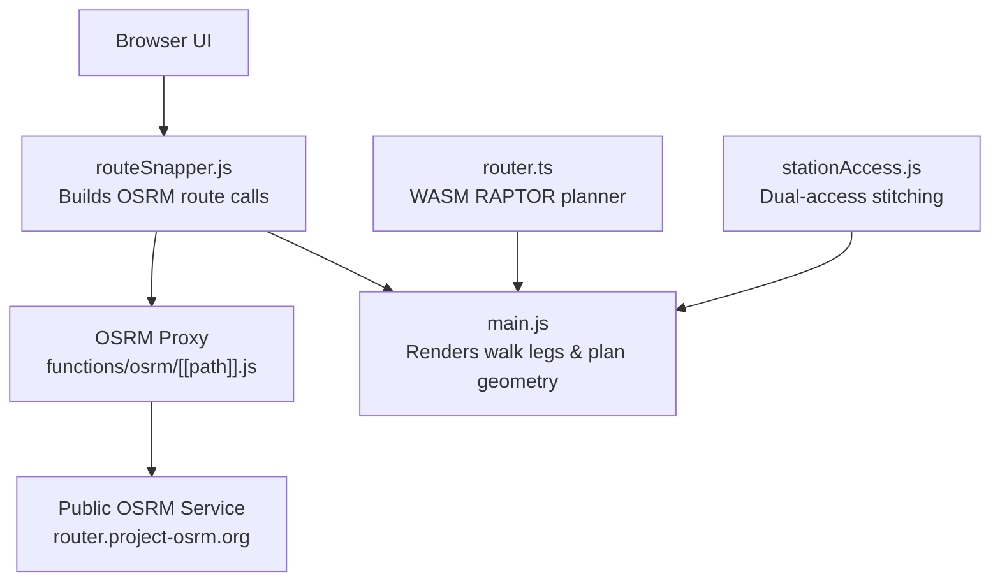
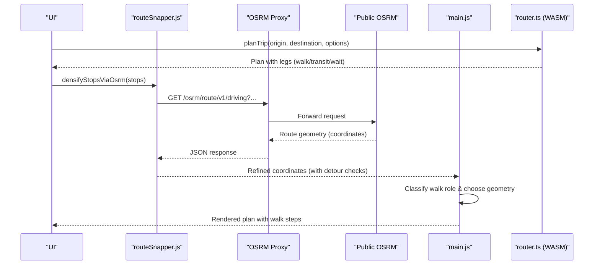
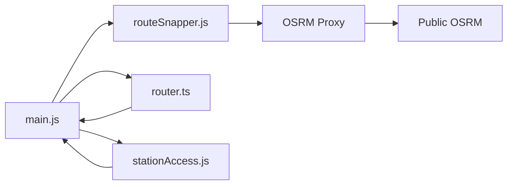

# Walking Directions via OSRM

<cite>
**Referenced Files in This Document**
- [functions/osrm/[[path]].js](file://functions/osrm/[[path]].js)
- [src/routeSnapper.js](file://src/routeSnapper.js)
- [src/router.ts](file://src/router.ts)
- [src/stationAccess.js](file://src/stationAccess.js)
- [src/main.js](file://src/main.js)
</cite>

## Table of Contents
1. [Introduction](#introduction)
2. [Project Structure](#project-structure)
3. [Core Components](#core-components)
4. [Architecture Overview](#architecture-overview)
5. [Detailed Component Analysis](#detailed-component-analysis)
6. [Dependency Analysis](#dependency-analysis)
7. [Performance Considerations](#performance-considerations)
8. [Troubleshooting Guide](#troubleshooting-guide)
9. [Conclusion](#conclusion)
10. [Appendices](#appendices)

## Introduction
This document describes how the application integrates with OSRM to compute walking routes between transit stops and destinations, and how those results are integrated into multi-modal journey planning. It covers:
- The OSRM proxy endpoint used by the app
- Coordinate format requirements
- How walking legs are represented and visualized
- How optimal paths consider pedestrian infrastructure, crossing points, and accessibility features (via dual-access station stitching and routing heuristics)
- Response structure for walking legs (distance, duration, step-like instructions, geometry)
- Example queries and performance optimization techniques
- Integration with the main routing engine for end-to-end journeys

## Project Structure
The OSRM integration spans a small Cloudflare Pages function that proxies requests to the public OSRM service and client-side modules that build queries, handle responses, and merge walking segments into multi-modal plans.

**Diagram sources**
- [functions/osrm/[[path]].js:1-25](file://functions/osrm/[[path]].js#L1-L25)
- [src/routeSnapper.js:1236-1261](file://src/routeSnapper.js#L1236-L1261)
- [src/main.js:4134-4298](file://src/main.js#L4134-L4298)
- [src/router.ts:1-120](file://src/router.ts#L1-L120)
- [src/stationAccess.js:1-50](file://src/stationAccess.js#L1-L50)

**Section sources**
- [functions/osrm/[[path]].js:1-25](file://functions/osrm/[[path]].js#L1-L25)
- [src/routeSnapper.js:1236-1261](file://src/routeSnapper.js#L1236-L1261)
- [src/main.js:4134-4298](file://src/main.js#L4134-L4298)
- [src/router.ts:1-120](file://src/router.ts#L1-L120)
- [src/stationAccess.js:1-50](file://src/stationAccess.js#L1-L50)

## Core Components
- OSRM Proxy Function: Forwards /osrm/* requests to the public OSRM router with CORS and caching headers.
- Route Snapper: Builds OSRM route queries using driving mode to densify paths for bus shapes and fallback geometry; includes detour rejection and pair-wise densification.
- Station Access Module: Expands origin/destination pins to nearby MTR stations or dual-access pairs and stitches free indoor/outdoor interchange walks when appropriate.
- Main App Logic: Classifies walk roles (access/egress/transfer), chooses detailed vs straight-line geometry, and renders leg summaries and map features.
- Router Engine: Produces multi-modal plans with walk legs; walking speed and max walk distance are configurable; walking legs carry distance/duration/path metadata.

**Section sources**
- [functions/osrm/[[path]].js:1-25](file://functions/osrm/[[path]].js#L1-L25)
- [src/routeSnapper.js:191-227](file://src/routeSnapper.js#L191-L227)
- [src/stationAccess.js:92-141](file://src/stationAccess.js#L92-L141)
- [src/main.js:4134-4298](file://src/main.js#L4134-L4298)
- [src/router.ts:35-75](file://src/router.ts#L35-L75)

## Architecture Overview
The system uses OSRM indirectly:
- For shape densification and path refinement, it calls OSRM’s driving profile to follow roads between waypoints.
- For walking legs produced by the WASM planner, it may use OSRM only to refine geometry where needed; otherwise, it relies on planner-provided paths or simple chords.
- Dual-access station logic ensures users see realistic access/egress walks even when the planner started from a sibling station.

**Diagram sources**
- [src/routeSnapper.js:1236-1261](file://src/routeSnapper.js#L1236-L1261)
- [functions/osrm/[[path]].js:5-23](file://functions/osrm/[[path]].js#L5-L23)
- [src/main.js:4134-4298](file://src/main.js#L4134-L4298)
- [src/router.ts:35-75](file://src/router.ts#L35-L75)

## Detailed Component Analysis

### OSRM Proxy Endpoint
- Purpose: Proxies all /osrm/* requests to https://router.project-osrm.org/* with Accept: application/json and CORS enabled.
- Caching: Sets Cache-Control: public, max-age=3600 for responses.
- Error handling: Returns upstream status codes and content types.

Key behaviors:
- Strips /osrm prefix and forwards the remainder to OSRM.
- Preserves query string parameters.
- Ensures cross-origin access for browser clients.

**Section sources**
- [functions/osrm/[[path]].js:1-25](file://functions/osrm/[[path]].js#L1-L25)

### Route Snapper — OSRM Calls and Path Refinement
- Base URL: Uses a same-origin proxy at /osrm to satisfy COEP constraints.
- Driving-based route call: Builds a semicolon-separated list of lon,lat coordinates and requests overview=full with GeoJSON geometries.
- Multi-waypoint strategy:
  - Attempts one multi-waypoint request first.
  - Rejects implausible routes (detours, far from original stops).
  - Falls back to pairwise densification if needed.
- Detour and sanity checks:
  - Caps maximum detour ratio and extra meters.
  - Rejects absurdly long hops or totals.
  - Limits lateral drift when snapping vertices to roads.
- Segment-level matching:
  - Tries OSRM match for short segments with radiuses and gap handling.
  - If match fails, samples along the chord and uses nearest-road points with concurrency limits.
  - Thins intermediate points to control payload size.

Coordinate format:
- Input arrays use { lon, lat } objects.
- Query strings use “lon,lat” order per waypoint.

Response usage:
- Extracts geometry.coordinates from the first route.
- Falls back to straight-line coordinates if OSRM returns insufficient data.

**Section sources**
- [src/routeSnapper.js:1236-1261](file://src/routeSnapper.js#L1236-L1261)
- [src/routeSnapper.js:191-227](file://src/routeSnapper.js#L191-L227)
- [src/routeSnapper.js:538-636](file://src/routeSnapper.js#L538-L636)
- [src/routeSnapper.js:782-798](file://src/routeSnapper.js#L782-L798)

### Station Access — Dual-Access and Accessibility Stitching
- Expands origin/destination pins to include:
  - Original pin
  - Nearby MTR stations within ~520 m
  - Dual-access complex members (e.g., Central ↔ Hong Kong, TST ↔ East TST, Airport ↔ AsiaWorld-Expo)
- Stitches free indoor/outdoor interchange walks when the planner used a sibling station instead of the user’s actual pin.
- Adjusts durations based on indoor vs outdoor pace and enforces minimum durations for free links.
- Marks stitched walks with metadata indicating free link and indoor interchange.

Accessibility considerations:
- Indoor corridors modeled with slower pace.
- Free interchange walks recognized and visually distinguished.
- Nearby-station expansion mitigates gaps in pedestrian graphs near POIs/hotels.

**Section sources**
- [src/stationAccess.js:1-50](file://src/stationAccess.js#L1-L50)
- [src/stationAccess.js:92-141](file://src/stationAccess.js#L92-L141)
- [src/stationAccess.js:155-235](file://src/stationAccess.js#L155-L235)
- [src/stationAccess.js:340-380](file://src/stationAccess.js#L340-L380)

### Main App — Walk Role Classification and Geometry Rendering
- Classifies each walk leg as access, egress, transfer, or walk-only based on context and walk_type.
- Chooses detailed path vs straight chord:
  - Access/egress typically drawn as straight lines.
  - Transfer/walk-only uses detailed path when available.
- Renders GeoJSON LineString features for map display with properties like kind and walk_style.
- Provides human-readable summaries for walk legs, including free links and in-station interchanges.

**Section sources**
- [src/main.js:4134-4298](file://src/main.js#L4134-L4298)
- [src/main.js:6171-6246](file://src/main.js#L6171-L6246)

### Router Engine — Multi-Modal Planning with Walking Legs
- Accepts origin/destination coordinates and options such as walkingSpeed and maxWalkDistance.
- Produces plans composed of legs:
  - Walk legs include duration_seconds, optional distance_meters, optional path array, and walk_type.
  - Transit legs include route options and stop info.
- Applies ranking heuristics that penalize long outdoor walks between MTR lines and prefer in-station transfers.
- Filters plans by allowed traffic methods and bus companies, with special handling for short access/egress walks when walking is disabled.

Walking speed and distances:
- Default walking speed is “slow”.
- Default max walk distance is 1200 meters.
- Walk meter penalty influences ranking.

**Section sources**
- [src/router.ts:35-75](file://src/router.ts#L35-L75)
- [src/router.ts:121-153](file://src/router.ts#L121-L153)
- [src/router.ts:251-303](file://src/router.ts#L251-L303)
- [src/router.ts:468-563](file://src/router.ts#L468-L563)

## Dependency Analysis

**Diagram sources**
- [src/routeSnapper.js:1236-1261](file://src/routeSnapper.js#L1236-L1261)
- [functions/osrm/[[path]].js:5-23](file://functions/osrm/[[path]].js#L5-L23)
- [src/main.js:4134-4298](file://src/main.js#L4134-L4298)
- [src/router.ts:35-75](file://src/router.ts#L35-L75)
- [src/stationAccess.js:92-141](file://src/stationAccess.js#L92-L141)

**Section sources**
- [src/routeSnapper.js:1236-1261](file://src/routeSnapper.js#L1236-L1261)
- [functions/osrm/[[path]].js:5-23](file://functions/osrm/[[path]].js#L5-L23)
- [src/main.js:4134-4298](file://src/main.js#L4134-L4298)
- [src/router.ts:35-75](file://src/router.ts#L35-L75)
- [src/stationAccess.js:92-141](file://src/stationAccess.js#L92-L141)

## Performance Considerations
- Waypoint capping: Multi-waypoint OSRM requests are capped to avoid excessive URL length and latency.
- Detour rejection: Routes that deviate too far from original stops are rejected to prevent unrealistic paths.
- Pairwise fallback: When multi-waypoint fails, the system falls back to segment-by-segment densification.
- Concurrency limits: Nearest-road lookups and sampling use bounded concurrency to avoid overwhelming the network.
- Point thinning: Intermediate points are thinned to reduce payload sizes while preserving visual fidelity.
- Caching: OSRM responses are cached for up to one hour via proxy headers.

[No sources needed since this section provides general guidance]

## Troubleshooting Guide
Common issues and remedies:
- No OSRM response or errors: Check network connectivity and ensure the /osrm proxy is reachable. Errors propagate upstream status codes.
- Implausible routes: The system rejects extreme detours; verify input coordinates and consider simplifying waypoints.
- Missing geometry: If OSRM returns fewer than two coordinates, the code falls back to straight-line segments.
- Excessive walk distances: Adjust walkingSpeed and maxWalkDistance in the planner options; filter plans by allowing/disallowing walking.
- Incorrect access/egress rendering: Ensure walk_type values are set correctly; access/egress are drawn as straight lines unless overridden.

**Section sources**
- [functions/osrm/[[path]].js:5-23](file://functions/osrm/[[path]].js#L5-L23)
- [src/routeSnapper.js:191-227](file://src/routeSnapper.js#L191-L227)
- [src/routeSnapper.js:1236-1261](file://src/routeSnapper.js#L1236-L1261)
- [src/main.js:4134-4298](file://src/main.js#L4134-L4298)
- [src/router.ts:468-563](file://src/router.ts#L468-L563)

## Conclusion
The application integrates OSRM primarily for road-following path densification and geometry refinement, while leveraging a WASM-based planner for multi-modal routing that includes walking legs. Dual-access station stitching improves realism for pedestrian infrastructure around major hubs. The system balances accuracy and performance through waypoint capping, detour rejection, concurrency limits, and point thinning. Walking legs expose distance, duration, and optional path geometry, enabling clear turn-by-turn visualization and navigation flows.

[No sources needed since this section summarizes without analyzing specific files]

## Appendices

### API Endpoints and Coordinate Format
- Proxy endpoint: /osrm/* forwards to https://router.project-osrm.org/*
- Route query example (driving mode used for densification):
  - URL pattern: /osrm/route/v1/driving/{lon1,lat1;lon2,lat2;...}?overview=full&geometries=geojson&steps=false
  - Coordinates: longitude first, then latitude, separated by semicolons for multiple waypoints.
- Response extraction:
  - First route geometry.coordinates array is used as the refined path.
  - If insufficient coordinates, fallback to straight-line segments.

**Section sources**
- [functions/osrm/[[path]].js:5-23](file://functions/osrm/[[path]].js#L5-L23)
- [src/routeSnapper.js:1236-1261](file://src/routeSnapper.js#L1236-L1261)

### Walking Leg Structure and Navigation Data
- Leg type: "walk"
- Fields:
  - duration_seconds: Estimated walking time
  - distance_meters: Optional distance in meters
  - path: Optional array of { lat, lon } points representing the route
  - walk_type: Contextual tag such as "access", "egress", "station_access", "station_transfer", "free_mtr_link"
- Step-like instructions:
  - Generated in UI summaries based on walk_type and adjacent transit legs
  - Examples include indoor interchange, free MTR link, in-station interchange, transfer walk, walk to station, walk from station

**Section sources**
- [src/router.ts:121-153](file://src/router.ts#L121-L153)
- [src/main.js:4786-4820](file://src/main.js#L4786-L4820)

### Optimal Path Calculation Considerations
- Pedestrian infrastructure:
  - Dual-access complexes stitch free indoor/outdoor interchange walks
  - Nearby MTR station expansion mitigates gaps in pedestrian graphs
- Crossing points and accessibility:
  - Indoor corridors modeled with slower pace
  - Free interchange walks marked distinctly
- Ranking heuristics:
  - Penalties for long outdoor walks between MTR lines
  - Preference for in-station transfers and MTR-only plans when applicable

**Section sources**
- [src/stationAccess.js:1-50](file://src/stationAccess.js#L1-L50)
- [src/stationAccess.js:92-141](file://src/stationAccess.js#L92-L141)
- [src/router.ts:251-303](file://src/router.ts#L251-L303)
- [src/router.ts:468-563](file://src/router.ts#L468-L563)

### Example Queries and Integration Notes
- Densify bus shapes via OSRM:
  - Call densifyStopsViaOsrm with ordered stops
  - Uses driving profile to follow roads and produce dense geometry
- Plan multi-modal trips:
  - Use planTrip with origin/destination coordinates and options like walkingSpeed and maxWalkDistance
  - Merge returned legs with map rendering logic to visualize walk and transit segments

**Section sources**
- [src/routeSnapper.js:191-227](file://src/routeSnapper.js#L191-L227)
- [src/router.ts:35-75](file://src/router.ts#L35-L75)
- [src/main.js:6171-6246](file://src/main.js#L6171-L6246)