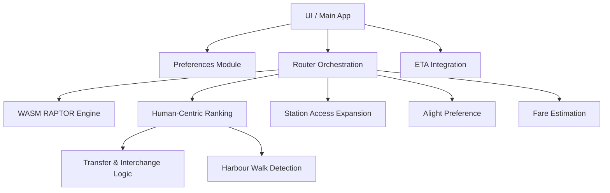
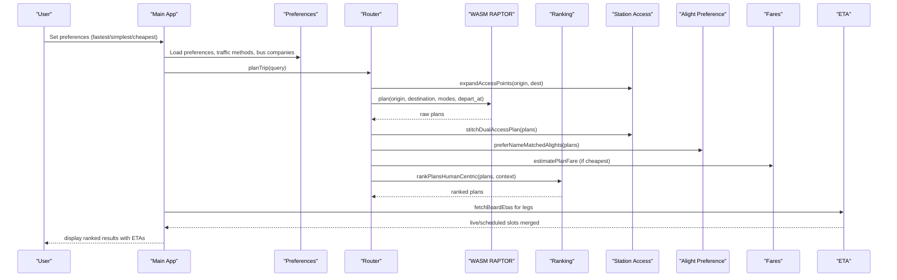
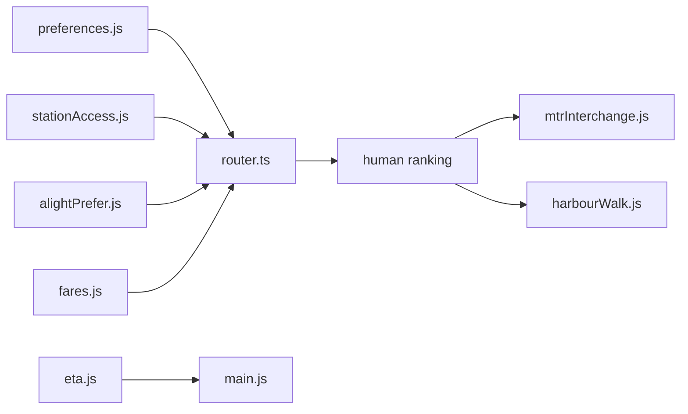

# Route Planning Preferences System

<cite>
**Referenced Files in This Document**
- [preferences.js](file://src/preferences.js)
- [router.ts](file://src/router.ts)
- [harbourWalk.js](file://src/harbourWalk.js)
- [mtrInterchange.js](file://src/mtrInterchange.js)
- [stationAccess.js](file://src/stationAccess.js)
- [alightPrefer.js](file://src/alightPrefer.js)
- [fares.js](file://src/fares.js)
- [eta.js](file://src/eta.js)
- [main.js](file://src/main.js)
</cite>

## Table of Contents
1. [Introduction](#introduction)
2. [Project Structure](#project-structure)
3. [Core Components](#core-components)
4. [Architecture Overview](#architecture-overview)
5. [Detailed Component Analysis](#detailed-component-analysis)
6. [Dependency Analysis](#dependency-analysis)
7. [Performance Considerations](#performance-considerations)
8. [Troubleshooting Guide](#troubleshooting-guide)
9. [Conclusion](#conclusion)

## Introduction
This document explains the route planning preferences system that supports fastest, simplest, and cheapest routing strategies with transfer optimization for Hong Kong’s transit network. It covers preference normalization, combining multiple selection criteria, human-centric ranking rules, a detailed penalty system for different transfer types, special handling for Victoria Harbour walks, MTR station access points, and Light Rail catchment areas. It also documents real-time schedule integration for accurate ETAs and the alighting preference system for optimal platform selection.

## Project Structure
The system is implemented as a set of focused modules:
- Preferences and configuration persistence
- Routing orchestration and human-centric ranking
- Transfer and interchange logic specific to MTR and legacy networks
- Harbour walk detection and penalties
- Station access expansion and dual-access stitching
- Alighting stop preference optimization
- Fare estimation and ticket-type handling
- Real-time ETA integration and timetable merging
- Application entry point wiring

**Diagram sources**
- [router.ts:1028-1389](file://src/router.ts#L1028-L1389)
- [preferences.js:330-461](file://src/preferences.js#L330-L461)
- [mtrInterchange.js:155-208](file://src/mtrInterchange.js#L155-L208)
- [harbourWalk.js:165-196](file://src/harbourWalk.js#L165-L196)
- [stationAccess.js:92-141](file://src/stationAccess.js#L92-L141)
- [alightPrefer.js:333-551](file://src/alightPrefer.js#L333-L551)
- [fares.js:460-503](file://src/fares.js#L460-L503)
- [eta.js:533-568](file://src/eta.js#L533-L568)

**Section sources**
- [router.ts:1-112](file://src/router.ts#L1-L112)
- [preferences.js:1-70](file://src/preferences.js#L1-L70)

## Core Components
- Preference normalization and multi-select combination
- Human-centric ranking with weighted penalties and bonuses
- Transfer type classification and penalties (bus-to-bus, MTR interchanges, mixed mode)
- Special handling for Victoria Harbour walks and MTR free links
- Dual-access station expansion and stitching
- Alighting preference optimization for destination matching
- Fare estimation and cheapest strategy support
- Real-time ETA integration and timetable merging

**Section sources**
- [router.ts:100-112](file://src/router.ts#L100-L112)
- [router.ts:829-971](file://src/router.ts#L829-L971)
- [mtrInterchange.js:217-285](file://src/mtrInterchange.js#L217-L285)
- [harbourWalk.js:35-36](file://src/harbourWalk.js#L35-L36)
- [stationAccess.js:155-235](file://src/stationAccess.js#L155-L235)
- [alightPrefer.js:169-238](file://src/alightPrefer.js#L169-L238)
- [fares.js:460-503](file://src/fares.js#L460-L503)
- [eta.js:533-568](file://src/eta.js#L533-L568)

## Architecture Overview
The routing pipeline integrates user preferences with a WASM-based RAPTOR engine and applies human-centric ranking tailored to Hong Kong’s transit characteristics.

**Diagram sources**
- [router.ts:1138-1389](file://src/router.ts#L1138-L1389)
- [stationAccess.js:92-235](file://src/stationAccess.js#L92-L235)
- [alightPrefer.js:333-551](file://src/alightPrefer.js#L333-L551)
- [fares.js:460-503](file://src/fares.js#L460-L503)
- [eta.js:533-568](file://src/eta.js#L533-L568)

## Detailed Component Analysis

### Preference Normalization and Multi-Select Combination
- Preferences are loaded from storage and normalized into a set of active goals: fastest, simplest, cheapest.
- Multiple preferences can be combined; weights are averaged across selected goals to balance time, transfers, walking, and fare considerations.
- Traffic method filters map to RAPTOR modes string, enabling selective inclusion/exclusion of bus, GMB, LRT, MTR, AEL, and walk.

Key behaviors:
- Default preference set is fastest if none provided.
- Bus company and traffic method selections are validated and persisted.
- Service day and departure time are handled with Hong Kong timezone awareness.

**Section sources**
- [preferences.js:330-364](file://src/preferences.js#L330-L364)
- [preferences.js:403-461](file://src/preferences.js#L403-L461)
- [preferences.js:527-544](file://src/preferences.js#L527-L544)
- [preferences.js:306-325](file://src/preferences.js#L306-L325)

### Human-Centric Ranking Rules
- Perceived cost blends travel time, transfer penalties, walking distance, and optional fare cost based on active preferences.
- Transfer penalties:
  - Bus-to-bus transfers: strong penalty to discourage multi-hop bus routes.
  - MTR interchanges: light penalty to allow line changes within stations.
  - Mixed mode transfers: moderate penalty for switching between bus/MTR/LRT/AEL.
- Additional adjustments:
  - MTR-only plans receive a bonus when both origin and destination are MTR stations.
  - Light Rail usage receives a bonus to favor local feeder services over pure bus.
  - Airport Express corridor plans get a soft boost; pure airport bus without MTR gets mild penalty.
  - Cross-harbour pedestrian walks incur a very large penalty to drop impossible routes.

Penalty constants:
- Bus-to-bus transfer penalty: 900 seconds (15 minutes).
- MTR interchange penalty: 90 seconds (1.5 minutes).
- Mixed transfer penalty: 480 seconds (8 minutes).
- MTR street walk penalty: 720 seconds plus distance effect.
- In-station MTR transfer walk penalty: small fixed value.
- Free interchange bonus: reduces perceived cost for official free links.

**Section sources**
- [router.ts:253-289](file://src/router.ts#L253-L289)
- [router.ts:829-971](file://src/router.ts#L829-L971)
- [mtrInterchange.js:21-44](file://src/mtrInterchange.js#L21-L44)
- [harbourWalk.js:35-36](file://src/harbourWalk.js#L35-L36)

### Transfer Classification and Penalties
- Transfers are classified by analyzing successive transit legs:
  - MTR-to-MTR line changes count as MTR transfers.
  - Bus-to-Bus transfers count as bus transfers.
  - Any other combination counts as mixed transfers.
- Legacy KCR–MTR interchanges at sprawling hubs incur extra perceived cost unless they are integrated or same-period pairs.
- Official free interchange walks (e.g., Central ↔ Hong Kong, Tsim Sha Tsui ↔ East Tsim Sha Tsui, Mong Kok ↔ Mong Kok East) are recognized and rewarded.

**Section sources**
- [router.ts:649-823](file://src/router.ts#L649-L823)
- [mtrInterchange.js:155-208](file://src/mtrInterchange.js#L155-L208)
- [mtrInterchange.js:217-285](file://src/mtrInterchange.js#L217-L285)

### Victoria Harbour Walk Handling
- The system detects pedestrian paths that cross Victoria Harbour in non-walkable ways and penalizes them heavily.
- Detection uses harbour water band control points and path sampling to identify island↔Kowloon crossings.
- Pure walk-only plans spanning opposite shores are also flagged.

**Section sources**
- [harbourWalk.js:18-36](file://src/harbourWalk.js#L18-L36)
- [harbourWalk.js:95-159](file://src/harbourWalk.js#L95-L159)
- [harbourWalk.js:165-196](file://src/harbourWalk.js#L165-L196)

### MTR Station Access Points and Dual-Access Stitching
- Origin and destination pins are expanded to include nearby MTR stations and dual-access complexes (Central ↔ Hong Kong, TST ↔ ETS, Airport ↔ AsiaWorld-Expo).
- Plans computed from sibling stations are stitched with indoor/outdoor free-link walks so itineraries reflect the user’s actual start/end points.
- Nearby MTR stations are used to avoid gaps in the walk graph for POIs/hotels.

**Section sources**
- [stationAccess.js:21-50](file://src/stationAccess.js#L21-L50)
- [stationAccess.js:92-141](file://src/stationAccess.js#L92-L141)
- [stationAccess.js:155-235](file://src/stationAccess.js#L155-L235)

### Light Rail Catchment Areas
- When origins or destinations fall within the Light Rail catchment (Tuen Mun/Tin Shui Wai/Yuen Long), the router increases candidate pool size and transfer allowances to surface multi-leg LRT plans.
- LRT usage receives a bonus in ranking to prefer local feeder services over pure bus.

**Section sources**
- [router.ts:337-346](file://src/router.ts#L337-L346)
- [router.ts:1172-1177](file://src/router.ts#L1172-L1177)
- [router.ts:1232-1247](file://src/router.ts#L1232-L1247)
- [router.ts:928-934](file://src/router.ts#L928-L934)

### Alighting Preference System
- For bus legs near the destination, the system prefers alighting at stops whose names match the destination label and are close geographically.
- It extends ride segments using known route patterns (e.g., approaches to Tung Chung Station) to avoid early alights like cable car terminals when the destination is an MTR station or bus terminus.
- Egress walks are adjusted to reflect improved alighting choices.

**Section sources**
- [alightPrefer.js:169-238](file://src/alightPrefer.js#L169-L238)
- [alightPrefer.js:333-551](file://src/alightPrefer.js#L333-L551)

### Fare Estimation and Cheapest Strategy
- Fare estimation supports multiple ticket types and includes MTR, AEL, LRT, MTR Bus, franchised buses, ferries, and interchange discounts.
- When “cheapest” is selected, fare totals are computed per plan and influence ranking; incomplete fares are penalized to avoid false wins.
- Ticket-type scaling and concession handling are applied consistently across modes.

**Section sources**
- [fares.js:460-503](file://src/fares.js#L460-L503)
- [fares.js:643-689](file://src/fares.js#L643-L689)
- [fares.js:696-748](file://src/fares.js#L696-L748)
- [router.ts:906-914](file://src/router.ts#L906-L914)

### Real-Time Schedule Integration and ETA Calculations
- Live ETAs are fetched via a same-origin proxy for operators (KMB/LWB, Citybus, NLB, MTR, LRT).
- Scheduled departures are derived from service-day clocks embedded in plans and expanded using headway grids when live data is unavailable.
- Live and scheduled slots are merged to present up-to-date waiting times and departure windows.

**Section sources**
- [eta.js:30-42](file://src/eta.js#L30-L42)
- [eta.js:214-225](file://src/eta.js#L214-L225)
- [eta.js:533-568](file://src/eta.js#L533-L568)
- [eta.js:692-758](file://src/eta.js#L692-L758)

## Dependency Analysis
The routing system composes several modules with clear responsibilities:

**Diagram sources**
- [router.ts:1-34](file://src/router.ts#L1-L34)
- [preferences.js:330-461](file://src/preferences.js#L330-L461)
- [stationAccess.js:92-235](file://src/stationAccess.js#L92-L235)
- [alightPrefer.js:333-551](file://src/alightPrefer.js#L333-L551)
- [fares.js:460-503](file://src/fares.js#L460-L503)
- [eta.js:533-568](file://src/eta.js#L533-L568)
- [mtrInterchange.js:155-285](file://src/mtrInterchange.js#L155-L285)
- [harbourWalk.js:165-196](file://src/harbourWalk.js#L165-L196)

**Section sources**
- [router.ts:1028-1389](file://src/router.ts#L1028-L1389)
- [main.js:22-143](file://src/main.js#L22-L143)

## Performance Considerations
- Candidate pool sizing adapts to MTR-only and Light Rail catchment scenarios to ensure diverse options while avoiding excessive computation.
- Night bus filtering during daytime avoids presenting irrelevant overnight routes.
- Harbour walk detection prevents invalid routes early, reducing downstream processing.
- Dual-access expansion limits OD pairs to keep queries efficient.

[No sources needed since this section provides general guidance]

## Troubleshooting Guide
Common issues and resolutions:
- No results returned: Check whether all candidates were filtered out due to harbour walks or mode/company constraints; adjust traffic methods or bus companies.
- Unexpected night bus results: Ensure departure time is not within the night window; the system suppresses N* routes during daytime.
- Missing ETAs: Verify operator-specific endpoints and stop IDs; fallback to headway-based schedules when live data is unavailable.
- Incorrect alighting stops: Confirm destination label matches expected station or terminus; the system will extend rides to better-matched stops when possible.

**Section sources**
- [router.ts:1325-1348](file://src/router.ts#L1325-L1348)
- [router.ts:1038-1055](file://src/router.ts#L1038-L1055)
- [eta.js:692-758](file://src/eta.js#L692-L758)
- [alightPrefer.js:333-551](file://src/alightPrefer.js#L333-L551)

## Conclusion
The route planning preferences system combines flexible multi-goal preferences with Hong Kong-specific ranking rules to deliver practical, human-centric routing outcomes. It balances speed, simplicity, and cost while respecting local transit realities such as transfer penalties, free interchange links, Light Rail catchments, and impossible harbour walks. Real-time ETA integration and optimized alighting preferences further enhance usability and accuracy.

[No sources needed since this section summarizes without analyzing specific files]