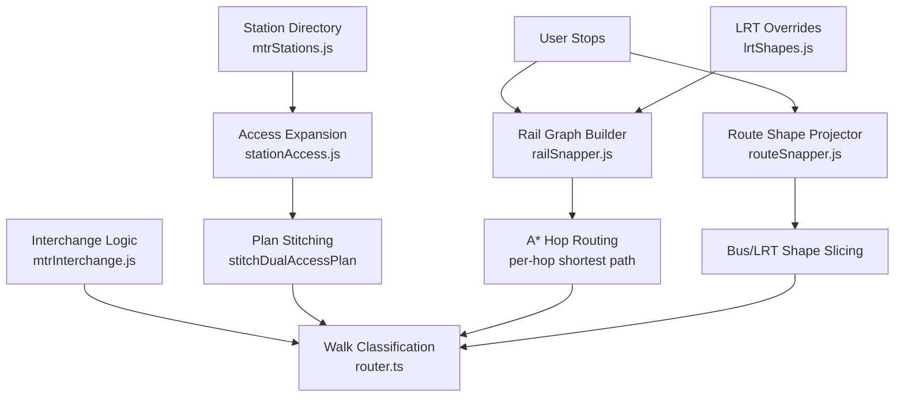
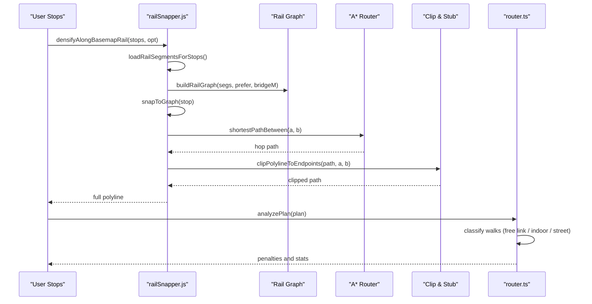
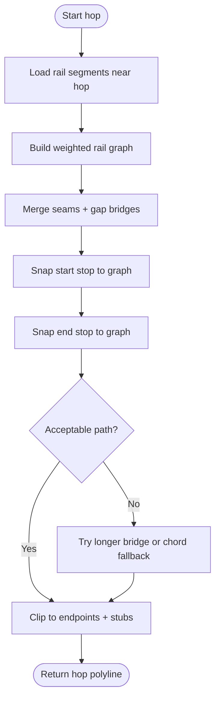
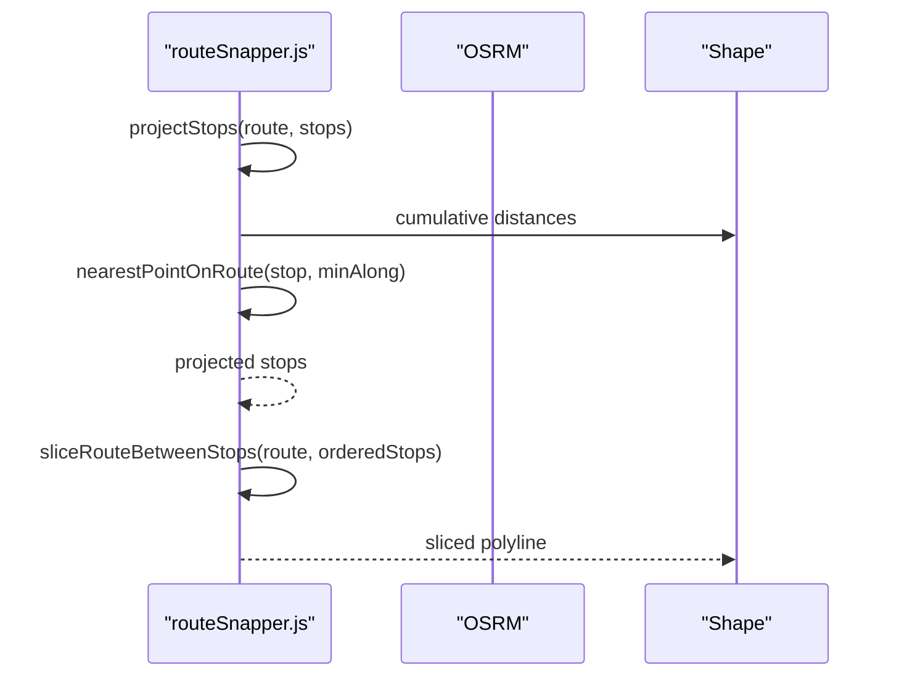
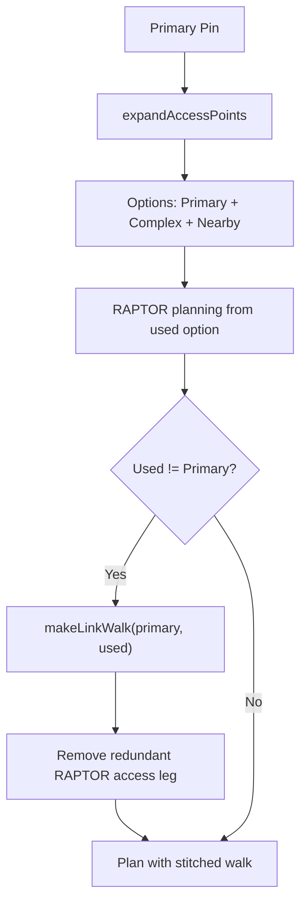
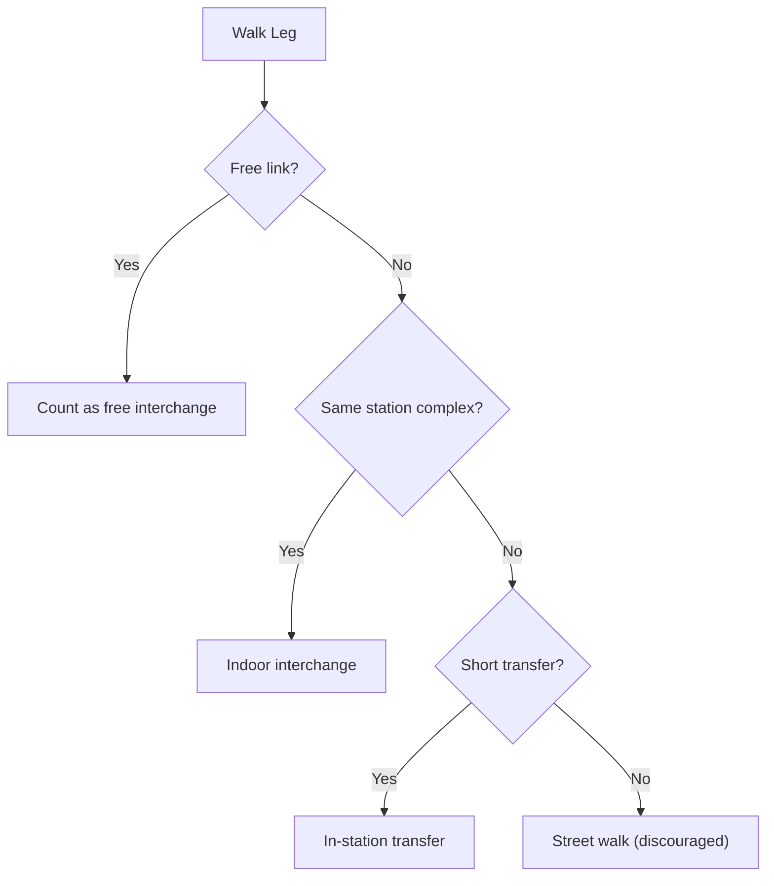
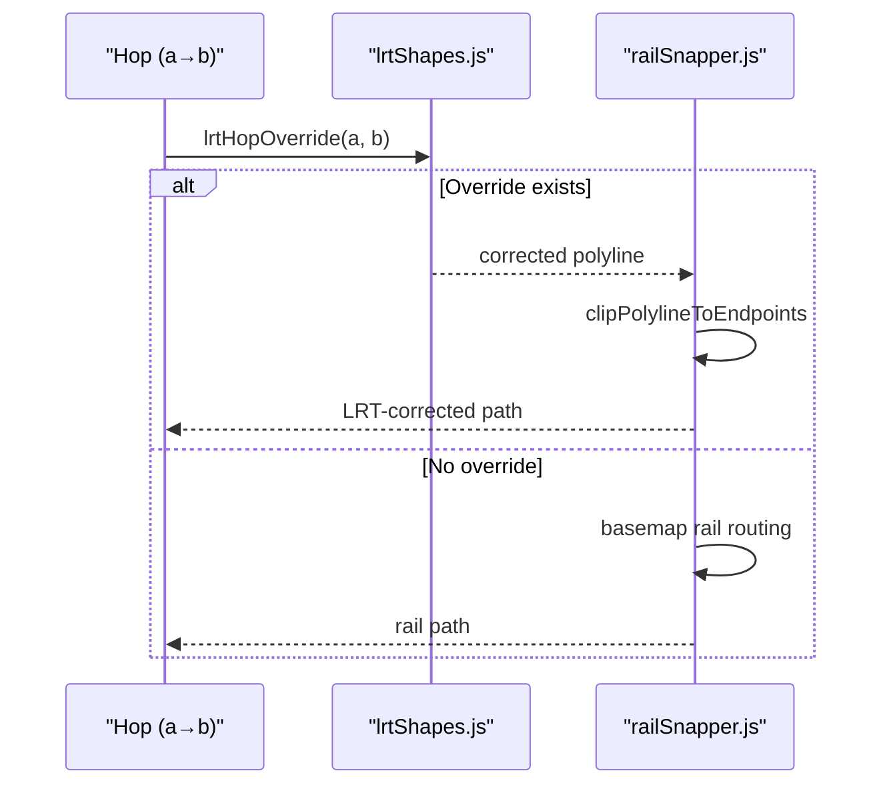
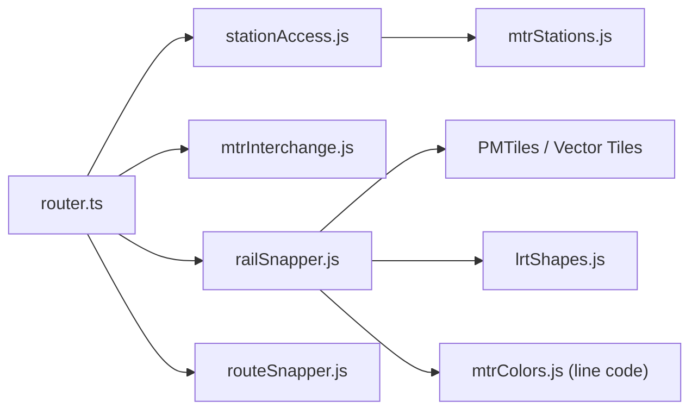

# Route Snapping and Path Matching

<cite>
**Referenced Files in This Document**
- [railSnapper.js](file://src/railSnapper.js)
- [routeSnapper.js](file://src/routeSnapper.js)
- [stationAccess.js](file://src/stationAccess.js)
- [mtrInterchange.js](file://src/mtrInterchange.js)
- [lrtShapes.js](file://src/lrtShapes.js)
- [mtrStations.js](file://src/mtrStations.js)
- [router.ts](file://src/router.ts)
</cite>

## Table of Contents
1. Introduction
2. Project Structure
3. Core Components
4. Architecture Overview
5. Detailed Component Analysis
6. Dependency Analysis
7. Performance Considerations
8. Troubleshooting Guide
9. Conclusion

## Introduction
This document explains how the system snaps calculated routes to actual transit infrastructure so that displayed paths follow real rails, platforms, and station corridors. It covers:
- Rail-specific snapping for MTR lines using basemap railway geometry
- Dual-access station handling (Central ↔ Hong Kong; Tsim Sha Tsui ↔ East Tsim Sha Tsui; Airport ↔ AsiaWorld-Expo)
- Light Rail platform matching and shape overrides
- Interchange detection and free link identification (CEN↔HOK, TST↔ETS, MOK↔MKK)
- Distance-based snapping thresholds, walk type classification, and integration with station geometry data
- Examples of route stitching and edge cases such as long outdoor walks between MTR lines
- Performance considerations and accuracy trade-offs

## Project Structure
The snapping pipeline spans several modules:
- Rail path densification uses basemap vector tiles to build a rail graph and A* routing per hop
- Bus and general route projection snap stops onto existing route shapes
- Station access expansion adds dual-access stations and nearby MTR stations as alternative boarding/egress points
- Interchange logic classifies walks as indoor/outdoor, official free links, or street walks
- LRT shape overrides correct known misalignments
- Router integrates all signals to classify and penalize walks appropriately

**Diagram sources**
- [railSnapper.js:69-209](file://src/railSnapper.js#L69-L209)
- [routeSnapper.js:68-173](file://src/routeSnapper.js#L68-L173)
- [stationAccess.js:92-235](file://src/stationAccess.js#L92-L235)
- [mtrInterchange.js:217-438](file://src/mtrInterchange.js#L217-L438)
- [lrtShapes.js:115-184](file://src/lrtShapes.js#L115-L184)
- [router.ts:700-823](file://src/router.ts#L700-L823)

**Section sources**
- [railSnapper.js:69-209](file://src/railSnapper.js#L69-L209)
- [routeSnapper.js:68-173](file://src/routeSnapper.js#L68-L173)
- [stationAccess.js:92-235](file://src/stationAccess.js#L92-L235)
- [mtrInterchange.js:217-438](file://src/mtrInterchange.js#L217-L438)
- [lrtShapes.js:115-184](file://src/lrtShapes.js#L115-L184)
- [router.ts:700-823](file://src/router.ts#L700-L823)

## Core Components
- Rail densification: Builds a track graph from basemap railways and finds shortest paths between consecutive stops, with line preference filtering and gap bridging.
- Route projection: Projects ordered stops onto a route LineString, slicing the segment between board and alight stops.
- Station access expansion: Adds dual-access stations and nearby MTR stations as alternate pins; stitches free-link walks into plans.
- Interchange classification: Detects official free links, indoor vs outdoor transfers, and legacy KCR–MTR interchange penalties.
- LRT corrections: Applies static shape/platform overrides to fix known misaligned segments.
- Router integration: Classifies walk types and applies penalties based on distance/time and context.

**Section sources**
- [railSnapper.js:69-209](file://src/railSnapper.js#L69-L209)
- [routeSnapper.js:68-173](file://src/routeSnapper.js#L68-L173)
- [stationAccess.js:92-235](file://src/stationAccess.js#L92-L235)
- [mtrInterchange.js:217-438](file://src/mtrInterchange.js#L217-L438)
- [lrtShapes.js:115-184](file://src/lrtShapes.js#L115-L184)
- [router.ts:700-823](file://src/router.ts#L700-L823)

## Architecture Overview
The end-to-end flow for a rail leg:
1. For each hop between stops, load relevant basemap rail segments around the hop.
2. Build a weighted graph with seam merges and gap bridges tuned for dual-track spacing and corridor gaps.
3. Snap each stop to the nearest graph edge by inserting virtual nodes.
4. Run A* between snapped nodes to get a rail-aligned polyline per hop.
5. Clip polylines to endpoints and add short stubs to exact platform pins.
6. For LRT hops, try static shape overrides before falling back to basemap routing.
7. Post-process plan legs to classify walks and apply penalties.

**Diagram sources**
- [railSnapper.js:69-209](file://src/railSnapper.js#L69-L209)
- [railSnapper.js:624-726](file://src/railSnapper.js#L624-L726)
- [railSnapper.js:733-800](file://src/railSnapper.js#L733-L800)
- [router.ts:700-823](file://src/router.ts#L700-L823)

## Detailed Component Analysis

### Rail Snapping (MTR and Heavy Rail)
- Basemap tile loading: Loads vector tiles at a fixed zoom, filters for rail kinds, and extracts line geometries.
- Line preferences: Uses route names/codes to prefer specific lines and avoid cross-line matches.
- Graph construction:
  - Nodes are created per vertex; edges are weighted by length and line match quality.
  - Seam merging connects nearby vertices within ~28 m to handle dual tracks.
  - Gap bridging connects fragments up to ~200 m normally, or ~320 m when named lines match (e.g., Tsing Ma corridor).
- Stop snapping: Each stop is projected onto the nearest edge; if close enough (≤320 m), a virtual node is inserted to allow mid-edge entry/exit.
- Per-hop routing: A* finds the shortest path between consecutive stops; strict acceptance checks reject implausible detours.
- LRT override: Before basemap routing, tries static LRT shape overrides for problematic segments.
- Clipping: Ensures paths do not overshoot past stops and adds short stubs to exact platform pins.

**Diagram sources**
- [railSnapper.js:69-209](file://src/railSnapper.js#L69-L209)
- [railSnapper.js:624-726](file://src/railSnapper.js#L624-L726)
- [railSnapper.js:733-800](file://src/railSnapper.js#L733-L800)

**Section sources**
- [railSnapper.js:69-209](file://src/railSnapper.js#L69-L209)
- [railSnapper.js:334-479](file://src/railSnapper.js#L334-L479)
- [railSnapper.js:498-595](file://src/railSnapper.js#L498-L595)
- [railSnapper.js:624-726](file://src/railSnapper.js#L624-L726)
- [railSnapper.js:733-800](file://src/railSnapper.js#L733-L800)

### Route Projection (Bus and General Shapes)
- Projects ordered stops onto a route LineString with forward bias to handle overlapping corridors and out-and-back patterns.
- Slices the route between first and last projected stops to produce the visible segment.
- Includes OSRM-based densification with detour rejection for bus-like paths where needed.

**Diagram sources**
- [routeSnapper.js:29-173](file://src/routeSnapper.js#L29-L173)

**Section sources**
- [routeSnapper.js:29-173](file://src/routeSnapper.js#L29-L173)
- [routeSnapper.js:198-227](file://src/routeSnapper.js#L198-L227)

### Station Access and Dual-Access Stitching
- Expands origin/destination pins to include:
  - The original pin
  - Dual-access complex members (Central ↔ Hong Kong; Tsim Sha Tsui ↔ East Tsim Sha Tsui; Airport ↔ AsiaWorld-Expo)
  - Nearest MTR station within ~520 m for POIs/hotels in walk-graph holes
- Stitches explicit walk legs between user’s primary pin and the used sibling/nearby station:
  - Removes redundant RAPTOR access walks if present
  - Adds a walk leg with appropriate duration and distance
  - Marks free indoor/outdoor interchange metadata for rendering and ranking

**Diagram sources**
- [stationAccess.js:92-235](file://src/stationAccess.js#L92-L235)

**Section sources**
- [stationAccess.js:92-235](file://src/stationAccess.js#L92-L235)
- [stationAccess.js:237-380](file://src/stationAccess.js#L237-L380)
- [mtrStations.js:14-118](file://src/mtrStations.js#L14-L118)

### Interchange Detection and Free Links
- Identifies official free interchange walks between distinct stations:
  - Central ↔ Hong Kong (indoor paid-area walkway)
  - Tsim Sha Tsui ↔ East Tsim Sha Tsui (outdoor pedestrian tunnel)
  - Mong Kok ↔ Mong Kok East
- Classifies walks:
  - Indoor interchange: straight chord on map for paid-area transfers
  - Official free link: treated as station transfer with relaxed constraints
  - Long outdoor walks between MTR lines: discouraged and counted as street walks
- Legacy KCR–MTR interchange penalty:
  - Adds extra perceived time for certain long hubs unless integrated or same-period cohorts (e.g., Admiralty TWL↔ISL or SIL↔EAL)

**Diagram sources**
- [mtrInterchange.js:217-438](file://src/mtrInterchange.js#L217-L438)
- [router.ts:700-823](file://src/router.ts#L700-L823)

**Section sources**
- [mtrInterchange.js:217-438](file://src/mtrInterchange.js#L217-L438)
- [router.ts:700-823](file://src/router.ts#L700-L823)

### Light Rail Platform Matching and Overrides
- Static overrides provide corrected shapes and platform centroids for problematic LRT segments (e.g., Tin Wing YOHO West).
- During rail densification, LRT hops attempt overrides first; if available and valid, they replace basemap routing for that hop.
- Approach rules enforce final segments into overridden stations to ensure accurate platform alignment.

**Diagram sources**
- [lrtShapes.js:115-184](file://src/lrtShapes.js#L115-L184)
- [railSnapper.js:120-162](file://src/railSnapper.js#L120-L162)

**Section sources**
- [lrtShapes.js:115-184](file://src/lrtShapes.js#L115-L184)
- [railSnapper.js:120-162](file://src/railSnapper.js#L120-L162)

### Walk Type Classification and Penalties
- Walk types:
  - station_transfer: In-station or paid-area transfer
  - station_access: Access/egress to/from station
  - street: Outdoor street walk
- Classification logic:
  - Official free links (CEN↔HOK, TST↔ETS, MOK↔MKK) are recognized and treated as station transfers
  - Indoor interchange (e.g., Central↔Hong Kong paid area) draws a straight chord and counts as station transfer
  - Long outdoor walks between MTR lines are classified as street walks and discouraged
- Penalties:
  - Legacy KCR–MTR interchanges at certain hubs incur extra perceived time unless integrated or same-period cohorts
  - LRT platform changes allow longer outdoor transfers due to street-level platforms

**Section sources**
- [mtrInterchange.js:217-438](file://src/mtrInterchange.js#L217-L438)
- [router.ts:700-823](file://src/router.ts#L700-L823)

## Dependency Analysis
Key dependencies and relationships:
- railSnapper.js depends on basemap PMTiles and vector tile parsing to extract rail segments
- routeSnapper.js depends on cumulative distance calculations and optional OSRM services for densification
- stationAccess.js depends on mtrStations.js for station directory and codes
- mtrInterchange.js provides interchange logic consumed by router.ts for walk classification
- lrtShapes.js supplies static overrides used by railSnapper.js during LRT hops
- router.ts integrates all components to compute penalties and statistics

**Diagram sources**
- [railSnapper.js:9-13](file://src/railSnapper.js#L9-L13)
- [railSnapper.js:120-162](file://src/railSnapper.js#L120-L162)
- [stationAccess.js:9-21](file://src/stationAccess.js#L9-L21)
- [mtrInterchange.js:18-21](file://src/mtrInterchange.js#L18-L21)
- [router.ts:700-823](file://src/router.ts#L700-L823)

**Section sources**
- [railSnapper.js:9-13](file://src/railSnapper.js#L9-L13)
- [stationAccess.js:9-21](file://src/stationAccess.js#L9-L21)
- [mtrInterchange.js:18-21](file://src/mtrInterchange.js#L18-L21)
- [router.ts:700-823](file://src/router.ts#L700-L823)

## Performance Considerations
- Tile budget and concurrency:
  - Tile loading uses a bounded concurrency limit to avoid overwhelming requests
  - Tile selection pads around hops to ensure coverage of long corridors while capping total tiles
- Graph building efficiency:
  - Node merging and grid-based neighbor search reduce pairwise comparisons
  - Gap bridging uses cost multipliers to prefer real track over artificial connections
- Acceptance thresholds:
  - Strict hop validation prevents unrealistic detours (e.g., sea chords or demolished loops)
  - LRT strict loop mode rejects excessive detours for short hops
- OSRM usage:
  - Multi-waypoint requests capped to prevent latency and URL length issues
  - Detour rejection avoids absurd airport/HZMB legs
- Memory and caching:
  - Tile cache stores parsed segments per tile key
  - LRT route data cached after first load

Accuracy trade-offs:
- Larger gap bridges improve connectivity but risk false connections; mitigated by higher costs and name-based restrictions
- Shorter snap thresholds reduce lateral drift but may miss distant platforms; balanced by MAX_SNAP_M and virtual node reuse
- LRT overrides prioritize correctness over basemap fidelity for known problem areas

[No sources needed since this section provides general guidance]

## Troubleshooting Guide
Common issues and diagnostics:
- Few rail segments found:
  - Indicates insufficient basemap coverage or overly restrictive filters; check tile selection and segment filtering
- No track path for a hop:
  - Falls back to chord; inspect hop distance and graph connectivity; consider increasing bridge threshold for long corridors
- Excessive detours:
  - Acceptance checks should reject; verify thresholds and strict loop mode for LRT
- Incorrect LRT alignment:
  - Ensure overrides exist and match stop names; approach rules may need adjustment
- Dual-access stitching anomalies:
  - Verify complex membership and label matching; check stitch conditions and removal of redundant RAPTOR access legs

**Section sources**
- [railSnapper.js:73-77](file://src/railSnapper.js#L73-L77)
- [railSnapper.js:179-185](file://src/railSnapper.js#L179-L185)
- [railSnapper.js:317-330](file://src/railSnapper.js#L317-L330)
- [lrtShapes.js:115-184](file://src/lrtShapes.js#L115-L184)
- [stationAccess.js:155-235](file://src/stationAccess.js#L155-L235)

## Conclusion
The snapping system combines basemap rail graphs, precise stop projection, and domain-specific overrides to produce accurate, infrastructure-aligned paths. Dual-access station handling ensures seamless transitions across complex station layouts, while interchange logic and walk classification provide realistic perception and penalties. Tuned thresholds and performance safeguards balance accuracy with responsiveness, making the system robust for diverse scenarios including long outdoor walks and LRT platform nuances.

[No sources needed since this section summarizes without analyzing specific files]