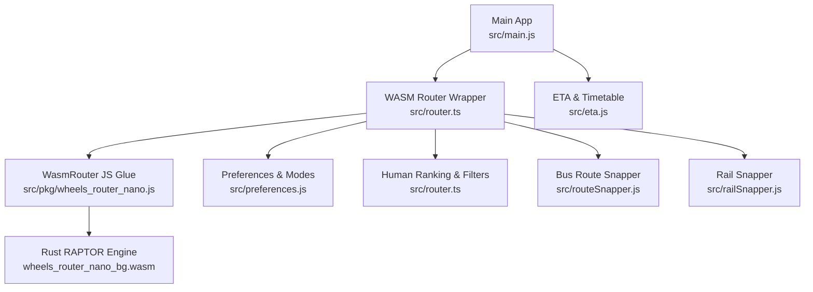
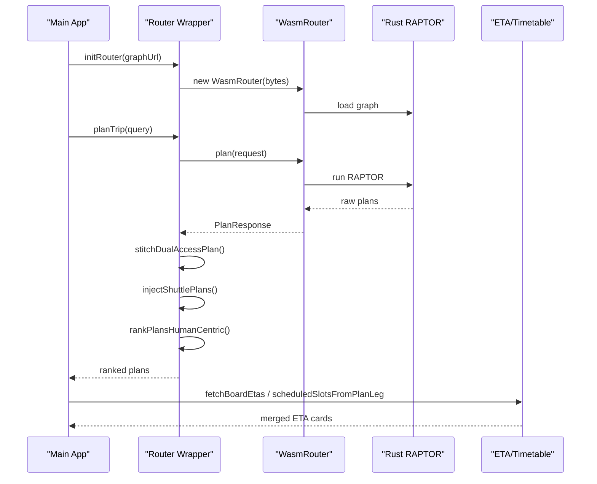
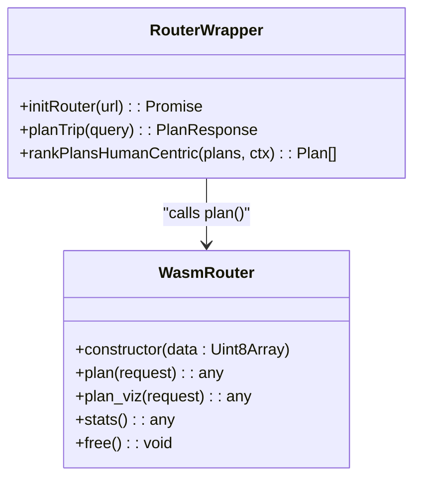
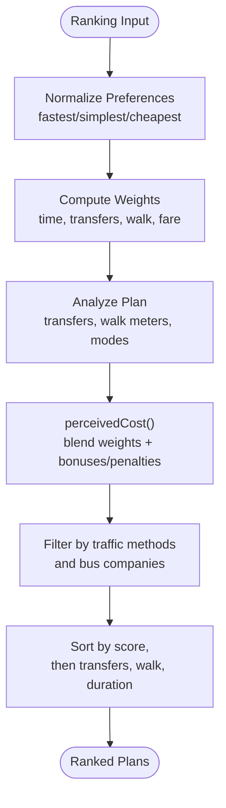
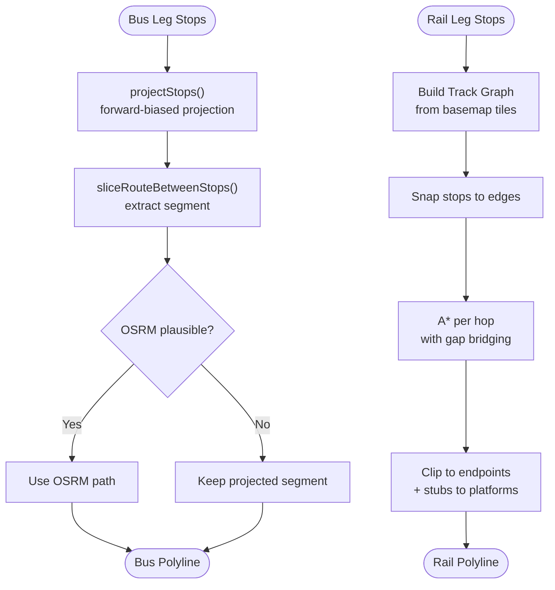
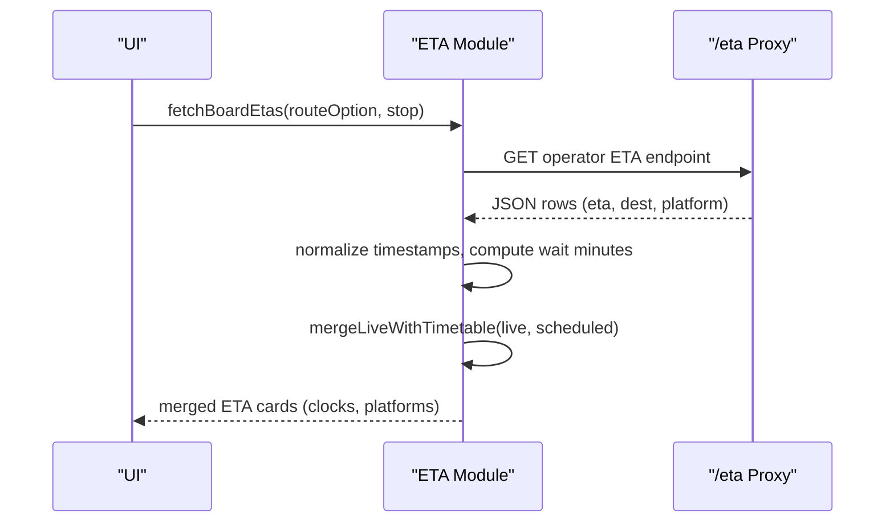
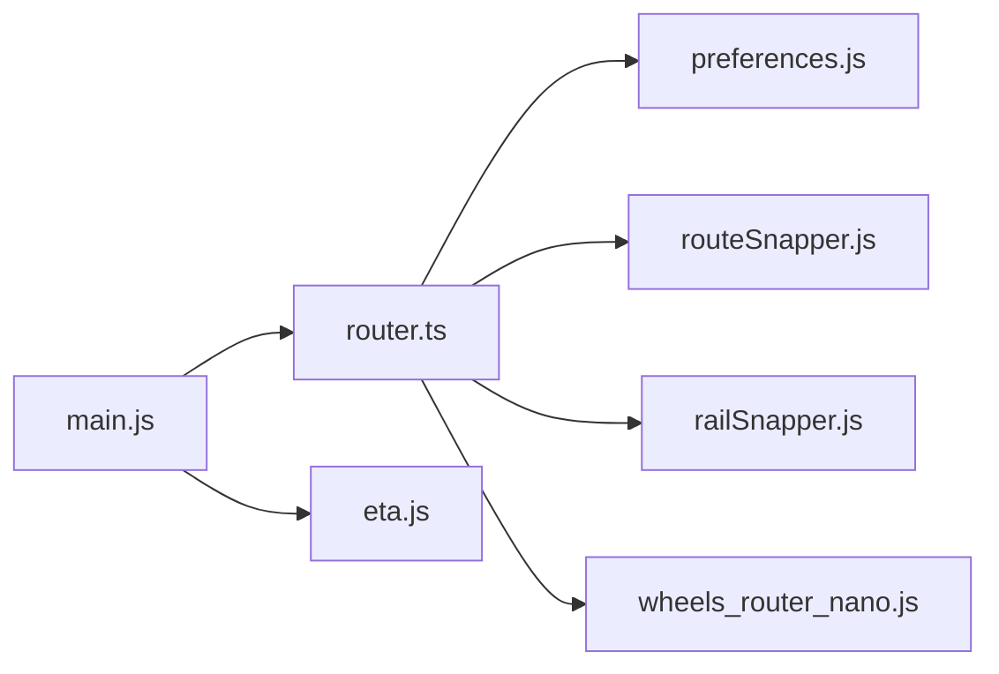

# Routing Engine

<cite>
**Referenced Files in This Document**
- [router.ts](file://src/router.ts)
- [wheels_router_nano.js](file://src/pkg/wheels_router_nano.js)
- [wheels_router_nano.d.ts](file://src/pkg/wheels_router_nano.d.ts)
- [preferences.js](file://src/preferences.js)
- [routeSnapper.js](file://src/routeSnapper.js)
- [railSnapper.js](file://src/railSnapper.js)
- [eta.js](file://src/eta.js)
- [main.js](file://src/main.js)
</cite>

## Table of Contents
1. [Introduction](#introduction)
2. [Project Structure](#project-structure)
3. [Core Components](#core-components)
4. [Architecture Overview](#architecture-overview)
5. [Detailed Component Analysis](#detailed-component-analysis)
6. [Dependency Analysis](#dependency-analysis)
7. [Performance Considerations](#performance-considerations)
8. [Troubleshooting Guide](#troubleshooting-guide)
9. [Conclusion](#conclusion)

## Introduction
This document explains the MorganTraveler routing engine with a focus on the WASM-based RAPTOR algorithm implementation for Hong Kong’s multi-modal transit network (MTR, Light Rail, buses, minibuses, and ferries). It covers:
- How route planning preferences (fastest, simplest, cheapest) are combined with transfer optimization
- The integration between the TypeScript router wrapper and the compiled Rust WASM engine
- Data structures, API interfaces, and performance optimizations
- Route snapping algorithms for precise path matching
- Integration with real-time schedule data for accurate ETA calculations

## Project Structure
The routing system is composed of:
- A TypeScript wrapper that prepares queries, calls the WASM RAPTOR engine, and applies human-centric ranking and filtering
- A compiled Rust WASM module exposing a small JavaScript interface to plan routes and retrieve stats
- Snapping utilities that align bus and rail itineraries to actual road/rail geometry
- An ETA subsystem that merges live departures with timetable headways

**Diagram sources**
- [main.js:6278-6309](file://src/main.js#L6278-L6309)
- [router.ts:1138-1389](file://src/router.ts#L1138-L1389)
- [wheels_router_nano.js:17-59](file://src/pkg/wheels_router_nano.js#L17-L59)
- [preferences.js:527-544](file://src/preferences.js#L527-L544)
- [routeSnapper.js:68-174](file://src/routeSnapper.js#L68-L174)
- [railSnapper.js:69-210](file://src/railSnapper.js#L69-L210)
- [eta.js:1-112](file://src/eta.js#L1-L112)

**Section sources**
- [main.js:6278-6309](file://src/main.js#L6278-L6309)
- [router.ts:1138-1389](file://src/router.ts#L1138-L1389)
- [wheels_router_nano.js:17-59](file://src/pkg/wheels_router_nano.js#L17-L59)
- [preferences.js:527-544](file://src/preferences.js#L527-L544)
- [routeSnapper.js:68-174](file://src/routeSnapper.js#L68-L174)
- [railSnapper.js:69-210](file://src/railSnapper.js#L69-L210)
- [eta.js:1-112](file://src/eta.js#L1-L112)

## Core Components
- WASM Router Wrapper: Initializes the WASM graph, builds RAPTOR requests, runs multiple attempts with different constraints, stitches dual-access walks, injects shuttles, and ranks results using human-centric scoring.
- Preferences System: Multi-select preferences (fastest/simplest/cheapest), traffic methods, bus companies, service day, and departure time; converts preferences into modes string and ranking weights.
- Route Snappers: Align bus itineraries to shape polylines and align rail itineraries to basemap railway graphs via A*.
- ETA System: Fetches live departures per operator, merges with timetable headways, and formats clocks/wait times for display.

Key responsibilities and interactions are detailed below.

**Section sources**
- [router.ts:100-112](file://src/router.ts#L100-L112)
- [router.ts:829-971](file://src/router.ts#L829-L971)
- [router.ts:1138-1389](file://src/router.ts#L1138-L1389)
- [preferences.js:21-54](file://src/preferences.js#L21-L54)
- [preferences.js:306-325](file://src/preferences.js#L306-L325)
- [preferences.js:527-544](file://src/preferences.js#L527-L544)
- [routeSnapper.js:68-174](file://src/routeSnapper.js#L68-L174)
- [railSnapper.js:69-210](file://src/railSnapper.js#L69-L210)
- [eta.js:1-112](file://src/eta.js#L1-L112)

## Architecture Overview
The routing flow starts from the main app, which bootstraps the WASM router and then issues trip plans. The wrapper constructs a request with origin/destination, departure time, walking speed, max transfers, and modes derived from user preferences. The WASM engine returns candidate plans, which are filtered, stitched, enriched, and ranked before being returned to the UI.

**Diagram sources**
- [main.js:6278-6309](file://src/main.js#L6278-L6309)
- [router.ts:207-249](file://src/router.ts#L207-L249)
- [router.ts:1138-1389](file://src/router.ts#L1138-L1389)
- [wheels_router_nano.js:17-59](file://src/pkg/wheels_router_nano.js#L17-L59)
- [eta.js:499-514](file://src/eta.js#L499-L514)

## Detailed Component Analysis

### WASM RAPTOR Integration
- Initialization: The wrapper loads the WASM module and graph bytes (local or remote, including gzip), creates a WasmRouter instance, and exposes stats.
- Request format: Origin/destination coordinates, ISO service-day departure time, max_results, max_transfers, max_walk_distance, walking_speed, and modes string.
- Response handling: Plans include legs (walk/transit/wait), route options, durations, and start times.

**Diagram sources**
- [wheels_router_nano.d.ts:4-11](file://src/pkg/wheels_router_nano.d.ts#L4-L11)
- [wheels_router_nano.js:17-59](file://src/pkg/wheels_router_nano.js#L17-L59)
- [router.ts:207-249](file://src/router.ts#L207-L249)
- [router.ts:1138-1389](file://src/router.ts#L1138-L1389)

**Section sources**
- [wheels_router_nano.d.ts:4-11](file://src/pkg/wheels_router_nano.d.ts#L4-L11)
- [wheels_router_nano.js:17-59](file://src/pkg/wheels_router_nano.js#L17-L59)
- [router.ts:207-249](file://src/router.ts#L207-L249)
- [router.ts:1138-1389](file://src/router.ts#L1138-L1389)

### Route Planning Preferences and Transfer Optimization
- Preferences: Users can select fastest, simplest, and/or cheapest. These are normalized into a set and used to weight time, transfers, walking, and fare contributions.
- Traffic methods and bus companies: Convert to a modes string passed to RAPTOR and filter plans post-search.
- Transfer penalties: Bus-to-bus transfers are heavily penalized; MTR interchanges are allowed with light penalty; mixed transfers have intermediate cost; long outdoor MTR street walks are discouraged; official free links receive bonuses.
- Mode-specific heuristics: Prefer MTR-only when both ends are MTR stations; prefer Light Rail over pure bus feeders; penalize impossible Victoria Harbour pedestrian crossings.

**Diagram sources**
- [router.ts:100-112](file://src/router.ts#L100-L112)
- [router.ts:829-971](file://src/router.ts#L829-L971)
- [router.ts:1028-1128](file://src/router.ts#L1028-L1128)
- [preferences.js:527-544](file://src/preferences.js#L527-L544)

**Section sources**
- [router.ts:100-112](file://src/router.ts#L100-L112)
- [router.ts:829-971](file://src/router.ts#L829-L971)
- [router.ts:1028-1128](file://src/router.ts#L1028-L1128)
- [preferences.js:527-544](file://src/preferences.js#L527-L544)

### Multi-Modal Network Coverage
- Modes supported: subway, rail, tram, light_rail, monorail, bus, trolleybus, ferry, cable_tram, funicular.
- MTR detection: Includes heavy rail and Light Rail (tram/light_rail modes) with agency name checks.
- Bus/minibus classification: Detects green minibus operators and other franchised bus companies.
- Airport Express corridor: Recognizes AEL and biases results appropriately.

**Section sources**
- [router.ts:295-296](file://src/router.ts#L295-L296)
- [router.ts:307-328](file://src/router.ts#L307-L328)
- [router.ts:385-414](file://src/router.ts#L385-L414)
- [router.ts:355-383](file://src/router.ts#L355-L383)

### Route Snapping Algorithms
- Bus snapping: Projects ordered stops onto a route LineString with forward bias, slices the polyline between board/alight stops, and uses OSRM to densify segments when needed. Handles out-and-back routes and overlapping corridors. Rejects implausible detours (e.g., airport bridge loops).
- Rail snapping: Builds a track graph from basemap vector tiles, snaps stops to edges, bridges gaps, and computes shortest paths per hop. Applies line-name preferences and avoids cross-line segments. Clips paths to endpoints and adds short stubs to platform pins.

**Diagram sources**
- [routeSnapper.js:68-174](file://src/routeSnapper.js#L68-L174)
- [routeSnapper.js:198-227](file://src/routeSnapper.js#L198-L227)
- [railSnapper.js:69-210](file://src/railSnapper.js#L69-L210)
- [railSnapper.js:624-726](file://src/railSnapper.js#L624-L726)

**Section sources**
- [routeSnapper.js:68-174](file://src/routeSnapper.js#L68-L174)
- [routeSnapper.js:198-227](file://src/routeSnapper.js#L198-L227)
- [railSnapper.js:69-210](file://src/railSnapper.js#L69-L210)
- [railSnapper.js:624-726](file://src/railSnapper.js#L624-L726)

### Real-Time Schedule Integration and ETA
- Operator detection: Identifies KMB/LWB, CTB, NLB, GMB, MTR, LRT, and MTR Bus based on route metadata.
- Live ETA fetching: Uses a same-origin proxy to fetch operator-specific ETA endpoints; caches responses for a short TTL.
- Timetable fallback: When live data is unavailable, generates headway-based slots aligned to typical service windows; expands single scheduled departures into multiple rows.
- Merging: Combines live and scheduled slots, preferring live arrivals and avoiding duplicates within a close window.

**Diagram sources**
- [eta.js:1-112](file://src/eta.js#L1-L112)
- [eta.js:499-514](file://src/eta.js#L499-L514)
- [eta.js:691-758](file://src/eta.js#L691-L758)
- [eta.js:406-428](file://src/eta.js#L406-L428)

**Section sources**
- [eta.js:1-112](file://src/eta.js#L1-L112)
- [eta.js:406-428](file://src/eta.js#L406-L428)
- [eta.js:499-514](file://src/eta.js#L499-L514)
- [eta.js:691-758](file://src/eta.js#L691-L758)

### Concrete Examples from Codebase
- Route calculation request: The wrapper sends a RAPTOR request with origin/destination, departure time, walking speed, max transfers, max walk distance, and modes derived from preferences. See the call site where the WASM plan method is invoked with these fields.
- Preference configuration: Preferences are normalized into a set and used to compute perceived costs and sorting behavior. Modes string is built from selected traffic methods.
- Result processing: After receiving raw plans, the wrapper stitches dual-access walks, injects shuttles, filters by mode/company, ranks by perceived cost, deduplicates, and returns top results.

Example references:
- Request construction and execution: [router.ts:1271-1286](file://src/router.ts#L1271-L1286)
- Preference normalization and weighting: [router.ts:100-112](file://src/router.ts#L100-L112), [router.ts:829-971](file://src/router.ts#L829-L971)
- Modes string generation: [preferences.js:527-544](file://src/preferences.js#L527-L544)
- Post-processing pipeline: [router.ts:1287-1389](file://src/router.ts#L1287-L1389)

**Section sources**
- [router.ts:100-112](file://src/router.ts#L100-L112)
- [router.ts:829-971](file://src/router.ts#L829-L971)
- [router.ts:1271-1286](file://src/router.ts#L1271-L1286)
- [router.ts:1287-1389](file://src/router.ts#L1287-L1389)
- [preferences.js:527-544](file://src/preferences.js#L527-L544)

## Dependency Analysis
- Main app initializes the router and displays status/stats.
- Router wrapper depends on preferences for modes and ranking context, and on snappers for visualizing routes.
- ETA module depends on preferences for service-day parsing and formatting.

**Diagram sources**
- [main.js:6278-6309](file://src/main.js#L6278-L6309)
- [router.ts:1138-1389](file://src/router.ts#L1138-L1389)
- [preferences.js:527-544](file://src/preferences.js#L527-L544)
- [routeSnapper.js:68-174](file://src/routeSnapper.js#L68-L174)
- [railSnapper.js:69-210](file://src/railSnapper.js#L69-L210)
- [wheels_router_nano.js:17-59](file://src/pkg/wheels_router_nano.js#L17-L59)

**Section sources**
- [main.js:6278-6309](file://src/main.js#L6278-L6309)
- [router.ts:1138-1389](file://src/router.ts#L1138-L1389)
- [preferences.js:527-544](file://src/preferences.js#L527-L544)
- [routeSnapper.js:68-174](file://src/routeSnapper.js#L68-L174)
- [railSnapper.js:69-210](file://src/railSnapper.js#L69-L210)
- [wheels_router_nano.js:17-59](file://src/pkg/wheels_router_nano.js#L17-L59)

## Performance Considerations
- Graph loading: Supports local cached .gz files and remote uncompressed/gzipped graphs; falls back across multiple URLs to ensure robust initialization.
- Candidate pooling: Multiple attempts with increasing transfer limits and walk distances improve coverage for complex trips (e.g., LRT networks, MTR-only OD pairs).
- Snapping efficiency: Bus snapping uses forward-biased projection and optional OSRM densification with strict plausibility checks; rail snapping builds a tile-sourced graph with gap bridging and A* per hop.
- ETA caching: Short TTL cache reduces repeated network calls; merging live and scheduled slots minimizes redundant UI updates.

[No sources needed since this section provides general guidance]

## Troubleshooting Guide
- Router not initialized: Ensure initRouter has been called before planTrip; check graph URL availability and browser support for gzip decompression.
- No viable plans after ranking: Check traffic methods/bus company filters; verify departure time and service day; inspect whether all candidates were dropped due to harbour walk penalties or night-bus filtering.
- ETA missing: Verify operator detection and stop/route identifiers; confirm proxy endpoints respond; fall back to headway-based scheduled slots.

**Section sources**
- [router.ts:207-249](file://src/router.ts#L207-L249)
- [router.ts:1325-1389](file://src/router.ts#L1325-L1389)
- [eta.js:691-758](file://src/eta.js#L691-L758)

## Conclusion
The MorganTraveler routing engine combines a fast WASM-based RAPTOR core with a sophisticated TypeScript wrapper that handles multi-modal preferences, transfer optimization, and human-centric ranking. Robust snapping ensures accurate visualization for both bus and rail, while the ETA subsystem integrates live departures with timetable headways to provide reliable arrival information. Together, these components deliver responsive, accurate route planning across Hong Kong’s diverse transit network.

[No sources needed since this section summarizes without analyzing specific files]