# Transit Mode Classification and Filtering

<cite>
**Referenced Files in This Document**
- [mtrColors.js](file://src/mtrColors.js)
- [lrtRouteData.js](file://src/lrtRouteData.js)
- [mtrBusData.js](file://src/mtrBusData.js)
- [gmbRouteData.js](file://src/gmbRouteData.js)
- [router.ts](file://src/router.ts)
- [preferences.js](file://src/preferences.js)
- [shuttleInject.js](file://src/shuttleInject.js)
- [main.js](file://src/main.js)
</cite>

## Table of Contents
1. [Introduction](#introduction)
2. [Project Structure](#project-structure)
3. [Core Components](#core-components)
4. [Architecture Overview](#architecture-overview)
5. [Detailed Component Analysis](#detailed-component-analysis)
6. [Dependency Analysis](#dependency-analysis)
7. [Performance Considerations](#performance-considerations)
8. [Troubleshooting Guide](#troubleshooting-guide)
9. [Conclusion](#conclusion)
10. [Appendices](#appendices)

## Introduction
This document explains how the application identifies, classifies, and filters transit modes for route planning across MTR rail lines, Light Rail (LRT), buses, minibuses (GMB), ferries, and Airport Express (AEL). It covers:
- Detection algorithms for MTR lines using color codes, agency hints, and name patterns.
- Bus company classification distinguishing KMB/LWB, CTB/NWFB, NLB, and GMB operators.
- Traffic method filtering to exclude specific modes or companies from results.
- Examples for complex scenarios such as joint operations, airport express services, and ferry routes.
- Integration with route option metadata, stop information, and how these affect planning outcomes and UI presentation.

## Project Structure
The system is organized into focused modules:
- Mode detection and coloring: MTR line colors and LRT identification.
- Route data loaders: LRT, MTR feeder bus, and GMB route/stop sequences.
- Routing engine wrapper: RAPTOR-based planner with human ranking and filtering.
- Preferences: persisted user choices for traffic methods and bus companies.
- Shuttle injection: synthetic plans for multi-operator corridors not present in GTFS graphs.
- Main integration: orchestrates data loading, ETA, map rendering, and plan display.

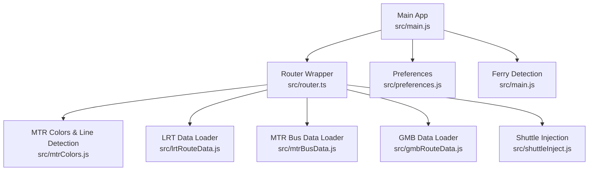

**Diagram sources**
- [main.js:1-200](file://src/main.js#L1-L200)
- [router.ts:1-120](file://src/router.ts#L1-L120)
- [mtrColors.js:1-120](file://src/mtrColors.js#L1-L120)
- [lrtRouteData.js:1-120](file://src/lrtRouteData.js#L1-L120)
- [mtrBusData.js:1-120](file://src/mtrBusData.js#L1-L120)
- [gmbRouteData.js:1-120](file://src/gmbRouteData.js#L1-L120)
- [shuttleInject.js:1-120](file://src/shuttleInject.js#L1-L120)

**Section sources**
- [main.js:1-200](file://src/main.js#L1-L200)
- [router.ts:1-120](file://src/router.ts#L1-L120)

## Core Components
- MTR line detection and color resolution:
  - Identifies heavy rail and light rail candidates by mode, agency, short names, and long name patterns.
  - Resolves brand colors for MTR lines; falls back to GTFS colors for non-rail.
- LRT route and stop sequence loader:
  - Loads CSV from bundled static, proxy, or direct source; merges overrides for peak-only routes.
  - Provides direction labels and ordered stops with coordinates when available.
- MTR feeder bus data loader:
  - Loads routes and stops CSVs; parses directions and stop sequences; supports nearby stop search.
- GMB route data loader:
  - Fetches region route codes, directions, and stop sequences via API; caches per route and direction.
- Router wrapper and filtering:
  - Wraps WASM RAPTOR planner; classifies each leg’s traffic method and bus company.
  - Applies user preferences to filter plans and adjust ranking.
- Preferences:
  - Stores and formats user selections for traffic methods and bus companies; builds RAPTOR modes string.
- Shuttle injection:
  - Injects synthetic plans for joint operator shuttles (e.g., S1) when missing from graph.
- Ferry detection:
  - Recognizes true ferry services by mode, agency, and route naming patterns.

**Section sources**
- [mtrColors.js:61-231](file://src/mtrColors.js#L61-L231)
- [lrtRouteData.js:176-429](file://src/lrtRouteData.js#L176-L429)
- [mtrBusData.js:197-539](file://src/mtrBusData.js#L197-L539)
- [gmbRouteData.js:42-265](file://src/gmbRouteData.js#L42-L265)
- [router.ts:307-563](file://src/router.ts#L307-L563)
- [preferences.js:36-544](file://src/preferences.js#L36-L544)
- [shuttleInject.js:25-501](file://src/shuttleInject.js#L25-L501)
- [main.js:4674-4703](file://src/main.js#L4674-L4703)

## Architecture Overview
The routing pipeline integrates multiple data sources and classification logic to produce filtered, ranked itineraries.

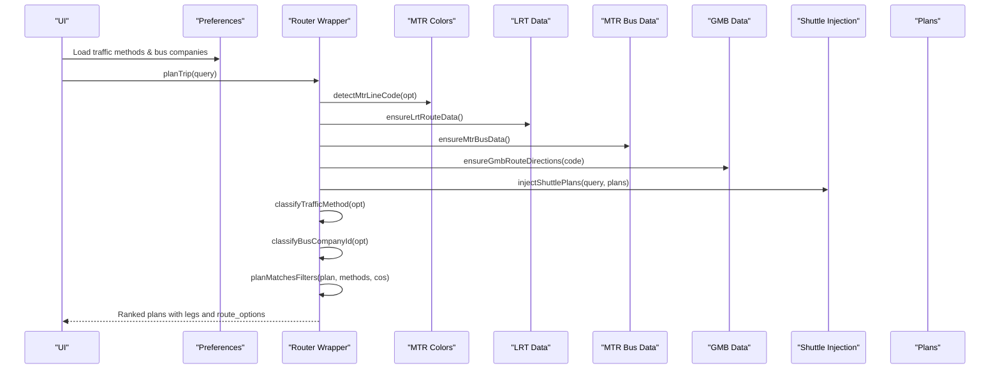

**Diagram sources**
- [router.ts:307-563](file://src/router.ts#L307-L563)
- [preferences.js:527-544](file://src/preferences.js#L527-L544)
- [mtrColors.js:61-231](file://src/mtrColors.js#L61-L231)
- [lrtRouteData.js:176-429](file://src/lrtRouteData.js#L176-L429)
- [mtrBusData.js:197-539](file://src/mtrBusData.js#L197-L539)
- [gmbRouteData.js:42-265](file://src/gmbRouteData.js#L42-L265)
- [shuttleInject.js:428-501](file://src/shuttleInject.js#L428-L501)

## Detailed Component Analysis

### MTR Line Detection and Color Resolution
- Candidate gating:
  - Excludes bus/trolleybus/ferry modes; includes rail-like modes and Light Rail indicators.
  - Uses agency name/id and short/long name patterns to avoid misclassifying bus routes that pass near MTR stations.
- Line code detection:
  - Prioritizes exact short codes; handles legacy WRL/MOL mapping to TML when long name indicates Tuen Ma.
  - Falls back to long-name regex hints and route_id suffixes.
- Color resolution:
  - For rail candidates, returns official brand hex; otherwise uses GTFS color.
  - Normalizes hex values and guards against generic MTR blue fallback.

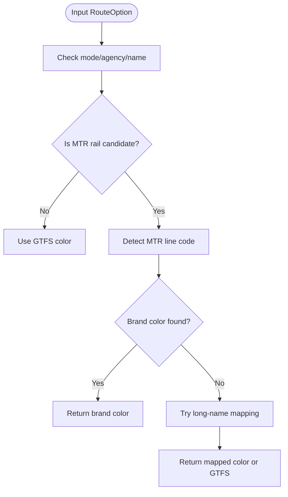

**Diagram sources**
- [mtrColors.js:61-231](file://src/mtrColors.js#L61-L231)

**Section sources**
- [mtrColors.js:61-231](file://src/mtrColors.js#L61-L231)

### Light Rail (LRT) Route and Stop Sequences
- Data loading strategy:
  - Attempts bundled CSV first, then proxy, then direct open data; validates headers and content length.
  - Merges local overrides for peak-only routes missing from open data.
- Direction and stop sequence:
  - Parses CSV into structured rows; maps directions O/I to 1/2; sorts by sequence.
  - Resolves coordinates via stop directory; keeps named stops even without coords.

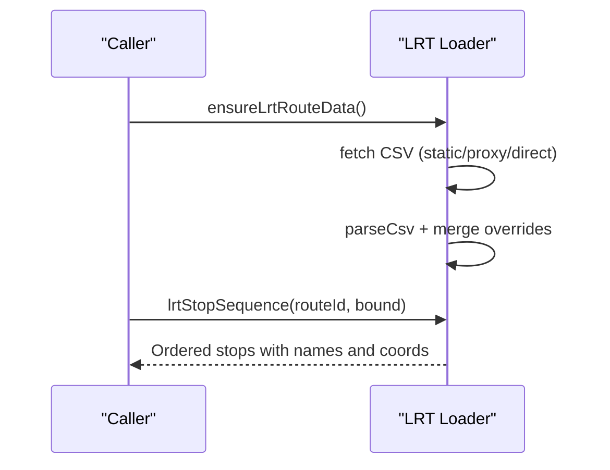

**Diagram sources**
- [lrtRouteData.js:176-429](file://src/lrtRouteData.js#L176-L429)

**Section sources**
- [lrtRouteData.js:176-429](file://src/lrtRouteData.js#L176-L429)

### MTR Feeder Bus Data
- Data loading:
  - Loads routes and stops CSVs concurrently; validates headers; caches parsed data.
- Directions and sequences:
  - Derives OD ends from stop sequences or route names; supports circular routes.
  - Returns ordered stops with coordinates when available.

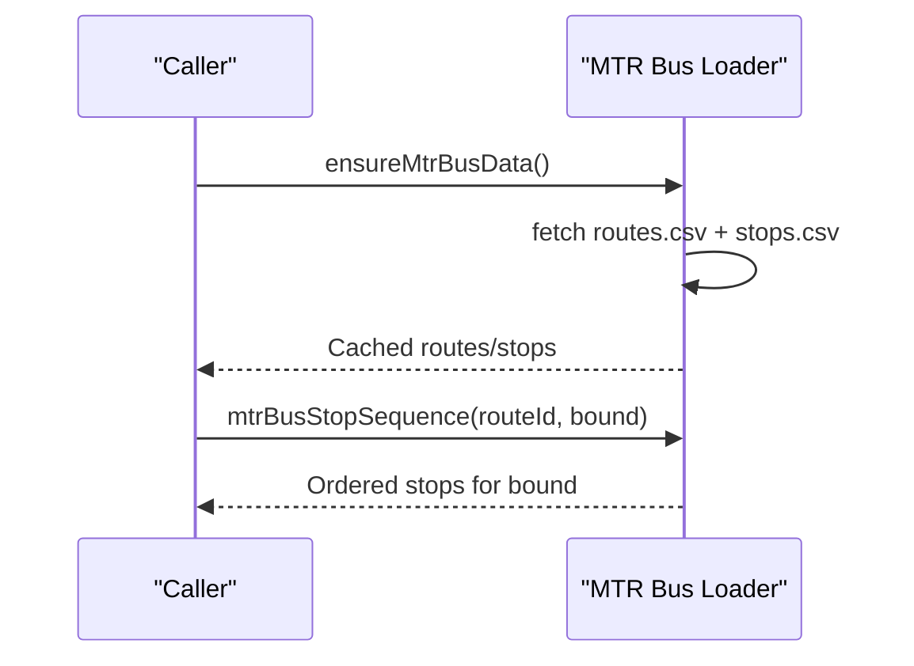

**Diagram sources**
- [mtrBusData.js:197-539](file://src/mtrBusData.js#L197-L539)

**Section sources**
- [mtrBusData.js:197-539](file://src/mtrBusData.js#L197-L539)

### Green Minibus (GMB) Data
- Route discovery:
  - Fetches region-to-route-code lists once; resolves regions for a given code.
- Directions and stops:
  - Loads direction slots per region; caches per route+seq; fetches stop sequences and optional coordinates.
  - Maps inbound/outbound to routeSeq 2/1.

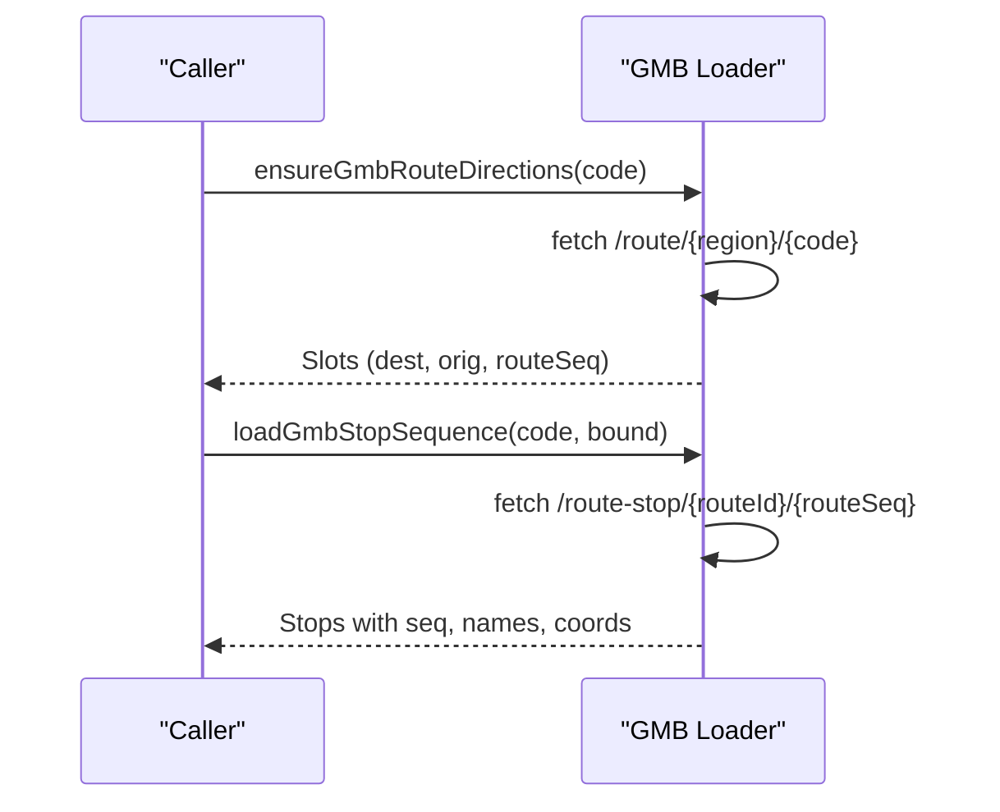

**Diagram sources**
- [gmbRouteData.js:42-265](file://src/gmbRouteData.js#L42-L265)

**Section sources**
- [gmbRouteData.js:42-265](file://src/gmbRouteData.js#L42-L265)

### Bus Company Classification
- Classification rules:
  - Matches agency id/name patterns for GMB, NLB, CTB/NWFB, and KMB/LWB.
  - Defaults unknown bus/trolleybus to KMB/LWB to allow inclusion unless explicitly excluded.
- Joint operations:
  - Extracts multiple company ids from route options’ agencies array or combined names.

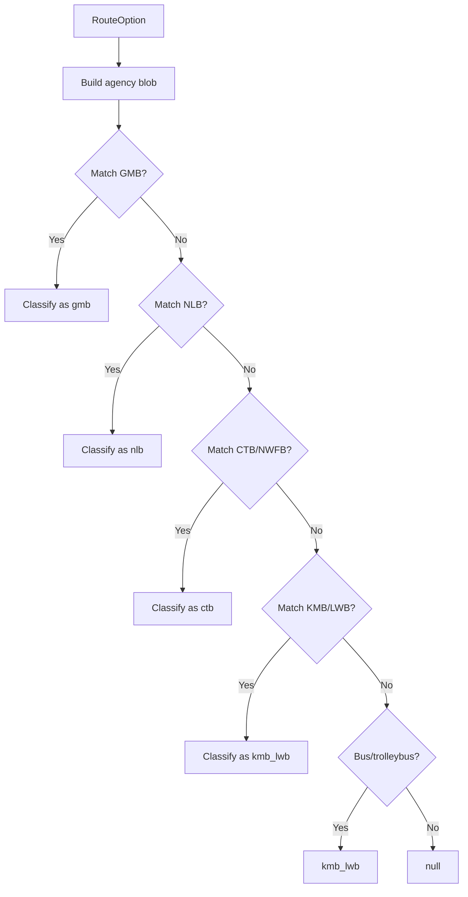

**Diagram sources**
- [router.ts:385-414](file://src/router.ts#L385-L414)
- [preferences.js:468-484](file://src/preferences.js#L468-L484)
- [shuttleInject.js:477-501](file://src/shuttleInject.js#L477-L501)

**Section sources**
- [router.ts:385-414](file://src/router.ts#L385-L414)
- [preferences.js:468-484](file://src/preferences.js#L468-L484)
- [shuttleInject.js:477-501](file://src/shuttleInject.js#L477-L501)

### Traffic Method Filtering
- Classification:
  - Maps route options to traffic methods: ael, lrt, mtr, gmb, bus, other.
  - Handles tramways vs Light Rail distinctions and excludes bus/trolleybus from ferry detection.
- Filtering logic:
  - Rejects plans containing disallowed methods; allows “other” only if bus/mtr/ael selected.
  - Enforces bus company filters including joint operations where any selected company matches.
  - Walk handling:
    - Allows station-scale access/egress walks when origin/destination are stations; rejects long egress when walk disabled.

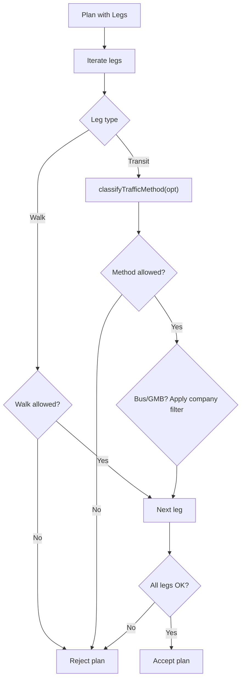

**Diagram sources**
- [router.ts:468-563](file://src/router.ts#L468-L563)
- [preferences.js:491-544](file://src/preferences.js#L491-L544)

**Section sources**
- [router.ts:468-563](file://src/router.ts#L468-L563)
- [preferences.js:491-544](file://src/preferences.js#L491-L544)

### Airport Express (AEL) Handling
- Detection:
  - Matches “airport express”, AEL code, or MTR-AEL identifiers in route metadata.
- Planning impact:
  - Plans using AEL are flagged; corridor touches influence ranking considerations.

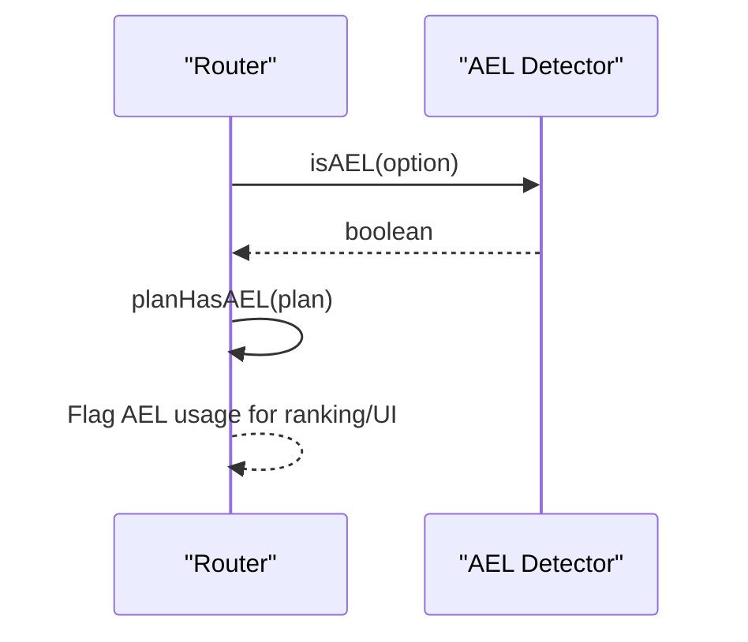

**Diagram sources**
- [router.ts:355-383](file://src/router.ts#L355-L383)

**Section sources**
- [router.ts:355-383](file://src/router.ts#L355-L383)

### Ferry Routes
- Detection:
  - True ferry services identified by mode=ferry, known ferry operators, or route titles indicating ferry products while excluding bus termini named “Ferry Pier”.
- Integration:
  - Ferries are always included in RAPTOR modes; they can be implicitly allowed even if not explicitly listed in UI filters.

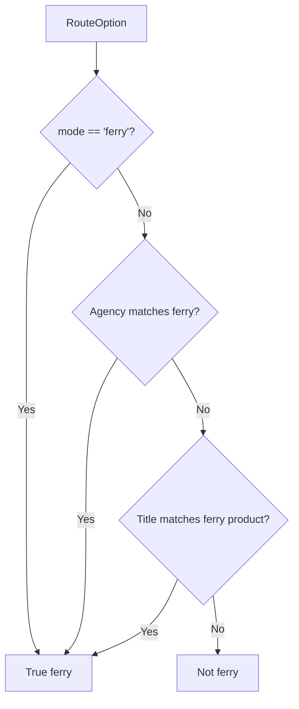

**Diagram sources**
- [main.js:4674-4703](file://src/main.js#L4674-L4703)
- [preferences.js:527-544](file://src/preferences.js#L527-L544)

**Section sources**
- [main.js:4674-4703](file://src/main.js#L4674-L4703)
- [preferences.js:527-544](file://src/preferences.js#L527-L544)

### Joint Operations and Shuttle Injection
- Challenge:
  - Some joint routes (e.g., S1 operated by CTB/KMB) appear as templates without frequencies in community GTFS, so the planner cannot board them.
- Solution:
  - Inject synthetic plans for known corridors (Tung Chung Station ↔ Airport/AsiaWorld-Expo) with realistic offsets and headways.
  - Mark injected plans and include multiple agencies for filtering and ETA lookup.

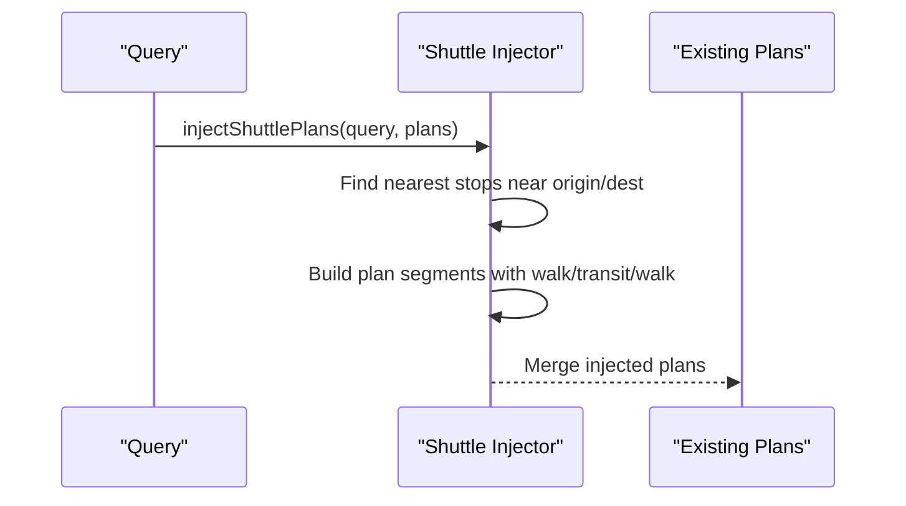

**Diagram sources**
- [shuttleInject.js:25-501](file://src/shuttleInject.js#L25-L501)

**Section sources**
- [shuttleInject.js:25-501](file://src/shuttleInject.js#L25-L501)

### Integration with Route Option Metadata and Stop Information
- Route options carry rich metadata:
  - IDs, names, modes, colors, agencies, from/to stops, and full stop sequences.
- Stop enrichment:
  - LRT and MTR bus loaders provide ordered stops with coordinates; GMB loader enriches stops with live ETA fields.
- UI presentation:
  - Colors resolve to brand hues for MTR lines; LRT and ferry routes get distinct visual treatment.
  - Directions and destinations derived from CSV/API data improve clarity on cards and detail views.

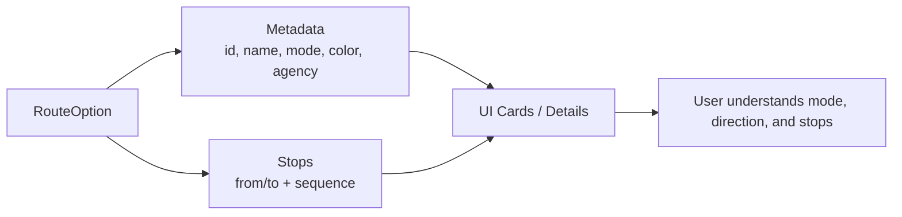

**Diagram sources**
- [router.ts:155-177](file://src/router.ts#L155-L177)
- [lrtRouteData.js:293-429](file://src/lrtRouteData.js#L293-L429)
- [mtrBusData.js:398-498](file://src/mtrBusData.js#L398-L498)
- [gmbRouteData.js:173-265](file://src/gmbRouteData.js#L173-L265)

**Section sources**
- [router.ts:155-177](file://src/router.ts#L155-L177)
- [lrtRouteData.js:293-429](file://src/lrtRouteData.js#L293-L429)
- [mtrBusData.js:398-498](file://src/mtrBusData.js#L398-L498)
- [gmbRouteData.js:173-265](file://src/gmbRouteData.js#L173-L265)

## Dependency Analysis
Key dependencies and interactions:
- Router depends on mode detection utilities (MTR colors, LRT detection) and preference-driven mode strings.
- Data loaders are independent but feed consistent structures used by router and UI.
- Shuttle injection augments plans post-planning to cover gaps in GTFS coverage.
- Ferry detection complements preferences to ensure island connectivity remains viable.

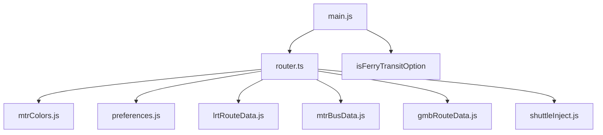

**Diagram sources**
- [router.ts:1-120](file://src/router.ts#L1-L120)
- [preferences.js:527-544](file://src/preferences.js#L527-L544)
- [mtrColors.js:61-231](file://src/mtrColors.js#L61-L231)
- [lrtRouteData.js:176-429](file://src/lrtRouteData.js#L176-L429)
- [mtrBusData.js:197-539](file://src/mtrBusData.js#L197-L539)
- [gmbRouteData.js:42-265](file://src/gmbRouteData.js#L42-L265)
- [shuttleInject.js:428-501](file://src/shuttleInject.js#L428-L501)
- [main.js:4674-4703](file://src/main.js#L4674-L4703)

**Section sources**
- [router.ts:1-120](file://src/router.ts#L1-L120)
- [preferences.js:527-544](file://src/preferences.js#L527-L544)

## Performance Considerations
- Data loading:
  - Prefer bundled static CSVs for COEP safety; fall back to proxy/direct with caching strategies.
  - Cache parsed route/stop data to avoid repeated network calls.
- Filtering:
  - Early rejection of plans with disallowed methods reduces downstream processing.
  - Joint operation company matching avoids unnecessary rejections.
- Ranking:
  - Human-centric penalties/bonuses (bus transfers, MTR interchanges, LRT network bonus) guide efficient plan selection.

[No sources needed since this section provides general guidance]

## Troubleshooting Guide
- LRT CSV failures:
  - If all sources fail, module falls back to local overrides; check console logs for source used and row counts.
- GMB directions unavailable:
  - Region mismatch may occur; loader tries HKI/KLN/NT sequentially; verify route code existence.
- Bus company misclassification:
  - Ensure agency names/ids match expected patterns; joint routes rely on agencies array or combined names.
- Walk filtering too strict:
  - When walk disabled, long egress/ingress walks are rejected; mark destination as station to allow platform-level walks.

**Section sources**
- [lrtRouteData.js:176-287](file://src/lrtRouteData.js#L176-L287)
- [gmbRouteData.js:90-166](file://src/gmbRouteData.js#L90-L166)
- [router.ts:468-563](file://src/router.ts#L468-L563)

## Conclusion
The transit mode classification system robustly identifies and categorizes transportation modes using layered heuristics and data sources. MTR lines are detected via mode, agency, and naming patterns with brand color resolution. Bus companies are classified through agency metadata and joint operation support. Traffic method and company filters enable precise control over route planning outcomes. Complex scenarios like joint operations, airport express services, and ferry routes are handled through specialized detection and synthetic plan injection. The result is a flexible, user-configurable routing experience that integrates seamlessly with stop information and route option metadata for clear UI presentation.

[No sources needed since this section summarizes without analyzing specific files]

## Appendices

### Example Scenarios

- Joint operations (S1):
  - Synthetic plans bridge gaps where GTFS lacks frequencies; injected plans include both CTB and KMB agencies for filtering and ETA.
  - See shuttle route definition and injection logic.

- Airport Express services:
  - AEL detection flags special rail service; plans touching airport corridors receive tailored ranking considerations.

- Ferry routes:
  - True ferry services recognized by mode and operator names; always enabled in RAPTOR modes to preserve island connectivity.

**Section sources**
- [shuttleInject.js:25-501](file://src/shuttleInject.js#L25-L501)
- [router.ts:355-383](file://src/router.ts#L355-L383)
- [main.js:4674-4703](file://src/main.js#L4674-L4703)