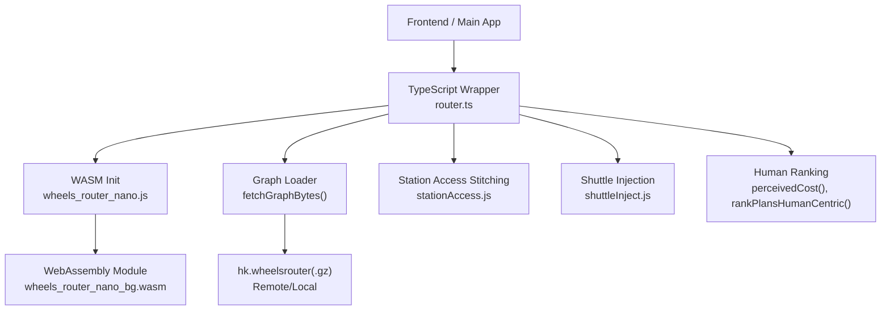
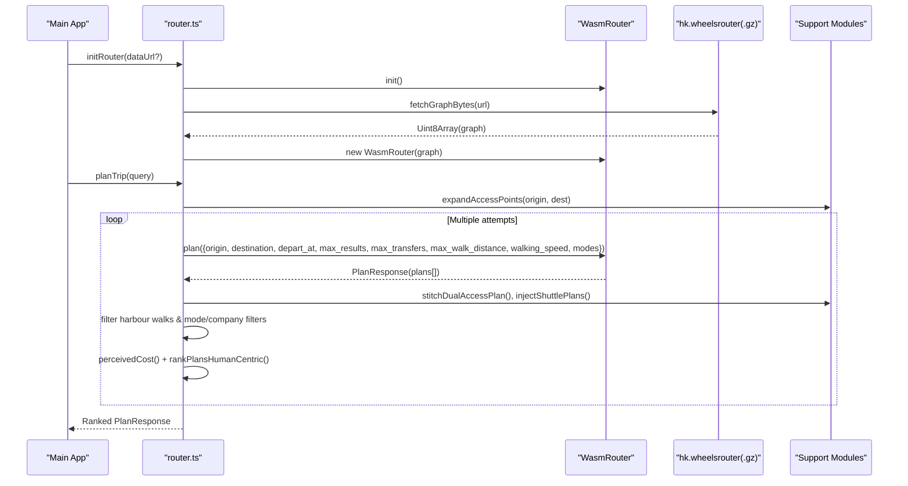
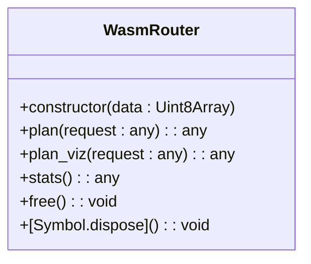
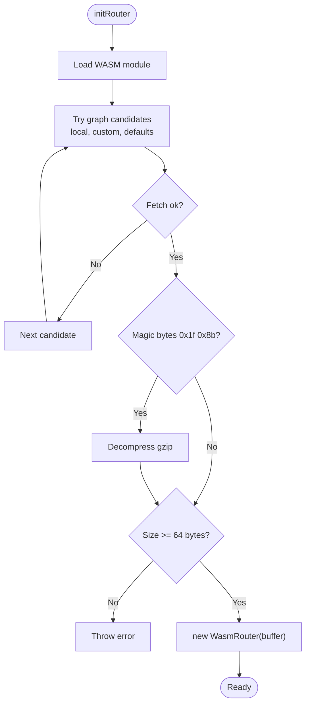
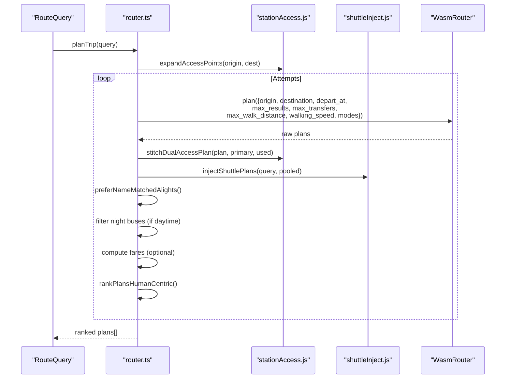
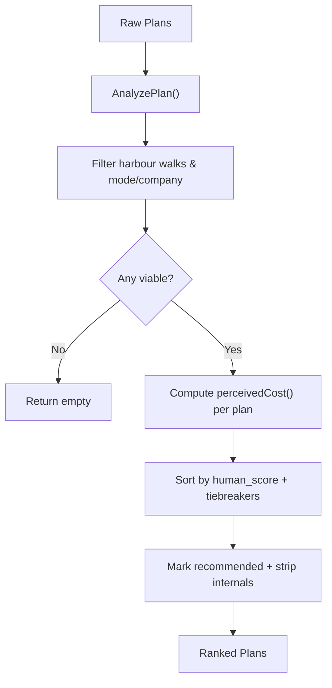
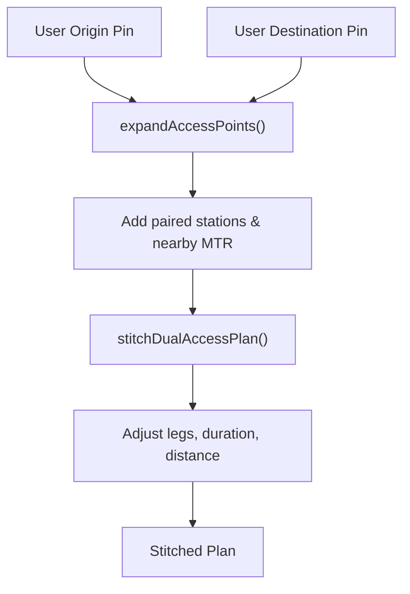
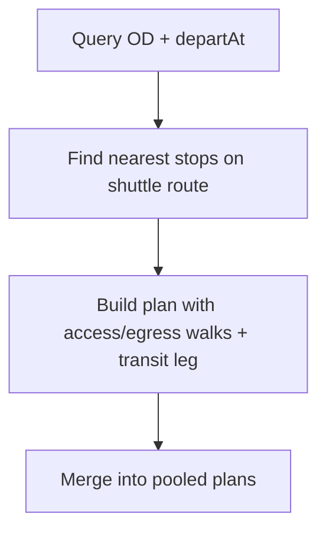
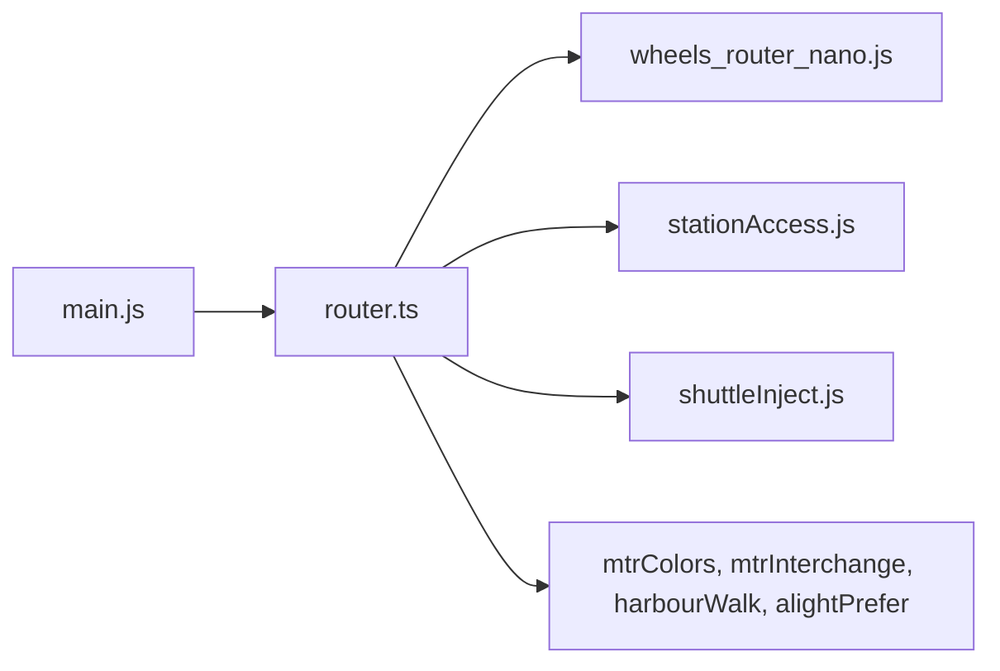

# WASM RAPTOR Algorithm Implementation

<cite>
**Referenced Files in This Document**
- [wheels_router_nano.d.ts](file://src/pkg/wheels_router_nano.d.ts)
- [wheels_router_nano.js](file://src/pkg/wheels_router_nano.js)
- [router.ts](file://src/router.ts)
- [main.js](file://src/main.js)
- [stationAccess.js](file://src/stationAccess.js)
- [shuttleInject.js](file://src/shuttleInject.js)
- [package.json](file://package.json)
</cite>

## Table of Contents
1. [Introduction](#introduction)
2. [Project Structure](#project-structure)
3. [Core Components](#core-components)
4. [Architecture Overview](#architecture-overview)
5. [Detailed Component Analysis](#detailed-component-analysis)
6. [Dependency Analysis](#dependency-analysis)
7. [Performance Considerations](#performance-considerations)
8. [Troubleshooting Guide](#troubleshooting-guide)
9. [Conclusion](#conclusion)
10. [Appendices](#appendices)

## Introduction
This document explains the WASM-based RAPTOR (Rapid All-Pairs Transit Routing) implementation used by MORGAN Travelers to plan multi-modal transit journeys across Hong Kong’s network, including MTR, Light Rail, buses, minibuses, and ferries. It covers how the compiled Rust engine is loaded from hk.wheelsrouter graph files, how queries are constructed and executed, and how results are ranked with human-centric rules. It also documents the wheels_router_nano API surface, memory management, error handling, and integration patterns with the TypeScript wrapper layer.

## Project Structure
The routing stack is composed of:
- A WebAssembly module exposing a WasmRouter class for loading a binary routing graph and executing route planning queries.
- A TypeScript wrapper that initializes the WASM module, loads the hk.wheelsrouter graph (plain or gzip), builds query parameters, executes multiple attempts, and applies human-centric ranking and filtering.
- Supporting modules for dual-access station stitching, synthetic shuttle injection, and mode classification.

**Diagram sources**
- [router.ts:207-249](file://src/router.ts#L207-L249)
- [router.ts:1429-1453](file://src/router.ts#L1429-L1453)
- [wheels_router_nano.js:466-490](file://src/pkg/wheels_router_nano.js#L466-L490)
- [stationAccess.js:92-141](file://src/stationAccess.js#L92-L141)
- [shuttleInject.js:428-470](file://src/shuttleInject.js#L428-L470)

**Section sources**
- [package.json:1-37](file://package.json#L1-L37)
- [router.ts:179-249](file://src/router.ts#L179-L249)
- [wheels_router_nano.js:466-490](file://src/pkg/wheels_router_nano.js#L466-L490)

## Core Components
- WasmRouter (WASM glue): Provides initialization, graph loading via constructor, plan execution, visualization plan, stats retrieval, and explicit memory free/disposal.
- TypeScript router wrapper: Orchestrates graph loading, query construction, multi-attempt planning, access-point expansion, shuttle injection, and human-centric ranking.
- Station access module: Expands origin/destination into nearby MTR stations and dual-access complexes; stitches indoor/outdoor walks to align plans with user pins.
- Shuttle injection module: Synthesizes missing multi-operator routes (e.g., S1) when GTFS templates lack frequencies.

Key responsibilities:
- Load hk.wheelsrouter (plain or gzip) into WASM memory.
- Execute RAPTOR queries with modes, walking speed, max transfers, and max walk distance.
- Filter out impossible harbour walks and enforce traffic method/bus company filters.
- Rank plans using time, transfers, walking, fare hints, and domain-specific penalties/bonuses.

**Section sources**
- [wheels_router_nano.d.ts:4-11](file://src/pkg/wheels_router_nano.d.ts#L4-L11)
- [wheels_router_nano.js:17-59](file://src/pkg/wheels_router_nano.js#L17-L59)
- [router.ts:1138-1389](file://src/router.ts#L1138-L1389)
- [stationAccess.js:92-141](file://src/stationAccess.js#L92-L141)
- [shuttleInject.js:428-470](file://src/shuttleInject.js#L428-L470)

## Architecture Overview
The system follows a layered architecture:
- Initialization layer: Loads the WASM module and the hk.wheelsrouter graph.
- Query layer: Builds RAPTOR requests with origin/destination coordinates, departure time, modes, walking constraints, and result limits.
- Execution layer: Calls WasmRouter.plan() to obtain candidate plans.
- Post-processing layer: Stitches dual-access walks, injects shuttles, filters invalid plans, and ranks them with human-centric scoring.

**Diagram sources**
- [router.ts:207-249](file://src/router.ts#L207-L249)
- [router.ts:1138-1389](file://src/router.ts#L1138-L1389)
- [wheels_router_nano.js:17-59](file://src/pkg/wheels_router_nano.js#L17-L59)
- [stationAccess.js:155-235](file://src/stationAccess.js#L155-L235)
- [shuttleInject.js:428-470](file://src/shuttleInject.js#L428-L470)

## Detailed Component Analysis

### WASM Router Interface (wheels_router_nano)
The generated JS glue exposes:
- Constructor accepting a Uint8Array of the binary graph.
- plan(request) returning a PlanResponse object.
- plan_viz(request) for visualization-oriented plans.
- stats() returning graph statistics (stops, routes, trips, services).
- free() and Symbol.dispose for explicit memory release.

Initialization supports both async and sync instantiation of the WASM module, with automatic fetching of the .wasm file if not provided.

**Diagram sources**
- [wheels_router_nano.d.ts:4-11](file://src/pkg/wheels_router_nano.d.ts#L4-L11)
- [wheels_router_nano.js:17-59](file://src/pkg/wheels_router_nano.js#L17-L59)

**Section sources**
- [wheels_router_nano.d.ts:4-11](file://src/pkg/wheels_router_nano.d.ts#L4-L11)
- [wheels_router_nano.js:17-59](file://src/pkg/wheels_router_nano.js#L17-L59)
- [wheels_router_nano.js:466-490](file://src/pkg/wheels_router_nano.js#L466-L490)

### Graph Loading and Initialization
- The wrapper calls init() to load the WASM module.
- It then tries multiple graph candidates: local gzipped file, custom URL, default remote URLs.
- fetchGraphBytes downloads bytes, auto-detects gzip via magic bytes, decompresses using DecompressionStream, and validates minimum size.
- On success, a WasmRouter instance is created with the graph buffer; stats are logged.

**Diagram sources**
- [router.ts:207-249](file://src/router.ts#L207-L249)
- [router.ts:1429-1453](file://src/router.ts#L1429-L1453)

**Section sources**
- [router.ts:207-249](file://src/router.ts#L207-L249)
- [router.ts:1429-1453](file://src/router.ts#L1429-L1453)

### Query Construction and Multi-Attempt Planning
- planTrip builds a context with preferences, traffic methods, bus companies, and station hints.
- It expands origins/destinations to include dual-access stations and nearby MTR stops.
- It constructs multiple attempts with varying max_results, max_transfers, max_walk_distance, and walking_speed to balance coverage and performance.
- For each attempt, it calls WasmRouter.plan() per OD pair, stitches dual-access walks, injects shuttles, adjusts alight stops, filters night buses during daytime, optionally computes fares, and ranks results.

**Diagram sources**
- [router.ts:1138-1389](file://src/router.ts#L1138-L1389)
- [stationAccess.js:155-235](file://src/stationAccess.js#L155-L235)
- [shuttleInject.js:428-470](file://src/shuttleInject.js#L428-L470)

**Section sources**
- [router.ts:1138-1389](file://src/router.ts#L1138-L1389)

### Human-Centric Ranking and Filtering
- AnalyzePlan extracts transfer counts, walk meters, MTR-only flags, LRT usage, street vs station transfers, and free interchange walks.
- PerceivedCost blends time, transfers, walking, fare hints, and domain-specific bonuses/penalties (e.g., MTR-only bonus, LRT preference, Airport Express corridor adjustments, cross-harbour walk penalty).
- rankPlansHumanCentric drops harbour walks and plans violating mode/company filters, sorts by human_score and tiebreakers, marks recommended plan, and strips internal fields.

**Diagram sources**
- [router.ts:649-823](file://src/router.ts#L649-L823)
- [router.ts:829-971](file://src/router.ts#L829-L971)
- [router.ts:1028-1128](file://src/router.ts#L1028-L1128)

**Section sources**
- [router.ts:649-823](file://src/router.ts#L649-L823)
- [router.ts:829-971](file://src/router.ts#L829-L971)
- [router.ts:1028-1128](file://src/router.ts#L1028-L1128)

### Dual-Access Station Stitching
- expandAccessPoints adds paired stations (Central ↔ Hong Kong, TST ↔ East TST, Airport ↔ AsiaWorld-Expo) and nearest MTR within ~520m for POIs/hotels.
- stitchDualAccessPlan prepends/appends walks between user pin and the pin actually used by RAPTOR, adjusting durations and distances and marking free/indoor links.

**Diagram sources**
- [stationAccess.js:92-141](file://src/stationAccess.js#L92-L141)
- [stationAccess.js:155-235](file://src/stationAccess.js#L155-L235)

**Section sources**
- [stationAccess.js:92-141](file://src/stationAccess.js#L92-L141)
- [stationAccess.js:155-235](file://src/stationAccess.js#L155-L235)

### Synthetic Shuttle Injection
- For multi-operator routes like S1 (CTB/KMB) that lack frequencies in GTFS, the wrapper synthesizes direct plans when OD matches corridor endpoints.
- It finds nearest stops within access radius, builds walk/transit/walk legs, aligns start times to headway grids, and merges into the plan pool.

**Diagram sources**
- [shuttleInject.js:242-330](file://src/shuttleInject.js#L242-L330)
- [shuttleInject.js:361-419](file://src/shuttleInject.js#L361-L419)
- [shuttleInject.js:428-470](file://src/shuttleInject.js#L428-L470)

**Section sources**
- [shuttleInject.js:242-330](file://src/shuttleInject.js#L242-L330)
- [shuttleInject.js:361-419](file://src/shuttleInject.js#L361-L419)
- [shuttleInject.js:428-470](file://src/shuttleInject.js#L428-L470)

## Dependency Analysis
- router.ts depends on:
  - wheels_router_nano.js for WASM interface and initialization.
  - stationAccess.js for dual-access expansion and stitching.
  - shuttleInject.js for synthetic multi-operator routes.
  - mtrColors.js, mtrInterchange.js, harbourWalk.js, alightPrefer.js for mode detection, interchange logic, harbour walk checks, and alight stop preference.
- main.js bootstraps router initialization and displays status.

**Diagram sources**
- [main.js:6278-6309](file://src/main.js#L6278-L6309)
- [router.ts:13-33](file://src/router.ts#L13-L33)

**Section sources**
- [main.js:6278-6309](file://src/main.js#L6278-L6309)
- [router.ts:13-33](file://src/router.ts#L13-L33)

## Performance Considerations
- WASM compilation: The core RAPTOR engine runs in WebAssembly for high-performance graph traversal and all-pairs search.
- Graph loading: Supports plain and gzip-encoded graphs; gzip reduces bandwidth and improves load time.
- Multi-attempt planning: Balances coverage with performance by varying max_results, max_transfers, max_walk_distance, and walking speed.
- Mode string: Explicitly includes subway, rail, tram, light_rail, monorail, bus, trolleybus, ferry, cable_tram, funicular to ensure full HK multi-modal coverage.
- Memory management: Uses FinalizationRegistry to free WASM resources; explicit free() and Symbol.dispose available.
- Streaming instantiation: Uses WebAssembly.instantiateStreaming when possible for faster module load.

[No sources needed since this section provides general guidance]

## Troubleshooting Guide
Common issues and resolutions:
- Graph download failures: Ensure network connectivity and correct CORS settings; verify server serves application/wasm for .wasm and proper MIME types for .gz.
- Gzip decompression errors: Requires browser support for DecompressionStream; fallback is not implemented.
- Small graph payload: Minimum size validation prevents corrupt or incomplete graphs.
- Router not initialized: planTrip throws if WasmRouter instance is absent; call initRouter first.
- Harbour walk plans: These are filtered out; adjust walking constraints or use transit options.
- Night bus plans during daytime: Suppressed unless only night buses exist; consider relaxing filters or changing departure time.

Error handling highlights:
- Graph fetch errors throw descriptive messages with URL and status.
- WASM constructor and plan methods propagate errors via externref table and throw JavaScript Errors.
- Initialization guards prevent duplicate init and expose readiness via isRouterReady().

**Section sources**
- [router.ts:207-249](file://src/router.ts#L207-L249)
- [router.ts:1138-1141](file://src/router.ts#L1138-L1141)
- [router.ts:1429-1453](file://src/router.ts#L1429-L1453)
- [wheels_router_nano.js:17-59](file://src/pkg/wheels_router_nano.js#L17-L59)

## Conclusion
The WASM-based RAPTOR implementation delivers fast, accurate multi-modal transit routing for Hong Kong by combining a compiled Rust engine with a robust TypeScript wrapper. The system efficiently loads hk.wheelsrouter graphs, executes RAPTOR queries with flexible constraints, and applies human-centric ranking to produce practical itineraries. Support for dual-access stations, synthetic shuttles, and comprehensive mode coverage ensures reliable results across MTR, Light Rail, buses, minibuses, and ferries.

[No sources needed since this section summarizes without analyzing specific files]

## Appendices

### API Interfaces Summary
- WasmRouter
  - constructor(data: Uint8Array): Initializes the engine with a binary graph.
  - plan(request: any): Executes a RAPTOR query and returns plans.
  - plan_viz(request: any): Returns visualization-friendly plans.
  - stats(): Returns graph statistics (stops, routes, trips, services).
  - free(): Releases WASM memory; also exposed via Symbol.dispose.
- TypeScript Wrapper
  - initRouter(dataUrl?): Loads WASM and graph; returns Promise<void>.
  - getRouterStats(): Returns RouterStats or null.
  - planTrip(query: RouteQuery): Returns PlanResponse with ranked plans.
  - Utility functions: isRouterReady(), getGraphSource(), analyzePlan(), perceivedCost(), rankPlansHumanCentric().

**Section sources**
- [wheels_router_nano.d.ts:4-11](file://src/pkg/wheels_router_nano.d.ts#L4-L11)
- [router.ts:114-123](file://src/router.ts#L114-L123)
- [router.ts:191-202](file://src/router.ts#L191-L202)
- [router.ts:207-249](file://src/router.ts#L207-L249)
- [router.ts:1138-1389](file://src/router.ts#L1138-L1389)

### Example Usage Patterns
- Initialize the router and load the graph:
  - Call initRouter with a preferred URL or rely on defaults; handle errors and display status.
- Execute a route planning query:
  - Provide origin/destination coordinates, optional departure time, preferences (fastest/simplest/cheapest), traffic methods, bus companies, and walking constraints.
- Process results:
  - Use ranked plans to display itineraries; leverage metadata such as transfer counts, walk meters, and recommended flag.

**Section sources**
- [main.js:6278-6309](file://src/main.js#L6278-L6309)
- [router.ts:1138-1389](file://src/router.ts#L1138-L1389)