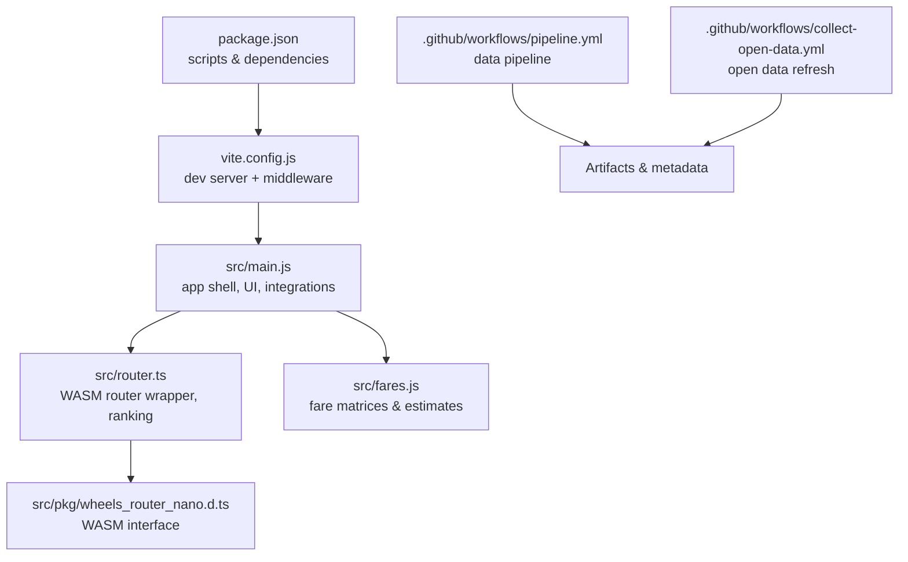
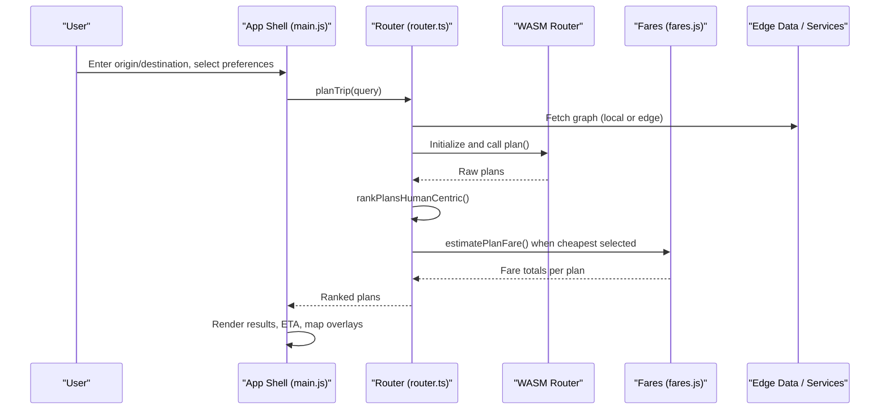
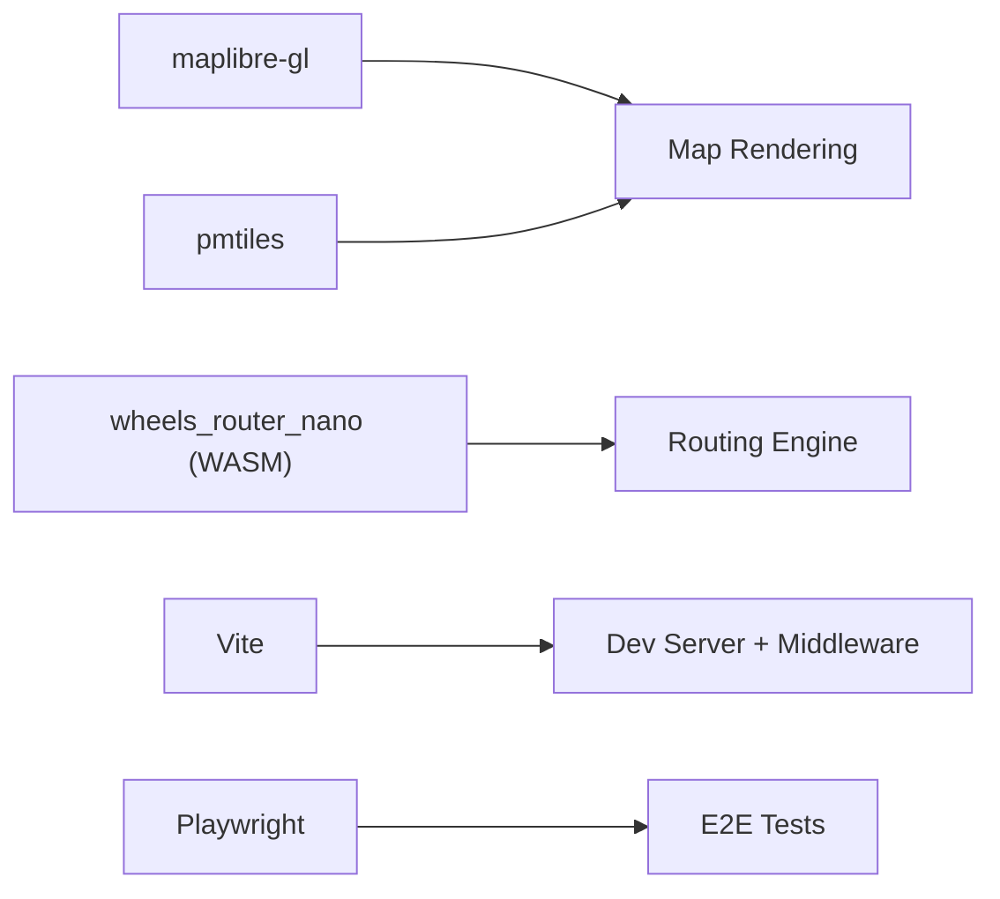

# Testing and Quality Assurance

<cite>
**Referenced Files in This Document**
- [package.json](file://package.json)
- [vite.config.js](file://vite.config.js)
- [pipeline.yml](file://.github/workflows/pipeline.yml)
- [collect-open-data.yml](file://.github/workflows/collect-open-data.yml)
- [main.js](file://src/main.js)
- [router.ts](file://src/router.ts)
- [fares.js](file://src/fares.js)
- [wheels_router_nano.d.ts](file://src/pkg/wheels_router_nano.d.ts)
</cite>

## Table of Contents
1. Introduction
2. Project Structure
3. Core Components
4. Architecture Overview
5. Detailed Component Analysis
6. Dependency Analysis
7. Performance Considerations
8. Troubleshooting Guide
9. Conclusion

## Introduction
This document describes the testing and quality assurance practices for MorganTraveler, a Hong Kong transit PWA that combines MapLibre maps, PMTiles, and a WASM-based routing engine. It focuses on:
- End-to-end (E2E) testing strategy using Playwright for critical user journeys such as route planning, real-time information display, and offline functionality.
- Unit testing approaches for core algorithms including routing calculations, fare computations, and data validation logic.
- Performance testing methodologies to measure routing algorithm efficiency, map rendering performance, and memory usage optimization.
- Continuous integration practices for automated testing, code quality checks, and deployment validation.
- Debugging techniques for identifying performance bottlenecks, memory leaks, and user experience issues.
- Accessibility testing ensuring compliance with WCAG guidelines and inclusive design principles.

## Project Structure
The project uses Vite for development and build, Playwright as a dev dependency for E2E testing, and GitHub Actions workflows for data pipeline automation and artifact publishing. The application initializes a MapLibre map, loads routing graphs, and integrates fare estimation and ETA features.

**Diagram sources**
- [package.json:1-37](file://package.json#L1-L37)
- [vite.config.js:773-800](file://vite.config.js#L773-L800)
- [main.js:1-120](file://src/main.js#L1-L120)
- [router.ts:180-249](file://src/router.ts#L180-L249)
- [fares.js:460-503](file://src/fares.js#L460-L503)
- [wheels_router_nano.d.ts:1-39](file://src/pkg/wheels_router_nano.d.ts#L1-L39)
- [pipeline.yml:1-183](file://.github/workflows/pipeline.yml#L1-L183)
- [collect-open-data.yml:1-220](file://.github/workflows/collect-open-data.yml#L1-L220)

**Section sources**
- [package.json:1-37](file://package.json#L1-L37)
- [vite.config.js:773-800](file://vite.config.js#L773-L800)

## Core Components
- Routing engine: WASM RAPTOR wrapper that loads graph assets, plans trips, and applies human-centric ranking rules.
- Fare estimation: Multi-type matrices for MTR/AEL/LRT/MTR Bus and full-journey bus/ferry fares with interchange discounts and ticket type scaling.
- App shell: Initializes MapLibre, overlays transit layers, handles search/geocoding, preferences, ETA, and route visualization.

Key responsibilities:
- Router initialization and plan execution with retries and dual-access origin/destination handling.
- Human-centric ranking blending time, transfers, walking, fare, and network preferences.
- Fare pack loading, matrix selection by ticket type, and per-leg fare computation.

**Section sources**
- [router.ts:180-249](file://src/router.ts#L180-L249)
- [router.ts:825-971](file://src/router.ts#L825-L971)
- [router.ts:1138-1389](file://src/router.ts#L1138-L1389)
- [fares.js:460-503](file://src/fares.js#L460-L503)
- [fares.js:643-783](file://src/fares.js#L643-L783)
- [main.js:1-120](file://src/main.js#L1-L120)

## Architecture Overview
The end-to-end flow spans UI interactions, routing, fare estimation, and data services.

**Diagram sources**
- [main.js:1-120](file://src/main.js#L1-L120)
- [router.ts:1138-1389](file://src/router.ts#L1138-L1389)
- [fares.js:460-503](file://src/fares.js#L460-L503)

## Detailed Component Analysis

### E2E Testing Strategy with Playwright
- Scope: Critical user journeys including route planning, real-time ETA display, and offline behavior via service worker and cached assets.
- Environment: Use Vite’s dev server configured with cross-origin isolation headers and proxying for edge assets; ensure COEP/CORP are set so WASM and shared workers operate correctly.
- Test categories:
  - Route planning: Validate query submission, result rendering, recommended plan selection, and preference toggles (fastest/simplest/cheapest).
  - Real-time information: Verify ETA cards update, live vs scheduled states, and platform indicators.
  - Offline functionality: Confirm app shell availability, map tiles load from cache, and routing works with local graph fallbacks.
- Execution: Install Playwright browsers once in CI; run tests against a built preview server or dev server; capture screenshots/videos on failure.

Practical notes:
- Ensure the dev server serves the graph under the expected path and headers; use the same-origin proxy in localhost to satisfy COEP requirements.
- For offline tests, simulate network throttling or disable network to validate cached resources and SW behavior.

**Section sources**
- [vite.config.js:111-120](file://vite.config.js#L111-L120)
- [vite.config.js:773-800](file://vite.config.js#L773-L800)
- [package.json:32-35](file://package.json#L32-L35)

### Unit Testing Approaches
Focus areas:
- Routing calculations: Validate plan filtering, transfer counting, walk meter aggregation, night-bus detection, and human-centric scoring.
- Fare computations: Validate matrix selection by ticket type, station name normalization, LRT stop ID resolution, and per-leg fare estimates.
- Data validation: Validate inputs to planTrip, fare estimators, and preference parsing.

Recommended test structure:
- Isolate pure functions in router.ts and fares.js for unit tests.
- Mock external dependencies (fetch for graph/fare packs, localStorage for preferences).
- Assert deterministic outputs for known inputs (e.g., specific plans and fare matrices).

Example targets:
- analyzePlan, perceivedCost, planMatchesFilters, isNightBusRouteName, normalizeStationName, resolveLrtStationId, estimateBusBoardFare.

**Section sources**
- [router.ts:598-615](file://src/router.ts#L598-L615)
- [router.ts:825-971](file://src/router.ts#L825-L971)
- [router.ts:973-1022](file://src/router.ts#L973-L1022)
- [fares.js:505-576](file://src/fares.js#L505-L576)
- [fares.js:750-783](file://src/fares.js#L750-L783)
- [fares.js:2312-2356](file://src/fares.js#L2312-L2356)

### Performance Testing Methodologies
Routing algorithm efficiency:
- Measure planTrip latency across multiple attempts and OD pairs; track WASM plan() calls and ranking overhead.
- Validate retry strategies and candidate pool sizes for MTR-only and LRT catchment scenarios.

Map rendering performance:
- Monitor MapLibre layer updates, tile fetches, and worker initialization; ensure COEP/CORP headers do not block workers.
- Profile paint times during heavy route overlays and interactive pan/zoom.

Memory usage optimization:
- Track WASM instance lifecycle and memory growth; ensure proper disposal and avoid repeated large allocations.
- Inspect browser memory snapshots during long sessions and after many route queries.

Metrics to collect:
- Time to first plan, median and p95 plan latency, number of WASM plan calls, memory delta before/after queries, FPS during map interactions.

**Section sources**
- [router.ts:1138-1389](file://src/router.ts#L1138-L1389)
- [vite.config.js:111-120](file://vite.config.js#L111-L120)
- [main.js:189-210](file://src/main.js#L189-L210)

### Continuous Integration Practices
Automated pipelines:
- GTFS data pipeline: Builds/collapses artifacts, generates metadata, syncs to storage, and posts status notifications.
- Open data collection: Periodically downloads mutable data sources, rebuilds fare packs, checksums products, and opens PRs when changes occur.

Quality gates:
- Enforce presence of required artifacts (GTFS, PMTiles, graph).
- Validate fare pack integrity (matrix sizes, versioning).
- Upload artifacts and publish metadata with appropriate cache headers.

Deployment validation:
- Use workflow artifacts to verify builds and data freshness.
- Post webhook notifications with status and metadata summaries for visibility.

**Section sources**
- [pipeline.yml:1-183](file://.github/workflows/pipeline.yml#L1-L183)
- [collect-open-data.yml:1-220](file://.github/workflows/collect-open-data.yml#L1-L220)

### Debugging Techniques
Performance bottlenecks:
- Instrument planTrip attempts and ranking steps; log attempt parameters and result counts.
- Capture timing around WASM plan() calls and fare estimator invocations.

Memory leaks:
- Inspect WASM instance reuse and ensure no lingering references to large buffers.
- Use browser DevTools Memory panel to identify retained objects after route queries.

User experience issues:
- Validate COEP/CORP headers in dev and preview servers to prevent silent failures in workers.
- Check error paths for graph fetch and fare pack loading; surface actionable messages to users.

Operational debugging:
- Review workflow logs for data pipeline failures and artifact availability.
- Use checksums and manifests to detect drift in public data products.

**Section sources**
- [router.ts:213-249](file://src/router.ts#L213-L249)
- [router.ts:1271-1389](file://src/router.ts#L1271-L1389)
- [fares.js:460-503](file://src/fares.js#L460-L503)
- [vite.config.js:111-120](file://vite.config.js#L111-L120)

### Accessibility Testing
Goals:
- Ensure WCAG compliance for keyboard navigation, screen reader labels, color contrast, and focus management.
- Validate ARIA attributes on dynamic components (plan cards, ETA lists, settings sheets).

Approach:
- Automated checks with accessibility linters and axe-core in E2E tests.
- Manual audits with screen readers and keyboard-only navigation.
- Verify that dynamic content updates announce changes to assistive technologies.

**Section sources**
- [main.js:214-295](file://src/main.js#L214-L295)

## Dependency Analysis
Core runtime dependencies and their roles:
- MapLibre GL for map rendering and controls.
- PMTiles protocol for efficient tile serving.
- WASM RAPTOR for fast multi-modal routing.
- Vite for dev/build tooling and custom middleware for COEP/CORP and API proxies.

**Diagram sources**
- [package.json:27-35](file://package.json#L27-L35)
- [wheels_router_nano.d.ts:1-39](file://src/pkg/wheels_router_nano.d.ts#L1-L39)

**Section sources**
- [package.json:27-35](file://package.json#L27-L35)

## Performance Considerations
- Prefer caching strategies that minimize re-fetching of large assets (graphs, PMTiles).
- Tune max_results and max_transfers based on OD context (MTR-only vs LRT catchment) to balance accuracy and latency.
- Avoid unnecessary re-ranking by deduplicating near-identical plans.
- Monitor memory usage during prolonged sessions; dispose of unused resources and avoid retaining large arrays.

[No sources needed since this section provides general guidance]

## Troubleshooting Guide
Common issues and resolutions:
- Graph load failures: Verify graph URLs, network reachability, and decompression support; check error messages from fetchGraphBytes.
- Fare pack missing or incomplete: Ensure build step runs to generate hk-fares.json; validate matrix sizes for student/child types.
- COEP/CORP errors: Confirm headers in dev/preview servers; ensure proxy routes add CORP where needed.
- Pipeline failures: Inspect workflow logs, artifact availability, and metadata generation steps.

Actionable checks:
- Validate router initialization sequence and stats output.
- Re-run fare build and confirm updated_at/version fields.
- Use checksums and manifests to detect data drift.

**Section sources**
- [router.ts:1429-1453](file://src/router.ts#L1429-L1453)
- [fares.js:460-503](file://src/fares.js#L460-L503)
- [pipeline.yml:54-127](file://.github/workflows/pipeline.yml#L54-L127)
- [collect-open-data.yml:67-103](file://.github/workflows/collect-open-data.yml#L67-L103)

## Conclusion
MorganTraveler’s QA strategy centers on robust E2E testing with Playwright, targeted unit tests for routing and fare algorithms, performance profiling for routing and map rendering, and reliable CI pipelines for data and artifact validation. By combining automated checks, manual accessibility audits, and thorough debugging practices, the team can maintain reliability, performance, and inclusivity across the transit application.

[No sources needed since this section summarizes without analyzing specific files]