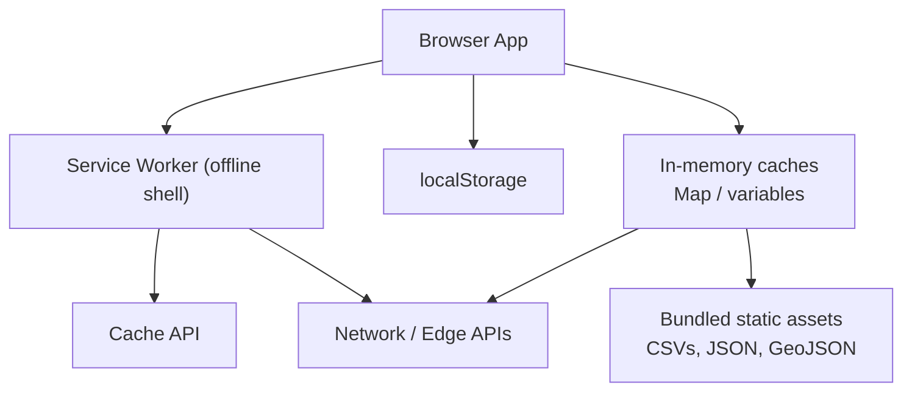
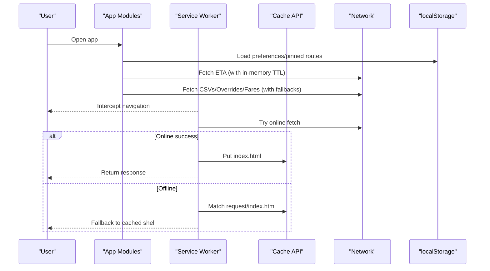
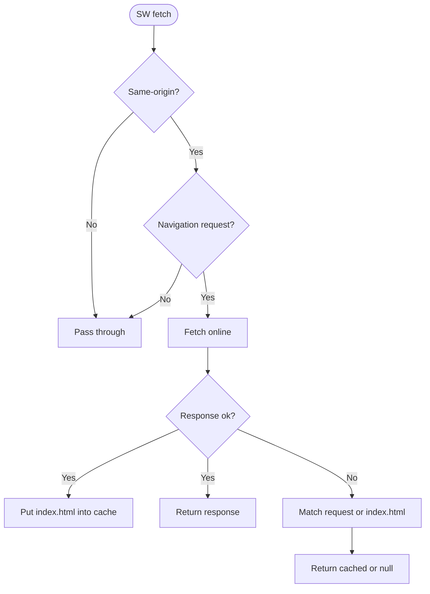
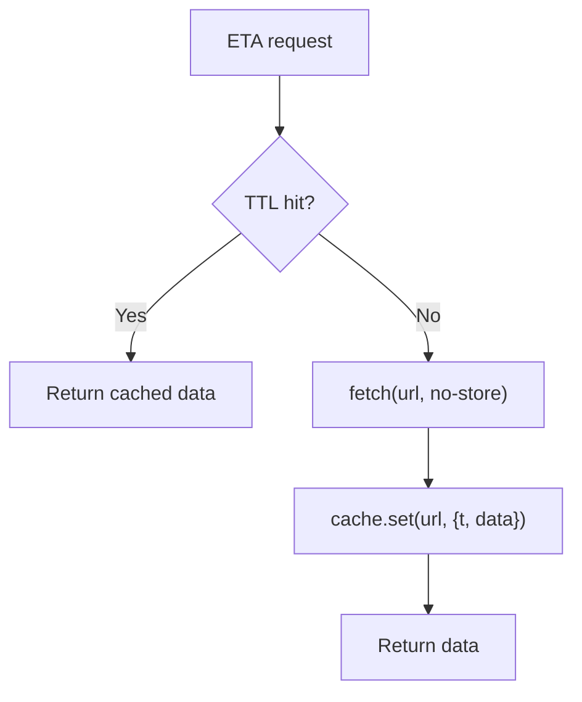
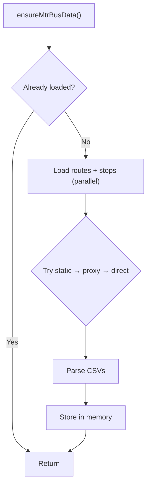
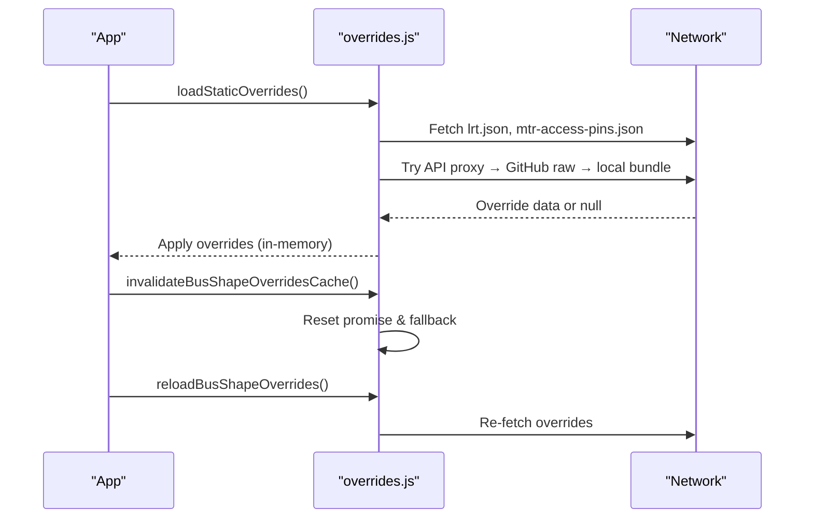
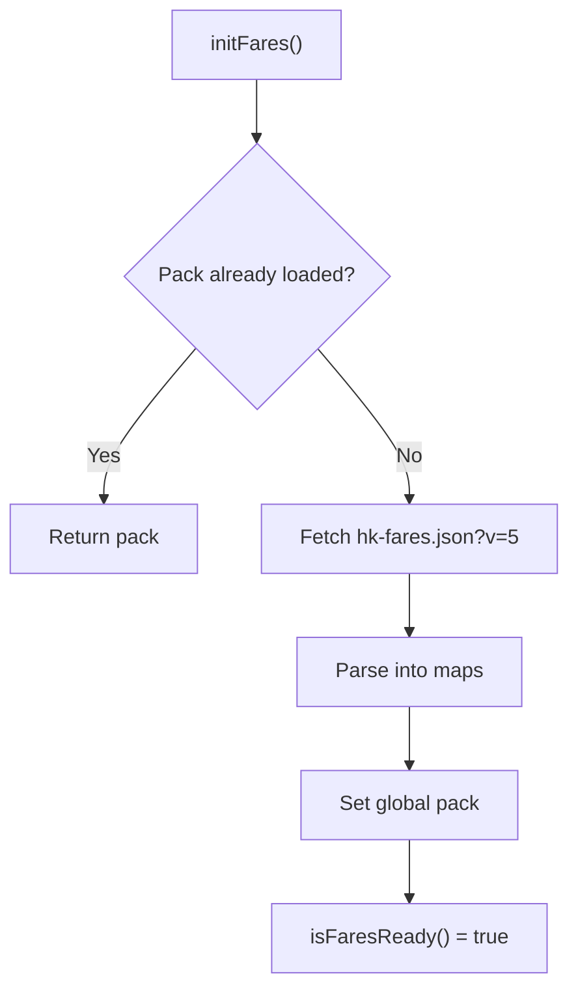
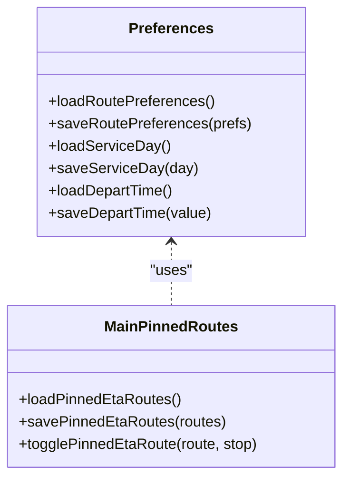
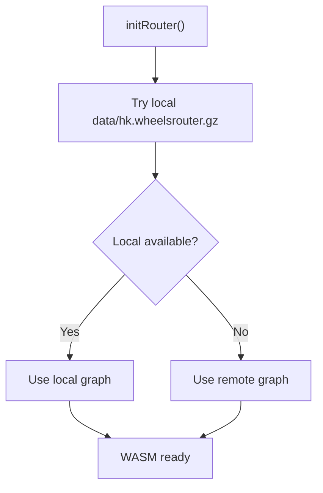
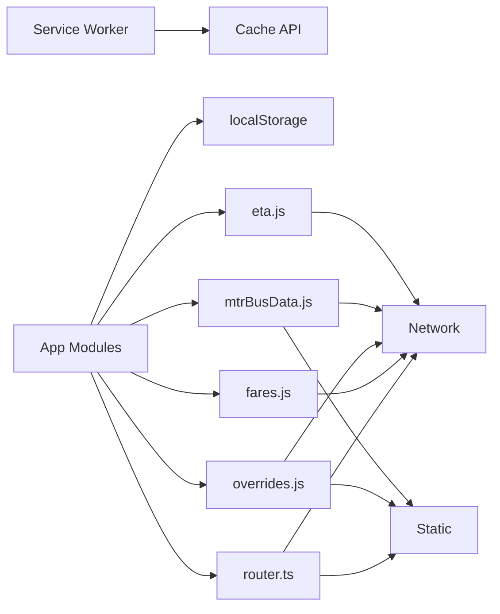

# Data Caching Strategies

<cite>
**Referenced Files in This Document**
- [sw.js](file://public/sw.js)
- [manifest.webmanifest](file://public/manifest.webmanifest)
- [main.js](file://src/main.js)
- [preferences.js](file://src/preferences.js)
- [overrides.js](file://src/overrides.js)
- [fares.js](file://src/fares.js)
- [mtrBusData.js](file://src/mtrBusData.js)
- [lrtStops.js](file://src/lrtStops.js)
- [eta.js](file://src/eta.js)
- [router.ts](file://src/router.ts)
</cite>

## Table of Contents
1. [Introduction](#introduction)
2. [Project Structure](#project-structure)
3. [Core Components](#core-components)
4. [Architecture Overview](#architecture-overview)
5. [Detailed Component Analysis](#detailed-component-analysis)
6. [Dependency Analysis](#dependency-analysis)
7. [Performance Considerations](#performance-considerations)
8. [Troubleshooting Guide](#troubleshooting-guide)
9. [Conclusion](#conclusion)

## Introduction
This document explains MorganTraveler’s multi-layered caching strategy for transit data across browser storage, service worker behavior, and application-level caches. It covers offline persistence, cache invalidation, version management, conflict resolution between cached and live data, progressive loading, background synchronization patterns, and cache warming techniques. It also addresses performance considerations for large datasets and memory management on mobile devices.

## Project Structure
MorganTraveler uses a minimal service worker to ensure offline navigation fallback and an application-level layered caching approach:
- Service Worker: intercepts navigations and caches the HTML shell for offline cold starts.
- Application modules: maintain in-memory caches with TTLs or lifecycle-based persistence for ETA, CSV route/stop data, overrides, and fare matrices.
- Browser storage: localStorage persists user preferences, pinned routes, and ticket type settings.

**Diagram sources**
- [sw.js:11-86](file://public/sw.js#L11-L86)
- [main.js:180-209](file://src/main.js#L180-L209)
- [mtrBusData.js:14-30](file://src/mtrBusData.js#L14-L30)
- [overrides.js:168-239](file://src/overrides.js#L168-L239)
- [fares.js:460-503](file://src/fares.js#L460-L503)
- [eta.js:19-42](file://src/eta.js#L19-L42)

**Section sources**
- [sw.js:1-86](file://public/sw.js#L1-L86)
- [manifest.webmanifest:1-28](file://public/manifest.webmanifest#L1-L28)

## Core Components
- Service Worker shell caching: ensures offline navigation by caching only the HTML shell and providing fallback responses.
- In-memory caches with TTL: ETA responses are cached in a Map with time-to-live to reduce network calls.
- Module-level caches: MTR Bus CSV data is parsed once per session; overrides are fetched with fallback chains; fares pack is loaded once and reused.
- Browser storage: localStorage stores user preferences, pinned routes, and fare type toggles.

Key responsibilities:
- Progressive loading: load lightweight bundles first, then fetch remote data with fallbacks.
- Offline resilience: rely on bundled CSVs/GeoJSON and service worker HTML fallback.
- Versioning and invalidation: explicit version query parameters for fares; module-level cache reset functions for overrides and CSV data.

**Section sources**
- [sw.js:9-28](file://public/sw.js#L9-L28)
- [eta.js:19-42](file://src/eta.js#L19-L42)
- [mtrBusData.js:56-63](file://src/mtrBusData.js#L56-L63)
- [overrides.js:122-125](file://src/overrides.js#L122-L125)
- [fares.js:329-332](file://src/fares.js#L329-L332)
- [preferences.js:6-13](file://src/preferences.js#L6-L13)
- [main.js:297-498](file://src/main.js#L297-L498)

## Architecture Overview
The caching architecture combines three layers:
1. Service Worker layer: minimal interception for navigation-only offline fallback.
2. Application in-memory layer: short-lived caches for live data (ETA), session-scoped caches for CSVs and overrides, and single-load packs for fares.
3. Browser storage layer: persistent user preferences and pinned routes via localStorage.

**Diagram sources**
- [sw.js:42-86](file://public/sw.js#L42-L86)
- [eta.js:27-42](file://src/eta.js#L27-L42)
- [mtrBusData.js:145-174](file://src/mtrBusData.js#L145-L174)
- [overrides.js:168-239](file://src/overrides.js#L168-L239)
- [fares.js:460-503](file://src/fares.js#L460-L503)
- [main.js:412-498](file://src/main.js#L412-L498)

## Detailed Component Analysis

### Service Worker Shell Caching
- Strategy: Only intercept GET navigations; store a single copy of index.html for offline cold start; do not cache CSS/JS/assets to avoid mismatched shells.
- Activation: Clears all caches on activate and notifies clients; supports clear-cache messaging from the app.
- Versioning: Uses a named cache string that can be bumped to force refresh.

**Diagram sources**
- [sw.js:42-86](file://public/sw.js#L42-L86)

**Section sources**
- [sw.js:9-28](file://public/sw.js#L9-L28)
- [sw.js:31-39](file://public/sw.js#L31-L39)
- [sw.js:42-86](file://public/sw.js#L42-L86)

### In-Memory ETA Cache with TTL
- Strategy: A Map keyed by URL stores ETA payloads with timestamps; requests within TTL return cached data; otherwise fetches with no-store headers.
- Purpose: Reduces repeated network calls for live ETAs while keeping data fresh.

**Diagram sources**
- [eta.js:19-42](file://src/eta.js#L19-L42)

**Section sources**
- [eta.js:19-42](file://src/eta.js#L19-L42)

### MTR Bus CSV Data Caching
- Strategy: Parse CSVs once per session; prefer bundled static files first, then same-origin proxy, then direct open data; retry on failure.
- Persistence: In-memory arrays for routes and stops; resettable via force option.

**Diagram sources**
- [mtrBusData.js:145-174](file://src/mtrBusData.js#L145-L174)
- [mtrBusData.js:197-313](file://src/mtrBusData.js#L197-L313)

**Section sources**
- [mtrBusData.js:14-30](file://src/mtrBusData.js#L14-L30)
- [mtrBusData.js:123-174](file://src/mtrBusData.js#L123-L174)
- [mtrBusData.js:197-313](file://src/mtrBusData.js#L197-L313)

### Overrides Loading and Invalidation
- Strategy: Fetch LRT shapes and access pins from app bundle; bus shapes from live GitHub via same-origin API or raw; fall back to bundled JSON if network fails.
- Invalidation: Clear module-level promise and reset state to force re-fetch; provide reload function.

**Diagram sources**
- [overrides.js:168-239](file://src/overrides.js#L168-L239)
- [overrides.js:243-259](file://src/overrides.js#L243-L259)

**Section sources**
- [overrides.js:168-239](file://src/overrides.js#L168-L239)
- [overrides.js:243-259](file://src/overrides.js#L243-L259)

### Fare Pack Loading and Version Management
- Strategy: Load hk-fares.json once; append version query parameter to bust cache; parse into maps for MTR/AEL/LRT/MTR Bus; expose readiness and getters.
- Versioning: Versioned URL ensures new matrices replace old ones; logs include updated_at and version.

**Diagram sources**
- [fares.js:460-503](file://src/fares.js#L460-L503)

**Section sources**
- [fares.js:460-503](file://src/fares.js#L460-L503)

### Browser Storage for Preferences and Pinned Routes
- Strategy: Persist user preferences, service day, depart time, fare type, and pinned routes using localStorage keys; migrate legacy keys when needed.
- Usage: Read/write helpers encapsulate parsing, validation, and defaults; errors ignored to handle private mode or quota issues.

**Diagram sources**
- [preferences.js:6-13](file://src/preferences.js#L6-L13)
- [preferences.js:106-195](file://src/preferences.js#L106-L195)
- [preferences.js:330-431](file://src/preferences.js#L330-L431)
- [main.js:412-498](file://src/main.js#L412-L498)

**Section sources**
- [preferences.js:6-13](file://src/preferences.js#L6-L13)
- [preferences.js:106-195](file://src/preferences.js#L106-L195)
- [preferences.js:330-431](file://src/preferences.js#L330-L431)
- [main.js:412-498](file://src/main.js#L412-L498)

### Router Graph Loading and Source Selection
- Strategy: Prefer local gzipped graph file from app bundle; fall back to remote host; initialize WASM router instance once.
- Implication: Large dataset (WASM graph) is loaded once and reused; source selection affects offline capability and startup time.

**Diagram sources**
- [router.ts:179-185](file://src/router.ts#L179-L185)

**Section sources**
- [router.ts:179-185](file://src/router.ts#L179-L185)

## Dependency Analysis
- Service Worker depends on Cache API and responds to navigation requests; it does not interfere with asset fetching to prevent shell mismatches.
- ETA module depends on network and maintains its own TTL-based cache; it does not persist beyond session.
- MTR Bus data module depends on static CSVs and optional proxies; caches parsed results in memory.
- Overrides module depends on network and static bundles; caches override objects in memory with invalidation hooks.
- Fares module depends on network for hk-fares.json; caches parsed matrices in memory.
- Preferences and main modules depend on localStorage for persistent user state.

**Diagram sources**
- [sw.js:42-86](file://public/sw.js#L42-L86)
- [eta.js:27-42](file://src/eta.js#L27-L42)
- [mtrBusData.js:145-174](file://src/mtrBusData.js#L145-L174)
- [overrides.js:168-239](file://src/overrides.js#L168-L239)
- [fares.js:460-503](file://src/fares.js#L460-L503)
- [router.ts:179-185](file://src/router.ts#L179-L185)

**Section sources**
- [sw.js:42-86](file://public/sw.js#L42-L86)
- [eta.js:27-42](file://src/eta.js#L27-L42)
- [mtrBusData.js:145-174](file://src/mtrBusData.js#L145-L174)
- [overrides.js:168-239](file://src/overrides.js#L168-L239)
- [fares.js:460-503](file://src/fares.js#L460-L503)
- [router.ts:179-185](file://src/router.ts#L179-L185)

## Performance Considerations
- Service Worker: Avoid intercepting non-navigation requests to minimize overhead; keep shell cache small and versioned.
- ETA cache: Short TTL reduces stale data without excessive memory usage; consider adjusting TTL based on update frequency.
- CSV parsing: Parse once per session; reuse parsed arrays; avoid re-parsing on every UI interaction.
- Overrides: Prefer same-origin API to bypass CORS issues; use bundled fallbacks to reduce network latency.
- Fares pack: Single load with versioned URL prevents repeated downloads; map lookups are O(1).
- Router graph: Prefer local gzipped graph for faster initialization; remote fallback ensures availability.
- Memory management: Keep in-memory caches scoped to session; clear or reset where appropriate (e.g., force reload for CSVs and overrides); avoid storing large blobs in localStorage.

[No sources needed since this section provides general guidance]

## Troubleshooting Guide
- Offline navigation shows blank or unstyled page:
  - Verify service worker activation and cache name bump; ensure index.html is stored.
  - Check that the SW only intercepts navigations and does not block assets.
- ETA data appears stale:
  - Confirm TTL expiration; check that fetch uses no-store; verify server returns updated data.
- CSV data missing or outdated:
  - Force reload via ensureMtrBusData({ force: true }); inspect fallback chain (static → proxy → direct).
- Overrides not applied:
  - Call invalidateBusShapeOverridesCache() and reloadBusShapeOverrides(); check network and fallback bundle.
- Fare estimates incorrect:
  - Ensure hk-fares.json version parameter is set; confirm pack loaded successfully; check matrix key mapping.
- Preferences not persisted:
  - Check localStorage availability (private mode); validate keys and migration logic.

**Section sources**
- [sw.js:9-28](file://public/sw.js#L9-L28)
- [sw.js:31-39](file://public/sw.js#L31-L39)
- [eta.js:27-42](file://src/eta.js#L27-L42)
- [mtrBusData.js:197-203](file://src/mtrBusData.js#L197-L203)
- [overrides.js:243-259](file://src/overrides.js#L243-L259)
- [fares.js:460-503](file://src/fares.js#L460-L503)
- [preferences.js:330-431](file://src/preferences.js#L330-L431)

## Conclusion
MorganTraveler employs a pragmatic, layered caching strategy tailored for transit data:
- Service Worker ensures offline navigation with a minimal shell cache.
- Application-level in-memory caches manage live and semi-static data efficiently.
- Browser storage persists user preferences and pinned routes reliably.
- Versioning and invalidation mechanisms keep data current while maintaining performance.
- Progressive loading and fallback chains improve resilience and user experience under varying network conditions.

[No sources needed since this section summarizes without analyzing specific files]