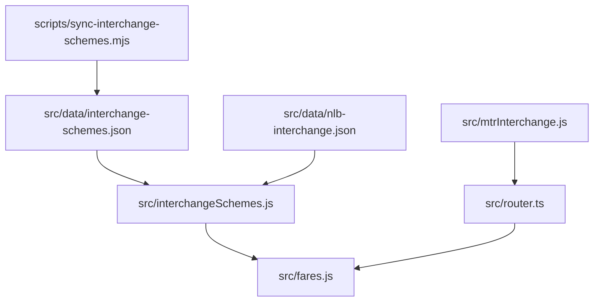
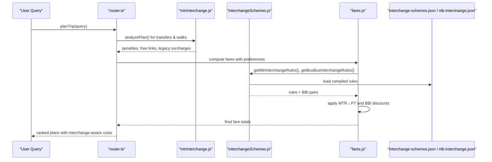
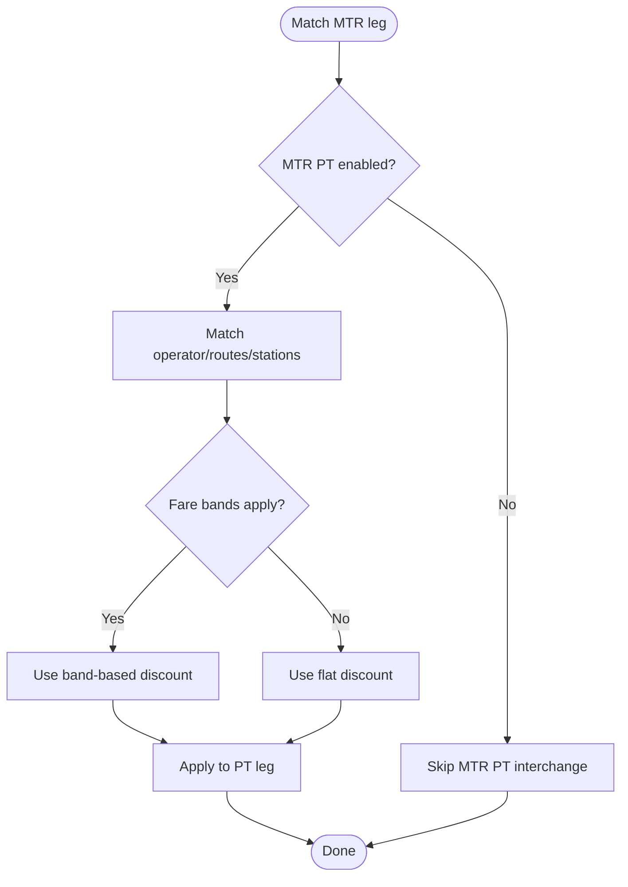
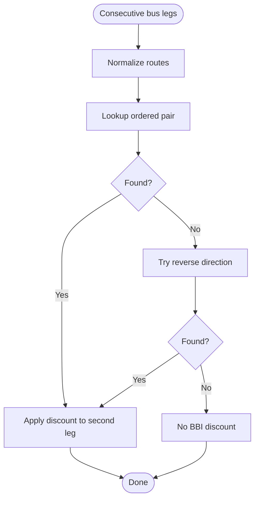
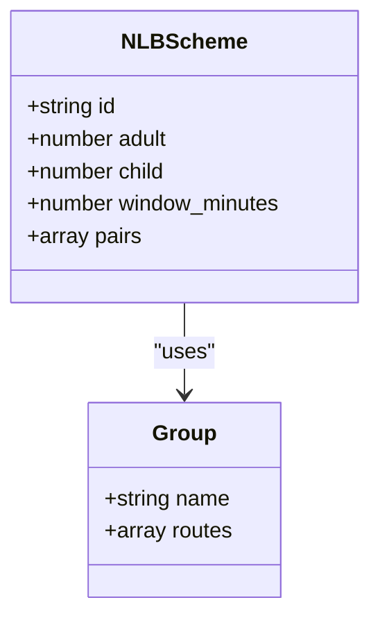
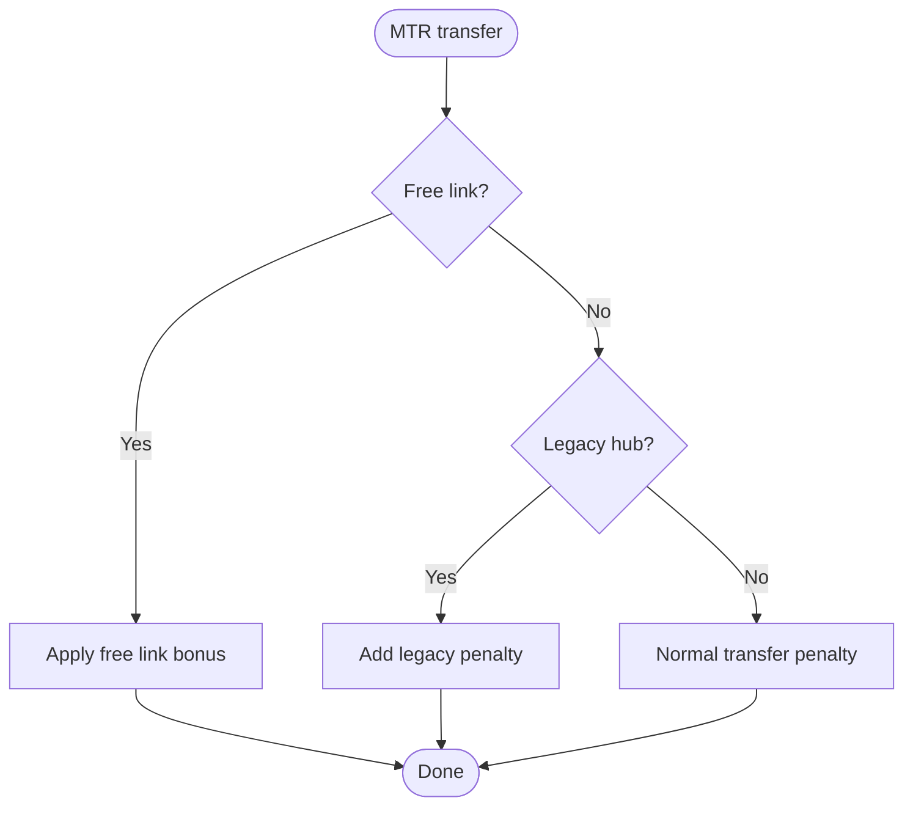
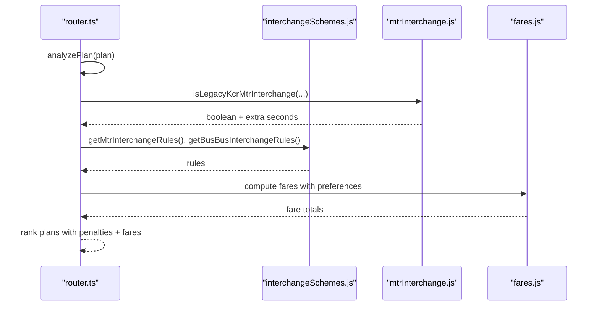
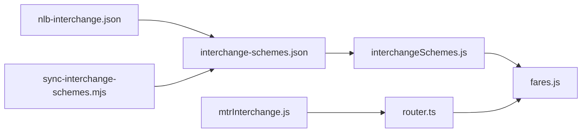

# Interchange Schemes

<cite>
**Referenced Files in This Document**
- [interchange-schemes.json](file://src/data/interchange-schemes.json)
- [nlb-interchange.json](file://src/data/nlb-interchange.json)
- [interchangeSchemes.js](file://src/interchangeSchemes.js)
- [mtrInterchange.js](file://src/mtrInterchange.js)
- [router.ts](file://src/router.ts)
- [fares.js](file://src/fares.js)
- [sync-interchange-schemes.mjs](file://scripts/sync-interchange-schemes.mjs)
</cite>

## Table of Contents
1. [Introduction](#introduction)
2. [Project Structure](#project-structure)
3. [Core Components](#core-components)
4. [Architecture Overview](#architecture-overview)
5. [Detailed Component Analysis](#detailed-component-analysis)
6. [Dependency Analysis](#dependency-analysis)
7. [Performance Considerations](#performance-considerations)
8. [Troubleshooting Guide](#troubleshooting-guide)
9. [Conclusion](#conclusion)
10. [Appendices](#appendices)

## Introduction
This document explains the interchange schemes system that enables seamless transfers between different transit modes and operators in Hong Kong. It covers:
- The JSON schema used to define interchange relationships, walking distances, and transfer windows.
- How the routing algorithm incorporates interchange data for optimal multi-modal journey planning.
- Data sources including NLB interchange schemes and custom configurations.
- Examples of complex interchange scenarios and troubleshooting common issues.

The system supports:
- MTR ↔ PT (bus/minibus/ferry) interchange discounts.
- Bus-to-bus interchange (BBI) discounts across KMB/LWB/Citybus/NLB.
- MTR internal interchanges with realistic walk penalties and free links.

## Project Structure
Key files involved in interchange logic:
- Data definitions: src/data/interchange-schemes.json, src/data/nlb-interchange.json
- Runtime compilation and lookup: src/interchangeSchemes.js
- MTR-specific interchange behavior: src/mtrInterchange.js
- Routing and ranking integration: src/router.ts
- Fare application: src/fares.js
- Data synchronization scripts: scripts/sync-interchange-schemes.mjs

**Diagram sources**
- [interchangeSchemes.js:1-240](file://src/interchangeSchemes.js#L1-L240)
- [mtrInterchange.js:1-544](file://src/mtrInterchange.js#L1-L544)
- [router.ts:1-800](file://src/router.ts#L1-L800)
- [fares.js:1632-1931](file://src/fares.js#L1632-L1931)
- [sync-interchange-schemes.mjs:1-204](file://scripts/sync-interchange-schemes.mjs#L1-L204)

**Section sources**
- [interchangeSchemes.js:1-240](file://src/interchangeSchemes.js#L1-L240)
- [mtrInterchange.js:1-544](file://src/mtrInterchange.js#L1-L544)
- [router.ts:1-800](file://src/router.ts#L1-L800)
- [fares.js:1632-1931](file://src/fares.js#L1632-L1931)
- [sync-interchange-schemes.mjs:1-204](file://scripts/sync-interchange-schemes.mjs#L1-L204)

## Core Components
- Interchange scheme definitions:
  - MTR ↔ PT rules with operator, route, station patterns, discount amounts, fare bands, and time windows.
  - Bus-to-bus compact pair map and hand-maintained rules.
- MTR interchange utilities:
  - Free indoor/outdoor links, long legacy KCR–MTR penalties, same-station detection.
- Routing integration:
  - Transfer penalties, mode classification, plan analysis, and human-centric ranking.
- Fare application:
  - Apply MTR↔PT discounts and BBI discounts per itinerary.

**Section sources**
- [interchange-schemes.json:1-743](file://src/data/interchange-schemes.json#L1-L743)
- [nlb-interchange.json:1-199](file://src/data/nlb-interchange.json#L1-L199)
- [interchangeSchemes.js:1-240](file://src/interchangeSchemes.js#L1-L240)
- [mtrInterchange.js:1-544](file://src/mtrInterchange.js#L1-L544)
- [router.ts:251-300](file://src/router.ts#L251-L300)
- [fares.js:1632-1931](file://src/fares.js#L1632-L1931)

## Architecture Overview
End-to-end flow from data to routing and fares:

**Diagram sources**
- [router.ts:1057-1141](file://src/router.ts#L1057-L1141)
- [mtrInterchange.js:155-208](file://src/mtrInterchange.js#L155-L208)
- [interchangeSchemes.js:118-171](file://src/interchangeSchemes.js#L118-L171)
- [fares.js:1778-1931](file://src/fares.js#L1778-L1931)

## Detailed Component Analysis

### Interchange Schema: MTR ↔ PT Rules
- Purpose: Define eligible operators, routes, stations, and discounts for MTR ↔ PT transfers.
- Key fields:
  - cos: operator identifiers (e.g., gmb, ctb, kmb_lwb, nlb).
  - routes: specific routes or wildcard “*”.
  - stations: regex patterns for station names.
  - adult/other/student: discount amounts per passenger type.
  - fare_bands: conditional discounts based on first-leg fare thresholds.
  - window_minutes: time window for eligibility (per rule or default).
  - source: provenance (e.g., mtr_intermodal, citybus_mtr_txt).
- Behavior:
  - Compiled into runtime rules; can be toggled via enabled flags.
  - Applied only when a paid domestic MTR component exists and conditions match.

**Diagram sources**
- [interchange-schemes.json:54-341](file://src/data/interchange-schemes.json#L54-L341)
- [interchangeSchemes.js:62-89](file://src/interchangeSchemes.js#L62-L89)
- [fares.js:1778-1864](file://src/fares.js#L1778-L1864)

**Section sources**
- [interchange-schemes.json:54-341](file://src/data/interchange-schemes.json#L54-L341)
- [interchangeSchemes.js:62-89](file://src/interchangeSchemes.js#L62-L89)
- [fares.js:1778-1864](file://src/fares.js#L1778-L1864)

### Interchange Schema: Bus-to-Bus (BBI) Compact Pairs
- Purpose: Provide fast lookup of bus-to-bus discounts for consecutive bus legs.
- Sources:
  - Offline summarized compact pair map (first→second direction).
  - Hand-maintained rules for special cases (e.g., Citybus packages).
- Lookup:
  - Normalize route strings and check ordered pairs; fallback to reverse if needed.
- Application:
  - Applied to the second matching bus leg in the same itinerary.

**Diagram sources**
- [interchangeSchemes.js:178-239](file://src/interchangeSchemes.js#L178-L239)
- [fares.js:1866-1931](file://src/fares.js#L1866-L1931)

**Section sources**
- [interchangeSchemes.js:178-239](file://src/interchangeSchemes.js#L178-L239)
- [fares.js:1866-1931](file://src/fares.js#L1866-L1931)

### NLB Interchange Schemes
- Purpose: Capture NLB-specific interchange relationships and groupings.
- Structure:
  - groups: named sets of routes for reuse in schemes.
  - schemes: pairwise relationships with discounts, windows, and optional exclusions.
  - south_lantau_combined_fares: fixed total fares not modeled as simple discounts.
- Integration:
  - Referenced by interchange-schemes.json sources and merged into compact BBI artifacts.

**Diagram sources**
- [nlb-interchange.json:1-199](file://src/data/nlb-interchange.json#L1-L199)

**Section sources**
- [nlb-interchange.json:1-199](file://src/data/nlb-interchange.json#L1-L199)
- [interchange-schemes.json:343-741](file://src/data/interchange-schemes.json#L343-L741)

### MTR Internal Interchange Logic
- Free links:
  - Indoor paid-area walkways (e.g., Central ↔ Hong Kong Station).
  - Outdoor cross-station corridors (e.g., Tsim Sha Tsui ↔ East Tsim Sha Tsui).
- Legacy penalties:
  - Extra seconds for former KCR–MTR style hubs at certain stations.
- Same-station detection:
  - Robust normalization handles platform/gate suffixes and East variants.

**Diagram sources**
- [mtrInterchange.js:210-285](file://src/mtrInterchange.js#L210-L285)
- [mtrInterchange.js:155-208](file://src/mtrInterchange.js#L155-L208)
- [router.ts:251-285](file://src/router.ts#L251-L285)

**Section sources**
- [mtrInterchange.js:210-285](file://src/mtrInterchange.js#L210-L285)
- [mtrInterchange.js:155-208](file://src/mtrInterchange.js#L155-L208)
- [router.ts:251-285](file://src/router.ts#L251-L285)

### Routing Algorithm Integration
- Transfer penalties:
  - Bus-to-bus: strong penalty to prefer direct buses.
  - MTR line changes: light penalty to allow interchanges.
  - Mixed transfers: moderate penalty.
  - Street walks between MTR lines: heavy penalty unless free link.
- Plan analysis:
  - Counts transfers, detects free links, identifies legacy hubs, and measures walk meters.
- Ranking:
  - Human-centric scoring combines duration, transfers, walk penalties, and fare info.

**Diagram sources**
- [router.ts:649-800](file://src/router.ts#L649-L800)
- [router.ts:1057-1141](file://src/router.ts#L1057-L1141)
- [interchangeSchemes.js:118-171](file://src/interchangeSchemes.js#L118-L171)
- [mtrInterchange.js:155-208](file://src/mtrInterchange.js#L155-L208)
- [fares.js:1778-1931](file://src/fares.js#L1778-L1931)

**Section sources**
- [router.ts:251-300](file://src/router.ts#L251-L300)
- [router.ts:649-800](file://src/router.ts#L649-L800)
- [router.ts:1057-1141](file://src/router.ts#L1057-L1141)

## Dependency Analysis
- Data to runtime:
  - interchange-schemes.json → interchangeSchemes.js (compiled rules).
  - nlb-interchange.json → referenced by interchange-schemes.json sources and artifacts.
- Runtime to routing:
  - router.ts uses mtrInterchange.js for transfer penalties and free links.
- Runtime to fares:
  - fares.js consumes interchangeSchemes.js for MTR↔PT and BBI discounts.
- Scripts to data:
  - sync-interchange-schemes.mjs refreshes indexes and artifacts.

**Diagram sources**
- [interchangeSchemes.js:1-240](file://src/interchangeSchemes.js#L1-L240)
- [mtrInterchange.js:1-544](file://src/mtrInterchange.js#L1-L544)
- [router.ts:1-800](file://src/router.ts#L1-L800)
- [fares.js:1632-1931](file://src/fares.js#L1632-L1931)
- [sync-interchange-schemes.mjs:1-204](file://scripts/sync-interchange-schemes.mjs#L1-L204)

**Section sources**
- [interchangeSchemes.js:1-240](file://src/interchangeSchemes.js#L1-L240)
- [mtrInterchange.js:1-544](file://src/mtrInterchange.js#L1-L544)
- [router.ts:1-800](file://src/router.ts#L1-L800)
- [fares.js:1632-1931](file://src/fares.js#L1632-L1931)
- [sync-interchange-schemes.mjs:1-204](file://scripts/sync-interchange-schemes.mjs#L1-L204)

## Performance Considerations
- Compact BBI pairs:
  - Single fetch once per session; cached in memory for O(1) lookups.
- Rule compilation:
  - Lazy compilation ensures minimal startup cost; resettable for hot reloads.
- MTR walk penalties:
  - Short thresholds differ for LRT vs heavy rail to avoid over-penalizing platform changes.
- Network requests:
  - BBI compact file fetched with cache busting; errors are logged and handled gracefully.

[No sources needed since this section provides general guidance]

## Troubleshooting Guide
Common issues and resolutions:
- BBI compact load failure:
  - Symptom: No BBI discounts applied.
  - Cause: Network error or missing file.
  - Resolution: Check network connectivity; verify public/fares/bbi-compact.json availability; inspect console warnings.
- MTR interchange not applied:
  - Symptom: PT leg shows full fare without discount.
  - Causes:
    - MTR PT disabled in configuration.
    - Not an Octopus/contactless family ticket type.
    - AEL free connection already zeroed MTR fare (T&C).
  - Resolution: Ensure enabled flag; use supported payment types; confirm MTR leg is paid domestic.
- Legacy KCR–MTR penalty too high:
  - Symptom: Plan penalized heavily at certain hubs.
  - Cause: Recognized as long legacy interchange.
  - Resolution: Verify station matching; consider alternative routes or free links where applicable.
- Free link not recognized:
  - Symptom: Walk between stations incurs street penalty.
  - Cause: Station names do not match official free link patterns.
  - Resolution: Update station labels or extend pattern matching if necessary.

**Section sources**
- [interchangeSchemes.js:183-209](file://src/interchangeSchemes.js#L183-L209)
- [fares.js:1778-1864](file://src/fares.js#L1778-L1864)
- [mtrInterchange.js:210-285](file://src/mtrInterchange.js#L210-L285)

## Conclusion
The interchange schemes system integrates rich operator-specific rules, robust MTR internal interchange logic, and efficient BBI discount lookups to deliver accurate multi-modal journey planning. By combining offline data synchronization with runtime compilation and careful routing penalties, it balances realism with performance while supporting complex scenarios like NLB partnerships and legacy hub handling.

[No sources needed since this section summarizes without analyzing specific files]

## Appendices

### Example Scenarios
- MTR ↔ Green Mini Bus at Ocean Park:
  - Eligible under MTR PT rules with discounted fare for designated routes and stations.
- Citybus ↔ MTR at Kai Tak:
  - Adult-only interchange within specified window applies discount to bus leg.
- NLB ↔ KMB/LWB at Tung Chung:
  - Pairwise schemes with distinct windows and discounts; combined fares noted separately.
- Consecutive KMB/LWB buses:
  - Compact pair map yields BBI discount on second leg; hand rules may augment.

[No sources needed since this section provides conceptual examples]