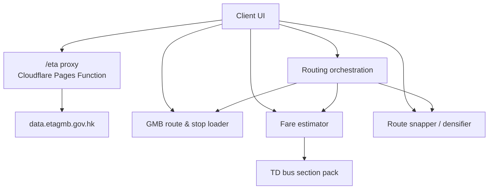
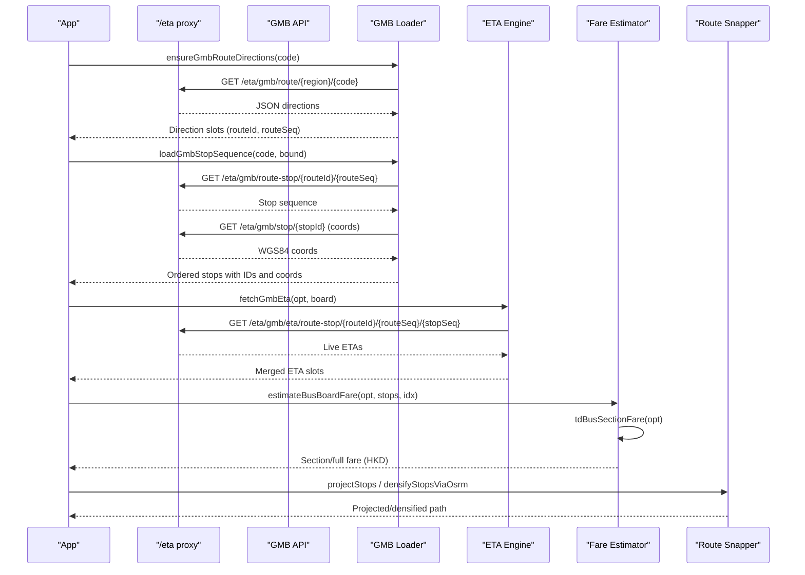
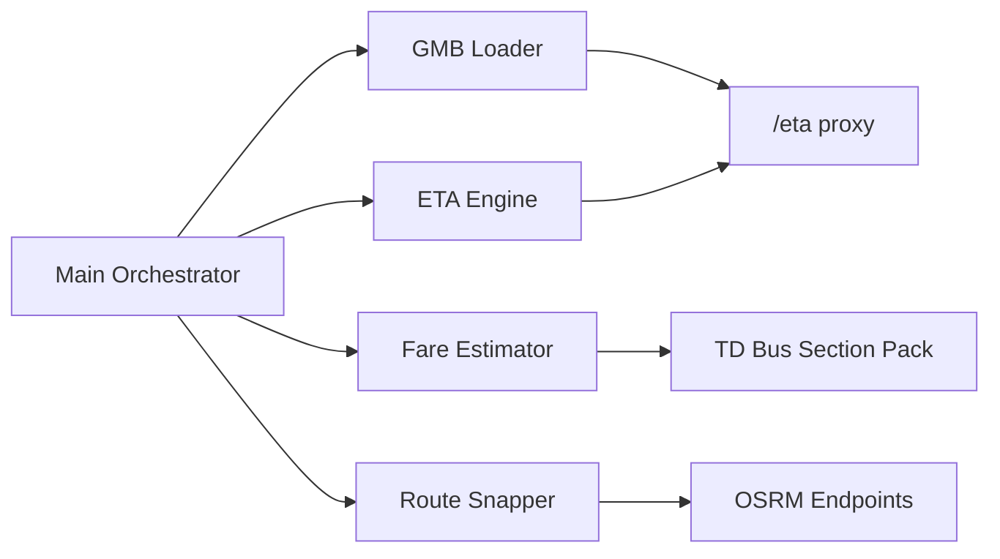

# Green Minibus Integration

<cite>
**Referenced Files in This Document**
- [gmbRouteData.js](file://src/gmbRouteData.js)
- [eta.js](file://src/eta.js)
- [fares.js](file://src/fares.js)
- [routeSnapper.js](file://src/routeSnapper.js)
- [[path]].js](file://functions/eta/[[path]].js)
- [main.js](file://src/main.js)
- [build-fares.mjs](file://scripts/build-fares.mjs)
</cite>

## Table of Contents
1. [Introduction](#introduction)
2. [Project Structure](#project-structure)
3. [Core Components](#core-components)
4. [Architecture Overview](#architecture-overview)
5. [Detailed Component Analysis](#detailed-component-analysis)
6. [Dependency Analysis](#dependency-analysis)
7. [Performance Considerations](#performance-considerations)
8. [Troubleshooting Guide](#troubleshooting-guide)
9. [Conclusion](#conclusion)

## Introduction
This document explains how the system integrates Hong Kong’s green minibus (GMB) services into a multimodal transit planner. It focuses on:
- Specialized GTFS-like data processing for GMB routes and stops, which are often less structured than major operators.
- Flexible route matching that handles informal stop locations and variable route patterns.
- Fare calculation logic tailored to minibus pricing structures and distance-based fares.
- Real-time arrival integration with GMB open data.
- How minibus data differs from other operators in quality and availability.

## Project Structure
The GMB integration spans several modules:
- Route and stop discovery via GMB open data APIs through a same-origin proxy.
- ETA retrieval for live arrivals.
- Fare estimation using Transport Department bus section tables and fallbacks.
- Route snapping and densification to connect stops to road geometry when needed.
- Orchestration in the main routing pipeline to load GMB directions and build route objects.

**Diagram sources**
- [[path]].js:15-22](file://functions/eta/[[path]].js#L15-L22)
- [gmbRouteData.js:32-66](file://src/gmbRouteData.js#L32-L66)
- [fares.js:1277-1390](file://src/fares.js#L1277-L1390)
- [routeSnapper.js:198-227](file://src/routeSnapper.js#L198-L227)
- [main.js:10525-10549](file://src/main.js#L10525-L10549)

**Section sources**
- [gmbRouteData.js:1-10](file://src/gmbRouteData.js#L1-L10)
- [[path]].js:1-22](file://functions/eta/[[path]].js#L1-L22)

## Core Components
- GMB route and stop loader: resolves region-specific route codes, direction slots, ordered stops, and coordinates.
- ETA engine: identifies operator, fetches live arrivals for GMB, and merges with timetable headways.
- Fare estimator: computes full-journey or section fares for GMB using Transport Department tables and fallbacks.
- Route snapper: projects stops onto route shapes and densifies paths via OSRM when necessary.
- Main orchestrator: ensures GMB directions are loaded before building route objects and selecting bounds.

**Section sources**
- [gmbRouteData.js:41-166](file://src/gmbRouteData.js#L41-L166)
- [eta.js:57-112](file://src/eta.js#L57-L112)
- [fares.js:1393-1416](file://src/fares.js#L1393-L1416)
- [routeSnapper.js:68-139](file://src/routeSnapper.js#L68-L139)
- [main.js:10525-10549](file://src/main.js#L10525-L10549)

## Architecture Overview
The GMB integration follows a layered approach:
- Data layer: GMB open data APIs provide route codes, directions, stop sequences, and coordinates. A Cloudflare function proxies requests to avoid CORS issues.
- Processing layer: The loader normalizes and caches route/direction/stop data; the snapper aligns stops to shapes; the fare module maps stops to section fares.
- Service layer: ETA service retrieves live arrivals and merges with scheduled headways.
- Application layer: The main router composes route options, selects bound (O/I), and constructs GTFS-like route entries for downstream use.

**Diagram sources**
- [gmbRouteData.js:90-166](file://src/gmbRouteData.js#L90-L166)
- [gmbRouteData.js:192-264](file://src/gmbRouteData.js#L192-L264)
- [eta.js:1341-1419](file://src/eta.js#L1341-L1419)
- [fares.js:1277-1390](file://src/fares.js#L1277-L1390)
- [routeSnapper.js:198-227](file://src/routeSnapper.js#L198-L227)
- [[path]].js:15-22](file://functions/eta/[[path]].js#L15-L22)

## Detailed Component Analysis

### GMB Route and Stop Discovery
- Region resolution: The loader first loads all region-to-route-code mappings once, then determines which regions publish a given code.
- Direction slots: For each code, it queries region endpoints to collect direction entries, including variants without explicit directions. It deduplicates by route sequence and sorts by sequence number.
- Stop sequences: For a chosen direction (bound O/I mapped to routeSeq 1/2), it fetches ordered stops and enriches them with coordinates via separate stop detail calls. Results are cached per routeId|routeSeq.

Key behaviors:
- Handles missing or partial direction metadata gracefully.
- Normalizes bilingual names and preserves stop identifiers for later ETA lookups.
- Exposes both async loading and synchronous helpers for UI.

**Section sources**
- [gmbRouteData.js:41-83](file://src/gmbRouteData.js#L41-L83)
- [gmbRouteData.js:90-166](file://src/gmbRouteData.js#L90-L166)
- [gmbRouteData.js:192-264](file://src/gmbRouteData.js#L192-L264)

### Real-Time Arrivals for GMB
- Operator detection: Identifies GMB via agency name patterns, route ID prefixes, or explicit kind flags.
- ETA endpoint: Uses a route-stop specific endpoint with routeId, routeSeq, and stopSeq to retrieve live arrivals.
- Caching and merging: Short-lived cache avoids excessive network calls; live results merge with timetable headway expansions when live data is unavailable.

Operational notes:
- Requires valid GMB routeId and routeSeq derived from the loader.
- Gracefully falls back to empty ETA sets if data is missing or network errors occur.

**Section sources**
- [eta.js:57-112](file://src/eta.js#L57-L112)
- [eta.js:1341-1419](file://src/eta.js#L1341-L1419)
- [eta.js:232-241](file://src/eta.js#L232-L241)

### Fare Calculation for Minibuses
- Classification: Bus/GMB legs are identified by agency and route patterns. GMB legs are tagged distinctly for labeling and interchange rules.
- Section fares: The estimator attempts to compute section fares using Transport Department bus section tables, mapping plan stops to official stop lists and reading triangular fare cells. If exact matches fail, it softens indices and tries terminus-based fares.
- Full-journey fallback: When section data is unavailable, it uses generic bus/ferry tables or published full fares per route.
- Concession scaling: Applies child/student/elderly scaling where applicable; JoyYou 60–64 applies per-leg formulas after discounts.
- Interchanges: Applies MTR↔GMB and designated bus/ferry interchange discounts according to scheme rules.

Minibus-specific considerations:
- Many GMB routes lack precise OD matrices; section-based lookup is preferred but may fall back to full-journey estimates.
- Board→terminus estimates are supported for search cards where only boarding stop is known.

**Section sources**
- [fares.js:2104-2139](file://src/fares.js#L2104-L2139)
- [fares.js:1277-1390](file://src/fares.js#L2277-L1390)
- [fares.js:1393-1416](file://src/fares.js#L1393-L1416)
- [fares.js:2223-2310](file://src/fares.js#L2223-L2310)
- [fares.js:2312-2428](file://src/fares.js#L2312-L2428)

### Flexible Route Matching and Stop Snapping
- Projection: Ordered stops are projected onto a route LineString with forward bias to handle out-and-back corridors and overlapping segments.
- Densification: When shape data is sparse or misaligned, the system can request OSRM driving routes between sampled points to reconstruct realistic paths, rejecting implausible detours (e.g., bridge loops).
- Contribution assistance: When editing paths, vertices are snapped to nearby roads without deleting user points; intermediate road points are inserted only when OSRM confirms connectivity within drift limits.

Why this matters for GMB:
- Informal stops and variable routing require robust snapping and densification to produce accurate distances and visualizations.

**Section sources**
- [routeSnapper.js:29-59](file://src/routeSnapper.js#L29-L59)
- [routeSnapper.js:68-139](file://src/routeSnapper.js#L68-L139)
- [routeSnapper.js:198-227](file://src/routeSnapper.js#L198-L227)
- [routeSnapper.js:265-479](file://src/routeSnapper.js#L265-L479)

### Main Routing Orchestration for GMB
- Preloading: Before building route objects, the orchestrator ensures GMB directions are loaded for the relevant route code.
- Bound selection: It resolves card-bound direction (O/I) to actual route sequences and constructs GTFS-like route entries with stops and endpoints.
- Shape reuse policy: Ensures shapes tagged for one operator are not reused across unrelated operators, including strict checks for GMB/minibus tags.

**Section sources**
- [main.js:10350-10382](file://src/main.js#L10350-L10382)
- [main.js:10525-10549](file://src/main.js#L10525-L10549)

## Dependency Analysis
- GMB loader depends on the /eta proxy to reach data.etagmb.gov.hk safely.
- ETA engine depends on loader outputs (routeId, routeSeq, stopSeq) to query live arrivals.
- Fare estimator depends on Transport Department bus section packs built offline; it also relies on operator classification to choose correct tables.
- Route snapper depends on OSRM endpoints for densification and nearest-road lookups.
- Main orchestrator ties these together, ensuring data readiness and consistent route object construction.

**Diagram sources**
- [gmbRouteData.js:32-66](file://src/gmbRouteData.js#L32-L66)
- [eta.js:1341-1419](file://src/eta.js#L1341-L1419)
- [fares.js:1277-1390](file://src/fares.js#L1277-L1390)
- [routeSnapper.js:782-798](file://src/routeSnapper.js#L782-L798)
- [main.js:10525-10549](file://src/main.js#L10525-L10549)

**Section sources**
- [gmbRouteData.js:32-66](file://src/gmbRouteData.js#L32-L66)
- [eta.js:1341-1419](file://src/eta.js#L1341-L1419)
- [fares.js:1277-1390](file://src/fares.js#L1277-L1390)
- [routeSnapper.js:782-798](file://src/routeSnapper.js#L782-L798)
- [main.js:10525-10549](file://src/main.js#L10525-L10549)

## Performance Considerations
- Caching: GMB route codes and direction/loading promises are cached to reduce repeated network calls. Stop sequences are cached per routeId|routeSeq.
- Concurrency: ETA and route-snapping operations use concurrency limits to balance responsiveness and server load.
- Detour rejection: OSRM densification rejects unrealistic detours to avoid inflated distances and misleading visuals.
- Fare computation: Section-based lookup prefers precise matches; fallbacks minimize expensive computations while preserving accuracy.

[No sources needed since this section provides general guidance]

## Troubleshooting Guide
Common issues and resolutions:
- Missing GMB directions: Ensure the route code exists in at least one region; the loader will try HKI/KLN/NT sequentially. Check console warnings for fetch failures.
- No live ETAs: Verify that routeId, routeSeq, and stopSeq are present and valid. Network errors or missing endpoints result in empty ETA sets.
- Incomplete fares: If section data is missing, the estimator falls back to full-journey estimates; display “N/A” or “+” indicators accordingly.
- Mis-snapped routes: Use densification to improve alignment; check drift thresholds and reject implausible OSRM paths.

**Section sources**
- [gmbRouteData.js:90-166](file://src/gmbRouteData.js#L90-L166)
- [eta.js:1341-1419](file://src/eta.js#L1341-L1419)
- [fares.js:2104-2139](file://src/fares.js#L2104-L2139)
- [routeSnapper.js:198-227](file://src/routeSnapper.js#L198-L227)

## Conclusion
The Green Minibus integration combines flexible data loading, robust route snapping, and pragmatic fare estimation to accommodate the informal nature of GMB operations. By leveraging GMB open data, Transport Department tables, and OSRM-based densification, the system delivers reliable route information, real-time arrivals, and cost estimates even when data quality varies. The modular design allows continued improvements in stop matching, fare coverage, and ETA reliability as source data evolves.