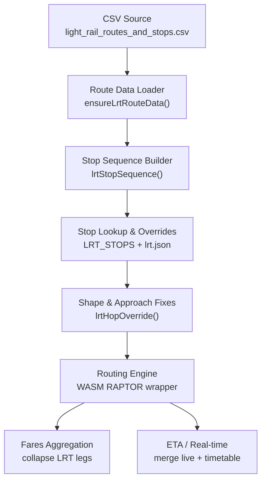
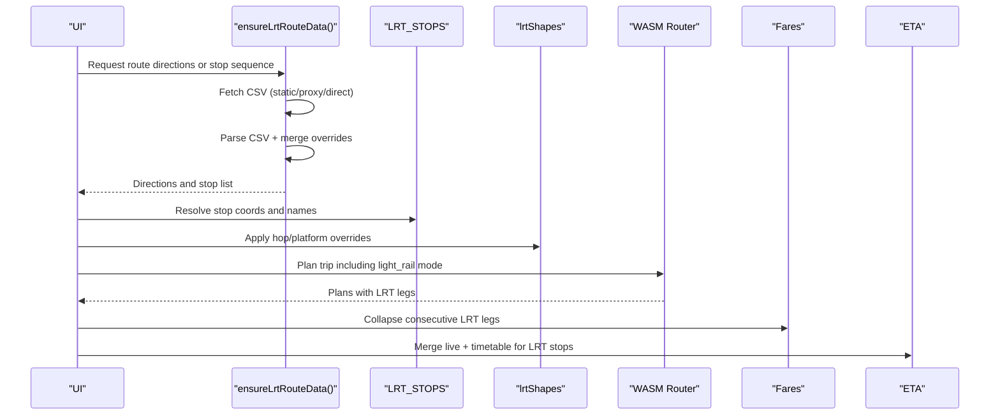
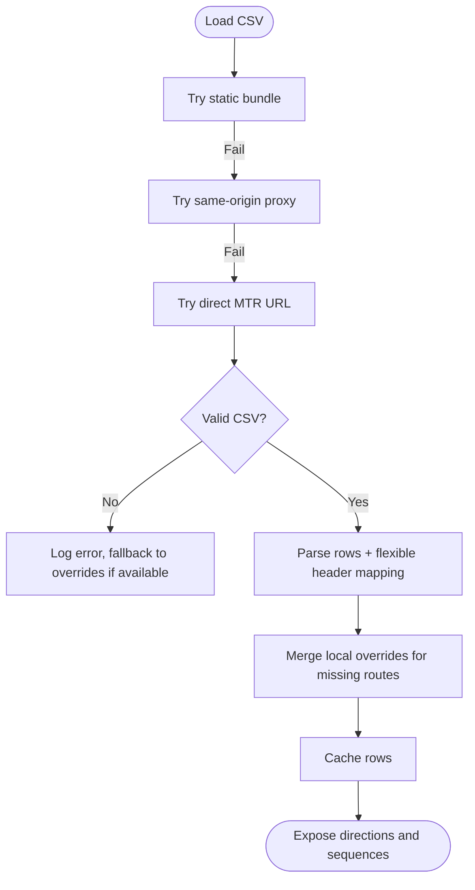
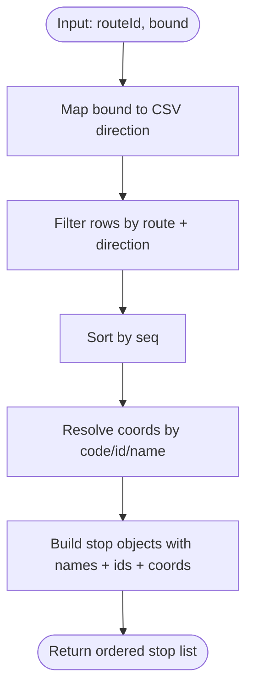
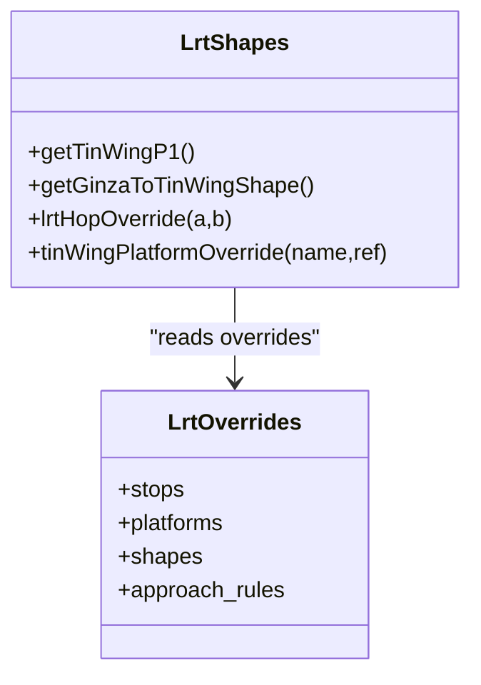
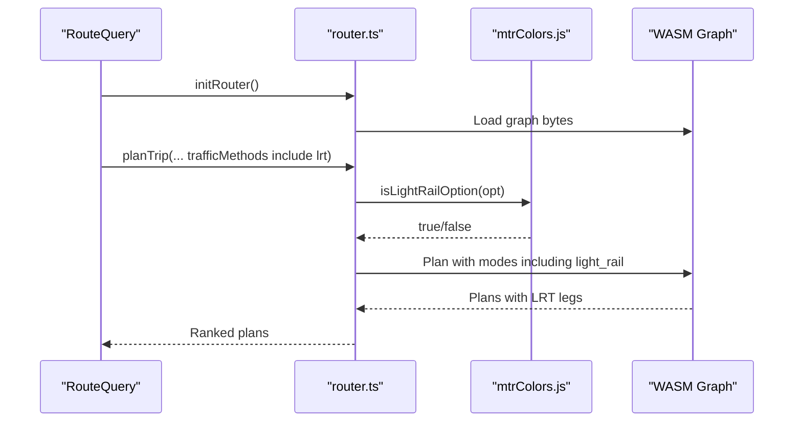
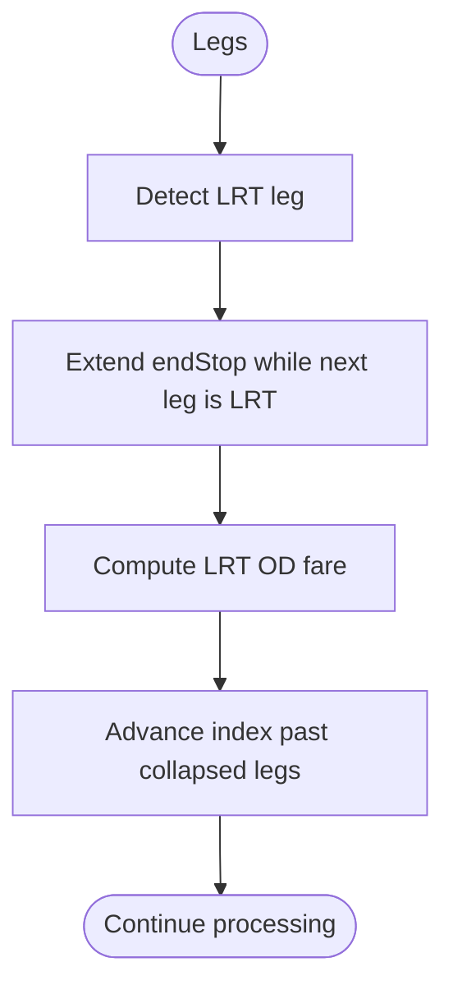
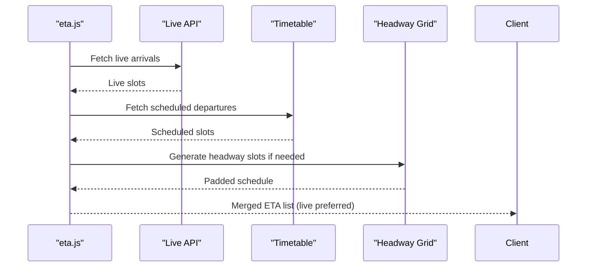
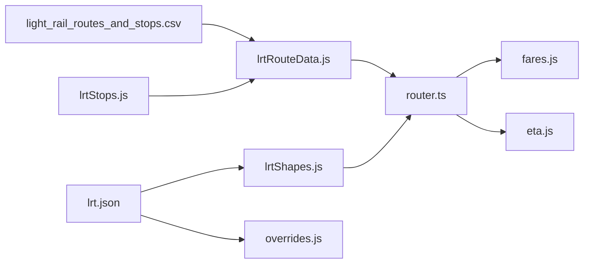

# Light Rail Integration

<cite>
**Referenced Files in This Document**
- [lrtRouteData.js](file://src/lrtRouteData.js)
- [lrtStops.js](file://src/lrtStops.js)
- [lrtShapes.js](file://src/lrtShapes.js)
- [overrides.js](file://src/overrides.js)
- [router.ts](file://src/router.ts)
- [mtrColors.js](file://src/mtrColors.js)
- [light_rail_routes_and_stops.csv](file://public/data/light_rail_routes_and_stops.csv)
- [lrt.json](file://public/overrides/lrt.json)
- [collect-open-data.mjs](file://scripts/collect-open-data.mjs)
- [fares.js](file://src/fares.js)
- [preferences.js](file://src/preferences.js)
- [eta.js](file://src/eta.js)
</cite>

## Table of Contents
1. [Introduction](#introduction)
2. [Project Structure](#project-structure)
3. [Core Components](#core-components)
4. [Architecture Overview](#architecture-overview)
5. [Detailed Component Analysis](#detailed-component-analysis)
6. [Dependency Analysis](#dependency-analysis)
7. [Performance Considerations](#performance-considerations)
8. [Troubleshooting Guide](#troubleshooting-guide)
9. [Conclusion](#conclusion)
10. [Appendices](#appendices)

## Introduction
This document explains how the application integrates Hong Kong’s Light Rail (MTR Light Rail) into a multi-operator routing engine. It covers GTFS-like data processing for route and stop sequences, handling of circular services and branch lines, complex interchanges with other modes, route validation logic, service day handling, real-time schedule integration, and normalization of Light Rail data so it can be processed consistently alongside MTR heavy rail and bus networks.

## Project Structure
Light Rail support is implemented across several modules:
- Route and stop sequence parsing from MTR open data CSV
- Stop coordinate management and platform overrides
- Shape and approach corrections for accurate geometry
- Routing engine integration that recognizes Light Rail as a distinct mode
- Fares aggregation that collapses consecutive Light Rail legs
- Service day and ETA handling to provide realistic schedules

**Diagram sources**
- [lrtRouteData.js:176-287](file://src/lrtRouteData.js#L176-L287)
- [lrtStops.js:86-102](file://src/lrtStops.js#L86-L102)
- [lrtShapes.js:115-184](file://src/lrtShapes.js#L115-L184)
- [router.ts:207-249](file://src/router.ts#L207-L249)
- [fares.js:2015-2056](file://src/fares.js#L2015-L2056)
- [eta.js:1795-1865](file://src/eta.js#L1795-L1865)

**Section sources**
- [lrtRouteData.js:176-287](file://src/lrtRouteData.js#L176-L287)
- [lrtStops.js:86-102](file://src/lrtStops.js#L86-L102)
- [lrtShapes.js:115-184](file://src/lrtShapes.js#L115-L184)
- [router.ts:207-249](file://src/router.ts#L207-L249)
- [fares.js:2015-2056](file://src/fares.js#L2015-L2056)
- [eta.js:1795-1865](file://src/eta.js#L1795-L1865)

## Core Components
- Route and stop sequence loader: parses MTR open data CSV, merges local overrides for peak-only routes, and exposes direction and stop sequence APIs.
- Stop database and matching: provides track-accurate coordinates, official codes, and name-based matching for search and geometry resolution.
- Shape and platform overrides: corrects problematic segments and pinpoints exact platform locations using static override files.
- Routing integration: identifies Light Rail options, includes them in the WASM router modes, and applies ranking preferences that favor Light Rail where appropriate.
- Fares and scheduling: collapses consecutive Light Rail legs for fare calculation and merges live ETAs with scheduled headways.

**Section sources**
- [lrtRouteData.js:176-287](file://src/lrtRouteData.js#L176-L287)
- [lrtStops.js:131-199](file://src/lrtStops.js#L131-L199)
- [lrtShapes.js:115-184](file://src/lrtShapes.js#L115-L184)
- [router.ts:291-296](file://src/router.ts#L291-L296)
- [fares.js:2015-2056](file://src/fares.js#L2015-L2056)
- [eta.js:1795-1865](file://src/eta.js#L1795-L1865)

## Architecture Overview
The Light Rail pipeline normalizes heterogeneous inputs (CSV, JSON overrides, OSM-derived stops) into a consistent internal representation consumed by the routing engine and UI.

**Diagram sources**
- [lrtRouteData.js:176-287](file://src/lrtRouteData.js#L176-L287)
- [lrtStops.js:86-102](file://src/lrtStops.js#L86-L102)
- [lrtShapes.js:115-184](file://src/lrtShapes.js#L115-L184)
- [router.ts:207-249](file://src/router.ts#L207-L249)
- [fares.js:2015-2056](file://src/fares.js#L2015-L2056)
- [eta.js:1795-1865](file://src/eta.js#L1795-L1865)

## Detailed Component Analysis

### Route Definition Parsing and Direction Handling
- The CSV source defines route, direction, stop code, stop ID, Chinese and English names, and sequence.
- The loader fetches from bundled static file first, then a same-origin proxy, then direct MTR open data, validating content before use.
- Peak-hour short-working routes missing from open data are injected via local overrides.
- Directions map CSV “1” to outbound (“O”) and “2” to inbound (“I”), and derive destination and origin from first/last stops in each direction.

**Diagram sources**
- [lrtRouteData.js:176-287](file://src/lrtRouteData.js#L176-L287)
- [lrtRouteData.js:293-338](file://src/lrtRouteData.js#L293-L338)

**Section sources**
- [lrtRouteData.js:176-287](file://src/lrtRouteData.js#L176-L287)
- [lrtRouteData.js:293-338](file://src/lrtRouteData.js#L293-L338)
- [light_rail_routes_and_stops.csv:1-402](file://public/data/light_rail_routes_and_stops.csv#L1-L402)

### Stop Sequence Management and Coordinate Resolution
- Stop sequences are built per route and direction, sorted by sequence number.
- Coordinates are resolved by stop code, stop ID, or English name match against the curated stop list; partial matches are supported.
- If coordinates are missing, stops still appear in lists but are skipped on maps.

**Diagram sources**
- [lrtRouteData.js:380-428](file://src/lrtRouteData.js#L380-L428)
- [lrtStops.js:131-199](file://src/lrtStops.js#L131-L199)

**Section sources**
- [lrtRouteData.js:380-428](file://src/lrtRouteData.js#L380-L428)
- [lrtStops.js:131-199](file://src/lrtStops.js#L131-L199)

### Platform and Shape Overrides for Accurate Geometry
- Static overrides define platform centroids and per-platform points for stations like Tin Wing, plus shape polylines for specific segments.
- When a hop between two stops matches override rules, the system replaces the raw segment with corrected geometry, ensuring accurate map rendering and routing.
- Approach rules force final approach segments when ending at certain stations.

**Diagram sources**
- [lrtShapes.js:115-184](file://src/lrtShapes.js#L115-L184)
- [lrt.json:1-56](file://public/overrides/lrt.json#L1-L56)
- [overrides.js:168-240](file://src/overrides.js#L168-L240)

**Section sources**
- [lrtShapes.js:115-184](file://src/lrtShapes.js#L115-L184)
- [lrt.json:1-56](file://public/overrides/lrt.json#L1-L56)
- [overrides.js:168-240](file://src/overrides.js#L168-L240)

### Light Rail Identification and Routing Integration
- Light Rail is identified by agency, mode, naming patterns, and numeric route codes typical of MTR Light Rail.
- The router explicitly includes “light_rail” in its modes string so Light Rail is never dropped during planning.
- Ranking bonuses prefer plans using Light Rail within its catchment area and penalize unnecessary bus usage when both origins and destinations are MTR stations.

**Diagram sources**
- [router.ts:207-249](file://src/router.ts#L207-L249)
- [router.ts:291-296](file://src/router.ts#L291-L296)
- [mtrColors.js:138-156](file://src/mtrColors.js#L138-L156)

**Section sources**
- [router.ts:291-296](file://src/router.ts#L291-L296)
- [mtrColors.js:138-156](file://src/mtrColors.js#L138-L156)

### Fares Aggregation for Consecutive Light Rail Legs
- Consecutive Light Rail legs are collapsed into a single origin–destination fare segment to reflect Light Rail’s flat or zone-based pricing model.
- Short walks between LRT platforms are ignored when collapsing.

**Diagram sources**
- [fares.js:2015-2056](file://src/fares.js#L2015-L2056)

**Section sources**
- [fares.js:2015-2056](file://src/fares.js#L2015-L2056)

### Real-Time Schedule Integration and Service Day Handling
- ETA merging combines live vehicle positions with scheduled headways when official data is unavailable, ensuring up-to-date estimates even outside service windows.
- Service day selection uses Hong Kong local time semantics for the routing engine, emitting ISO timestamps representing local clock face times.

**Diagram sources**
- [eta.js:1795-1865](file://src/eta.js#L1795-L1865)
- [preferences.js:292-325](file://src/preferences.js#L292-L325)

**Section sources**
- [eta.js:1795-1865](file://src/eta.js#L1795-L1865)
- [preferences.js:292-325](file://src/preferences.js#L292-L325)

## Dependency Analysis
Light Rail components depend on shared utilities and static assets:
- Route data depends on stop definitions and override files for robustness.
- Shapes depend on overrides for precise platform and segment geometry.
- Routing depends on mode identification and network graphs that include Light Rail.
- Fares and ETA depend on normalized stop IDs and route metadata.

**Diagram sources**
- [lrtRouteData.js:176-287](file://src/lrtRouteData.js#L176-L287)
- [lrtShapes.js:115-184](file://src/lrtShapes.js#L115-L184)
- [overrides.js:168-240](file://src/overrides.js#L168-L240)
- [router.ts:207-249](file://src/router.ts#L207-L249)
- [fares.js:2015-2056](file://src/fares.js#L2015-L2056)
- [eta.js:1795-1865](file://src/eta.js#L1795-L1865)

**Section sources**
- [lrtRouteData.js:176-287](file://src/lrtRouteData.js#L176-L287)
- [lrtShapes.js:115-184](file://src/lrtShapes.js#L115-L184)
- [overrides.js:168-240](file://src/overrides.js#L168-L240)
- [router.ts:207-249](file://src/router.ts#L207-L249)
- [fares.js:2015-2056](file://src/fares.js#L2015-L2056)
- [eta.js:1795-1865](file://src/eta.js#L1795-L1865)

## Performance Considerations
- CSV loading uses a cached promise to avoid repeated network requests; static bundles ensure COEP-safe access without proxies.
- Stop matching supports multiple strategies (code, ID, name, partial match) to reduce failures and improve lookup speed.
- Shape overrides minimize expensive recalculations by reusing predefined polylines and applying targeted fixes.
- ETA merging prioritizes live data and pads with headways only when necessary to keep response times low.

[No sources needed since this section provides general guidance]

## Troubleshooting Guide
- CSV load failures: The loader falls back to overrides and logs warnings; verify network access and proxy availability.
- Missing stops in sequences: Ensure stop codes and IDs align with LRT_STOPS; check override files for updated coordinates.
- Incorrect platform pins: Use platform overrides to correct station-specific points; validate name matching patterns.
- Routing excludes Light Rail: Confirm modes include “light_rail” and that route options are recognized as Light Rail by detection logic.
- ETA gaps: Check service window and headway generation; ensure live API responses are valid.

**Section sources**
- [lrtRouteData.js:176-287](file://src/lrtRouteData.js#L176-L287)
- [lrtStops.js:86-102](file://src/lrtStops.js#L86-L102)
- [lrtShapes.js:115-184](file://src/lrtShapes.js#L115-L184)
- [router.ts:291-296](file://src/router.ts#L291-L296)
- [eta.js:1795-1865](file://src/eta.js#L1795-L1865)

## Conclusion
The Light Rail integration layer transforms MTR open data and curated overrides into a robust, normalized dataset that powers accurate routing, fares, and real-time schedules. By handling circular services, branch lines, and complex interchanges, and by integrating tightly with the broader routing engine, the system delivers consistent Light Rail experiences alongside other transit modes.

[No sources needed since this section summarizes without analyzing specific files]

## Appendices

### Light Rail Route Numbering Conventions
- Numeric route codes such as 505, 507, 610, 614, 615, 705, 706, 751, 751P, 761P identify Light Rail services.
- Direction fields “1” and “2” map to outbound/inbound bounds used throughout the system.

**Section sources**
- [mtrColors.js:138-156](file://src/mtrColors.js#L138-L156)
- [light_rail_routes_and_stops.csv:1-402](file://public/data/light_rail_routes_and_stops.csv#L1-L402)

### Station Naming Patterns
- Stops include both English and Chinese names; matching algorithms normalize names and support partial matches.
- Official stop codes and IDs from MTR open data are preserved for interoperability.

**Section sources**
- [lrtStops.js:131-199](file://src/lrtStops.js#L131-L199)
- [lrtRouteData.js:380-428](file://src/lrtRouteData.js#L380-L428)

### Data Collection and Normalization
- Open data collection scripts download Light Rail routes and stops along with other datasets for build pipelines.
- Overrides are loaded from static files and refreshed via same-origin APIs to maintain accuracy.

**Section sources**
- [collect-open-data.mjs:31-63](file://scripts/collect-open-data.mjs#L31-L63)
- [overrides.js:168-240](file://src/overrides.js#L168-L240)