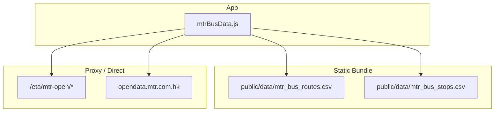
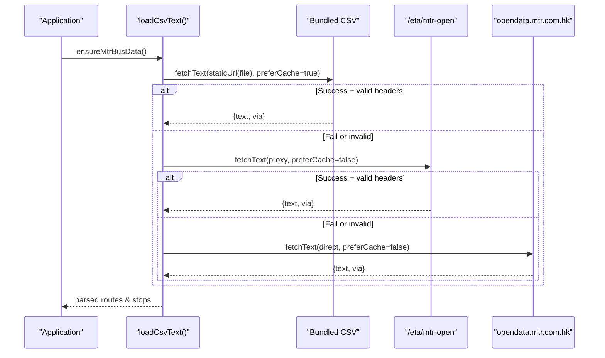
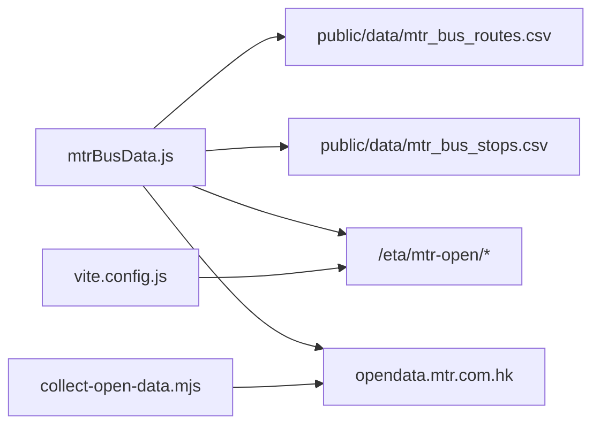

# MTR Bus Integration

<cite>
**Referenced Files in This Document**
- [mtrBusData.js](file://src/mtrBusData.js)
- [vite.config.js](file://vite.config.js)
- [collect-open-data.mjs](file://scripts/collect-open-data.mjs)
- [mtr_bus_routes.csv](file://public/data/mtr_bus_routes.csv)
- [mtr_bus_stops.csv](file://public/data/mtr_bus_stops.csv)
</cite>

## Table of Contents
1. [Introduction](#introduction)
2. [Project Structure](#project-structure)
3. [Core Components](#core-components)
4. [Architecture Overview](#architecture-overview)
5. [Detailed Component Analysis](#detailed-component-analysis)
6. [Dependency Analysis](#dependency-analysis)
7. [Performance Considerations](#performance-considerations)
8. [Troubleshooting Guide](#troubleshooting-guide)
9. [Conclusion](#conclusion)

## Introduction
This document explains how the application integrates with MTR Corporation’s open data for Light Rail Feeder bus routes and stops. It covers:
- CSV parsing with BOM handling and quoted field support
- A three-tier data loading strategy (bundled static files, proxy endpoints, direct API access with CORS fallbacks)
- Route direction parsing from English “A to B” and Chinese “A至B” route names
- Reference ID system for managing route variants such as “506-1”
- Nearby stops calculation using the haversine distance formula with radius-based filtering

## Project Structure
The MTR Bus integration centers on a single module that loads, parses, and exposes route and stop data. Static CSV bundles are shipped under public/data and can be served directly or proxied. The build/dev configuration provides proxies and CORS headers to ensure reliable loading across environments.

**Diagram sources**
- [mtrBusData.js:13-30](file://src/mtrBusData.js#L13-L30)
- [vite.config.js:878-905](file://vite.config.js#L878-L905)

**Section sources**
- [mtrBusData.js:13-30](file://src/mtrBusData.js#L13-L30)
- [vite.config.js:878-905](file://vite.config.js#L878-L905)

## Core Components
- CSV loader and parser: robust handling of BOM, quoted fields, and flexible column mapping
- Three-tier fetcher: bundled static → proxy → direct, with header validation and retry semantics
- Route and stop model builders: normalize fields, handle variants via reference IDs, and expose APIs for directions and sequences
- Direction parser: extracts origin–destination pairs from both English and Chinese route names
- Nearby stops calculator: uses haversine distance to filter stops within a radius

**Section sources**
- [mtrBusData.js:64-121](file://src/mtrBusData.js#L64-L121)
- [mtrBusData.js:141-174](file://src/mtrBusData.js#L141-L174)
- [mtrBusData.js:192-314](file://src/mtrBusData.js#L192-L314)
- [mtrBusData.js:343-441](file://src/mtrBusData.js#L343-L441)
- [mtrBusData.js:500-538](file://src/mtrBusData.js#L500-L538)

## Architecture Overview
The data loading pipeline follows a strict order to maximize reliability and performance:
1. Bundled static CSV files (COEP-safe, same-origin)
2. Proxy endpoint (/eta/mtr-open) which forwards to upstream and adds CORS headers
3. Direct access to opendata.mtr.com.hk (may fail under COEP; used as last resort)

Each source is validated by checking expected headers before accepting it. On failure, the next tier is attempted. Results are cached until explicitly refreshed.

**Diagram sources**
- [mtrBusData.js:141-174](file://src/mtrBusData.js#L141-L174)
- [vite.config.js:878-905](file://vite.config.js#L878-L905)

**Section sources**
- [mtrBusData.js:141-174](file://src/mtrBusData.js#L141-L174)
- [vite.config.js:878-905](file://vite.config.js#L878-L905)

## Detailed Component Analysis

### CSV Parsing with BOM and Quoted Fields
- Strips leading BOM character to avoid corrupting the first field
- Handles quoted fields and escaped quotes inside values
- Supports CRLF and LF line endings
- Skips empty rows and preserves meaningful content

Complexity: O(n) over input text length. Memory usage proportional to file size.

**Section sources**
- [mtrBusData.js:64-121](file://src/mtrBusData.js#L64-L121)

### Three-Tier Data Loading Strategy
- Tier 1: Bundled static CSVs under public/data, resolved via a helper that respects base URLs and serves same-origin paths
- Tier 2: Proxy endpoint /eta/mtr-open configured in dev/prod to forward requests and inject CORS headers
- Tier 3: Direct fetch to opendata.mtr.com.hk when proxies are unavailable or blocked

Validation: Each response is checked for expected headers (e.g., route_id, station_id/station_name). Only accepted responses proceed to parsing.

Caching: First tier prefers cache; subsequent tiers use default caching behavior.

**Section sources**
- [mtrBusData.js:13-30](file://src/mtrBusData.js#L13-L30)
- [mtrBusData.js:128-174](file://src/mtrBusData.js#L128-L174)
- [vite.config.js:878-905](file://vite.config.js#L878-L905)

### Route and Stop Model Building
- Routes: normalized id, bilingual names, circular flag, up/down lines, and reference ID
- Stops: normalized routeId, direction, sequence, stopId, coordinates, bilingual names, and reference ID
- Column mapping is flexible to accommodate variations in header naming

Reference ID handling:
- Primary variant selection prefers rows where REFERENCE_ID equals ROUTE_ID
- For catalog entries like “506”, stops may be keyed by “506-1”; lookup falls back to matching refId

**Section sources**
- [mtrBusData.js:215-285](file://src/mtrBusData.js#L215-L285)
- [mtrBusData.js:343-362](file://src/mtrBusData.js#L343-L362)

### Route Direction Parsing (English and Chinese)
- Parses English “A to B” patterns and Chinese “A至B” patterns to extract origin and destination
- If both languages match, bilingual labels are preserved
- Directions are derived first from stop sequences (first and last stops per direction); otherwise, they fall back to parsed route name OD pairs
- Circular routes do not emit an opposite direction pair

Examples:
- Route “Tuen Mun Ferry Pier to Siu Lun” yields origin “Tuen Mun Ferry Pier” and destination “Siu Lun”
- Route “屯門碼頭至兆麟” yields corresponding Chinese labels

**Section sources**
- [mtrBusData.js:364-441](file://src/mtrBusData.js#L364-L441)

### Stop Sequences and Circular Routes
- Stop sequences are filtered by route and direction; if no direction matches, all stops for the route are returned (one-way/circular)
- Stops are sorted by sequence number
- For map rendering, stops with coordinates are preferred; named stops without coordinates are still included for list views

Circular routes:
- Flagged in routes metadata; direction logic avoids generating a reverse pair for circular services

**Section sources**
- [mtrBusData.js:473-498](file://src/mtrBusData.js#L473-L498)
- [mtrBusData.js:398-441](file://src/mtrBusData.js#L398-L441)

### Reference ID System for Route Variants
- Many routes have multiple variants (e.g., “506-1”) sharing a base route ID (“506”)
- The system prefers primary variants where REFERENCE_ID equals ROUTE_ID
- Lookup also supports matching by refId so catalog entries referencing “506-1” resolve correctly

**Section sources**
- [mtrBusData.js:343-362](file://src/mtrBusData.js#L343-L362)
- [mtr_bus_routes.csv:1-43](file://public/data/mtr_bus_routes.csv#L1-L43)

### Nearby Stops Calculation Using Haversine Distance
- Computes distances between user location and each stop using the haversine formula
- Filters stops within a configurable radius (default meters)
- Sorts results by distance ascending

Implementation notes:
- Coordinates must be finite; stops without coordinates are skipped
- Reference ID logic ensures variants are considered appropriately during nearby calculations

**Section sources**
- [mtrBusData.js:500-538](file://src/mtrBusData.js#L500-L538)

## Dependency Analysis
- mtrBusData.js depends on:
  - Bundled CSVs under public/data
  - Proxy endpoint /eta/mtr-open configured in vite.config.js
  - Direct access to opendata.mtr.com.hk as fallback
- Build scripts collect upstream open data into artifacts; while not required at runtime, they demonstrate the sources and update process

**Diagram sources**
- [mtrBusData.js:13-30](file://src/mtrBusData.js#L13-L30)
- [vite.config.js:878-905](file://vite.config.js#L878-L905)
- [collect-open-data.mjs:31-63](file://scripts/collect-open-data.mjs#L31-L63)

**Section sources**
- [mtrBusData.js:13-30](file://src/mtrBusData.js#L13-L30)
- [vite.config.js:878-905](file://vite.config.js#L878-L905)
- [collect-open-data.mjs:31-63](file://scripts/collect-open-data.mjs#L31-L63)

## Performance Considerations
- Parsing is linear in input size; large CSVs are handled efficiently
- Caching strategy reduces network calls:
  - Prefer cached static bundle first
  - Avoid unnecessary re-fetches by validating headers once
- Haversine distance computation is O(n) over stops; acceptable for typical stop counts
- Sorting nearby stops is O(n log n); negligible for realistic datasets

[No sources needed since this section provides general guidance]

## Troubleshooting Guide
Common issues and resolutions:
- Empty or malformed CSV:
  - Ensure the response contains expected headers (route_id, station_id/station_name)
  - Check for BOM or encoding issues; the parser strips BOM automatically
- CORS or COEP failures:
  - Use the proxy endpoint /eta/mtr-open to add necessary headers
  - In development, the server configures CORS and isolation headers for proxies
- No stops found for a route:
  - Verify reference ID matching; some entries use variants like “506-1”
  - Confirm direction filters; one-way or circular routes may not have both directions

**Section sources**
- [mtrBusData.js:141-174](file://src/mtrBusData.js#L141-L174)
- [mtrBusData.js:343-362](file://src/mtrBusData.js#L343-L362)
- [vite.config.js:878-905](file://vite.config.js#L878-L905)

## Conclusion
The MTR Bus integration provides a resilient, efficient pipeline for loading and interpreting open data. It combines robust CSV parsing, a multi-tier loading strategy with CORS-aware proxies, and precise direction and proximity utilities. The reference ID system cleanly manages route variants, ensuring accurate display and navigation for users.

[No sources needed since this section summarizes without analyzing specific files]