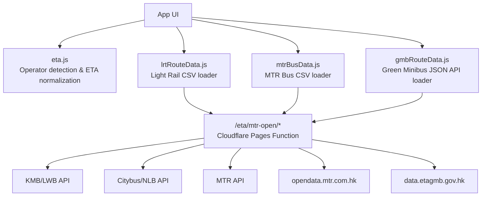
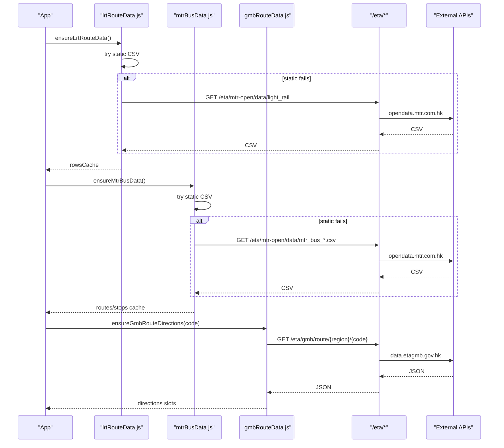
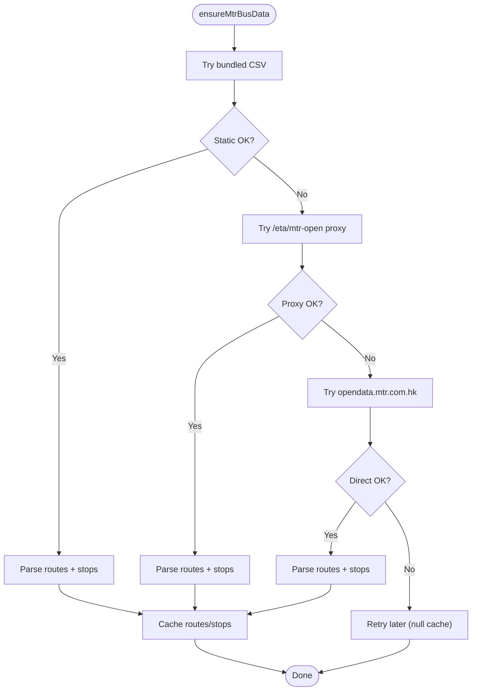
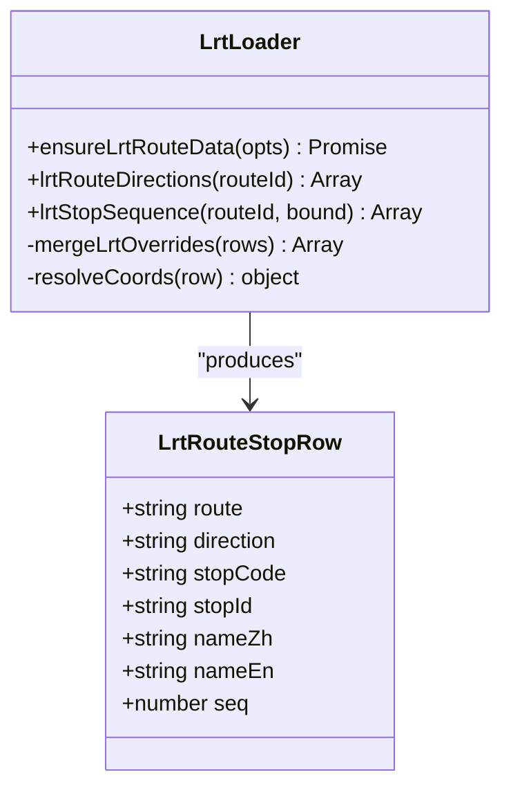
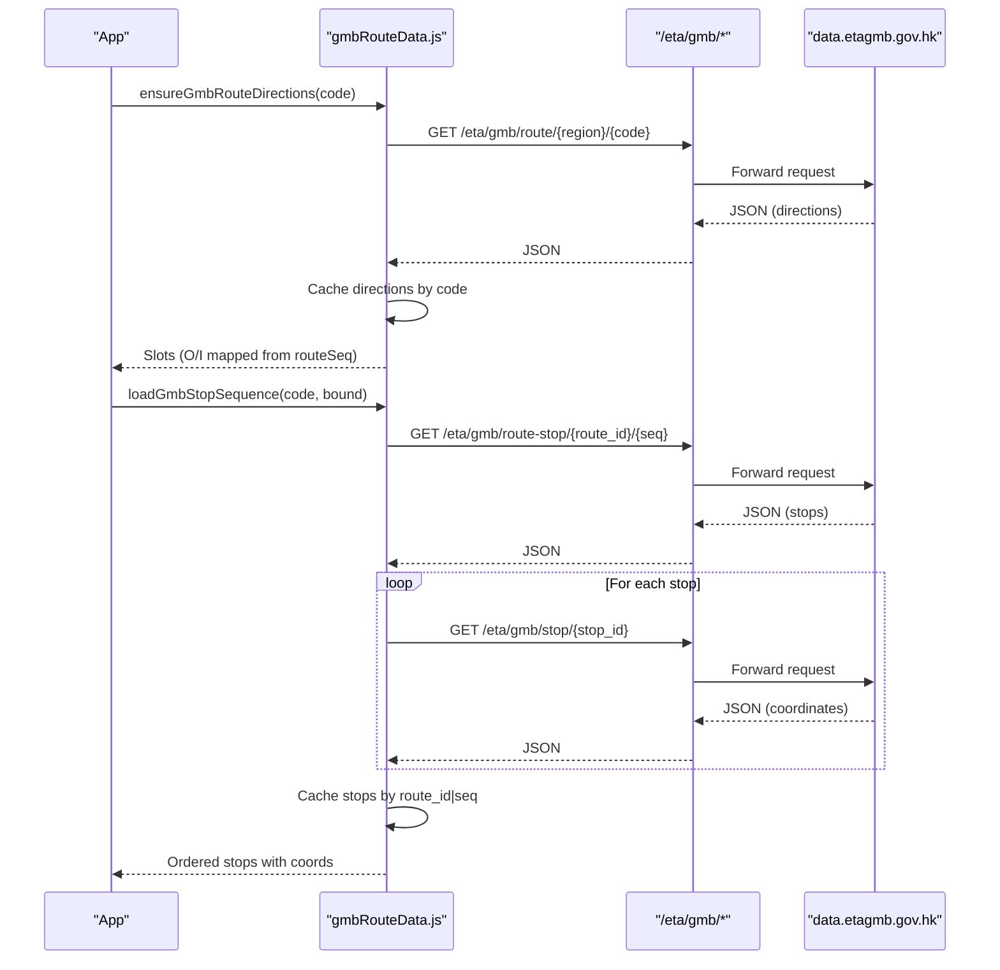
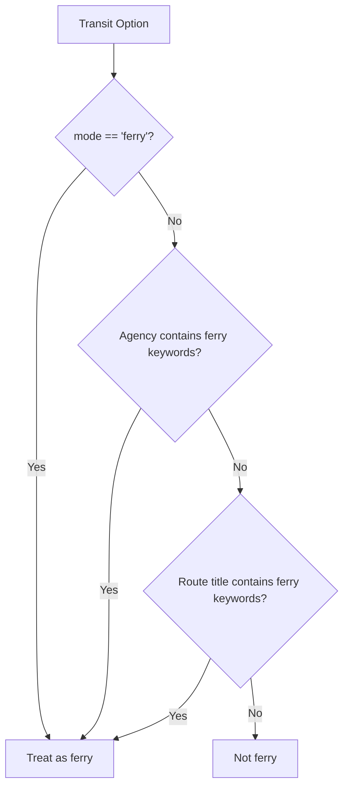
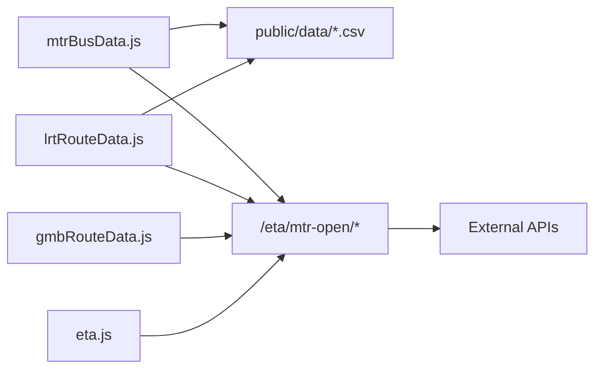

# Operator Integrations

<cite>
**Referenced Files in This Document**
- [mtrBusData.js](file://src/mtrBusData.js)
- [lrtRouteData.js](file://src/lrtRouteData.js)
- [gmbRouteData.js](file://src/gmbRouteData.js)
- [eta.js](file://src/eta.js)
- [[path]].js](file://functions/eta/[[path]].js)
- [mtr_bus_routes.csv](file://public/data/mtr_bus_routes.csv)
- [light_rail_routes_and_stops.csv](file://public/data/light_rail_routes_and_stops.csv)
- [main.js](file://src/main.js)
</cite>

## Table of Contents
1. Introduction
2. Project Structure
3. Core Components
4. Architecture Overview
5. Detailed Component Analysis
6. Dependency Analysis
7. Performance Considerations
8. Troubleshooting Guide
9. Conclusion

## Introduction
This document explains how MorganTraveler integrates multiple transit operators into a single system: MTR Corporation buses (LRT feeders), Light Rail, green minibuses, and ferries. It covers operator-specific data sources, CSV parsing, API endpoints, fallback strategies for CORS and network failures, and the standardized interface pattern used to expose route definitions, stop sequences, and direction handling consistently across operators.

## Project Structure
The integration spans three layers:
- Data loaders per operator that fetch and parse GTFS-like or open-data formats
- A Cloudflare Pages function proxy that forwards requests to operator APIs while adding CORS headers
- A unified ETA and routing layer that normalizes operator outputs into common structures

**Diagram sources**
- [mtrBusData.js:14-30](file://src/mtrBusData.js#L14-L30)
- [lrtRouteData.js:10-28](file://src/lrtRouteData.js#L10-L28)
- [gmbRouteData.js:29-39](file://src/gmbRouteData.js#L29-L39)
- [[path]].js:15-22](file://functions/eta/[[path]].js#L15-L22)

**Section sources**
- [mtrBusData.js:14-30](file://src/mtrBusData.js#L14-L30)
- [lrtRouteData.js:10-28](file://src/lrtRouteData.js#L10-L28)
- [gmbRouteData.js:29-39](file://src/gmbRouteData.js#L29-L39)
- [[path]].js:15-22](file://functions/eta/[[path]].js#L15-L22)

## Core Components
- MTR Bus data loader: loads routes and stop sequences from bundled CSVs with fallbacks to a same-origin proxy and direct open data. Provides route directions, stop sequences, and nearby stops.
- Light Rail data loader: loads a combined routes-and-stops CSV, merges local overrides for peak-only routes, resolves coordinates via a stop directory, and exposes directions and stop sequences.
- Green Minibus data loader: queries region-scoped JSON APIs for route codes, directions, ordered stops, and per-stop coordinates; caches results by route and sequence.
- ETA operator router: detects operator kind from route metadata and dispatches to operator-specific ETA flows using the same /eta proxy.

Key responsibilities:
- Robust loading order: static bundle → same-origin proxy → direct external source
- Flexible CSV header matching and tolerant parsing
- Direction mapping to a common O/I scheme where applicable
- Caching and retry semantics to handle transient failures

**Section sources**
- [mtrBusData.js:56-63](file://src/mtrBusData.js#L56-L63)
- [lrtRouteData.js:42-46](file://src/lrtRouteData.js#L42-L46)
- [gmbRouteData.js:14-27](file://src/gmbRouteData.js#L14-L27)
- [eta.js:61-112](file://src/eta.js#L61-L112)

## Architecture Overview
The system uses a consistent pattern per operator:
- ensure* function to load data once with caching and retries
- getDirections function returning bound labels (O/I or operator-specific)
- getStopSequence function returning ordered stops with names and coordinates
- Fallback chain for data sources to mitigate CORS and network issues

**Diagram sources**
- [lrtRouteData.js:176-286](file://src/lrtRouteData.js#L176-L286)
- [mtrBusData.js:145-174](file://src/mtrBusData.js#L145-L174)
- [gmbRouteData.js:90-166](file://src/gmbRouteData.js#L90-L166)
- [[path]].js:31-85](file://functions/eta/[[path]].js#L31-L85)

## Detailed Component Analysis

### MTR Bus (LRT Feeder) Integration
- Data sources:
  - Bundled CSVs under public/data (COEP-safe)
  - Same-origin proxy at /eta/mtr-open/data/mtr_bus_*.csv
  - Direct opendata.mtr.com.hk (may fail under COEP)
- CSV parsing:
  - Custom parser handles BOM, quoted fields, and varied line endings
  - Header matching is flexible via substring search
- Route and stop models:
  - Routes include identifiers, bilingual names, circular flag, and up/down line references
  - Stops include route association, direction, sequence, coordinates, and bilingual names
- Directions:
  - Derive O/I from stop ends when available; otherwise parse route name patterns
  - Prefer primary variant via reference IDs to avoid mixing route variants
- Stop sequences:
  - Filter by route and direction; fallback to any direction for one-way/circular routes
  - Sort by sequence and map to normalized output including coordinates when present
- Nearby stops:
  - Compute distances using haversine formula and return sorted results within radius

**Diagram sources**
- [mtrBusData.js:145-174](file://src/mtrBusData.js#L145-L174)
- [mtrBusData.js:197-314](file://src/mtrBusData.js#L197-L314)

**Section sources**
- [mtrBusData.js:64-121](file://src/mtrBusData.js#L64-L121)
- [mtrBusData.js:145-174](file://src/mtrBusData.js#L145-L174)
- [mtrBusData.js:197-314](file://src/mtrBusData.js#L197-L314)
- [mtrBusData.js:398-498](file://src/mtrBusData.js#L398-L498)
- [mtr_bus_routes.csv:1-43](file://public/data/mtr_bus_routes.csv#L1-L43)

### Light Rail Integration
- Data sources:
  - Bundled CSV combining routes and stops
  - Same-origin proxy to opendata.mtr.com.hk
  - Direct opendata.mtr.com.hk (fallback)
- Local overrides:
  - Peak-hour or short-working routes (e.g., 751P) injected when missing from open data
  - Overrides merged into loaded rows, preserving sequence and direction
- Coordinate resolution:
  - Resolve stop coordinates via a separate stop directory using code, ID, or name matching
- Directions:
  - Map CSV direction codes 1/2 to O/I; support additional custom direction codes
- Stop sequences:
  - Normalize bound input (O/I/1/2/LRT) to CSV direction
  - Return ordered stops with bilingual names and resolved coordinates

**Diagram sources**
- [lrtRouteData.js:30-40](file://src/lrtRouteData.js#L30-L40)
- [lrtRouteData.js:100-112](file://src/lrtRouteData.js#L100-L112)
- [lrtRouteData.js:176-286](file://src/lrtRouteData.js#L176-L286)
- [lrtRouteData.js:293-338](file://src/lrtRouteData.js#L293-L338)
- [lrtRouteData.js:380-428](file://src/lrtRouteData.js#L380-L428)

**Section sources**
- [lrtRouteData.js:48-112](file://src/lrtRouteData.js#L48-L112)
- [lrtRouteData.js:176-286](file://src/lrtRouteData.js#L176-L286)
- [lrtRouteData.js:293-338](file://src/lrtRouteData.js#L293-L338)
- [lrtRouteData.js:380-428](file://src/lrtRouteData.js#L380-L428)
- [light_rail_routes_and_stops.csv:1-402](file://public/data/light_rail_routes_and_stops.csv#L1-L402)

### Green Minibus Integration
- Data sources:
  - Region-based JSON APIs under /eta/gmb/* proxied to data.etagmb.gov.hk
  - Endpoints:
    - GET /eta/gmb/route/ — all region route codes
    - GET /eta/gmb/route/{HKI|KLN|NT}/{code} — variants and directions
    - GET /eta/gmb/route-stop/{route_id}/{seq} — ordered stops
    - GET /eta/gmb/stop/{stop_id} — WGS84 coordinates
- Loading strategy:
  - Ensure route codes are loaded once per region
  - For each route code, discover regions and fetch details until valid directions found
  - Cache directions by route code and stop sequences by route_id|route_seq
- Directions:
  - Map routeSeq 1/2 to O/I for display
  - Include bilingual destination and origin labels
- Stop sequences:
  - Fetch ordered stops and enrich with per-stop coordinates
  - Keep sequence numbers stable and sort by stop sequence

**Diagram sources**
- [gmbRouteData.js:42-66](file://src/gmbRouteData.js#L42-L66)
- [gmbRouteData.js:90-166](file://src/gmbRouteData.js#L90-L166)
- [gmbRouteData.js:192-264](file://src/gmbRouteData.js#L192-L264)
- [[path]].js:15-22](file://functions/eta/[[path]].js#L15-L22)

**Section sources**
- [gmbRouteData.js:29-39](file://src/gmbRouteData.js#L29-L39)
- [gmbRouteData.js:90-166](file://src/gmbRouteData.js#L90-L166)
- [gmbRouteData.js:192-264](file://src/gmbRouteData.js#L192-L264)

### Ferry Integration
- Detection:
  - Ferries are identified by mode, agency names, or route titles containing ferry-related terms
  - Excludes bus stops named “Ferry Pier” to avoid false positives
- Data model:
  - Ferries are part of the broader GTFS dataset consumed by the app’s routing and ETA systems
  - The operator detection logic ensures ferry services are treated distinctly from bus modes
- ETA and routing:
  - Ferries participate in plan and ETA flows through the unified ETA layer

**Diagram sources**
- [main.js:4674-4703](file://src/main.js#L4674-L4703)

**Section sources**
- [main.js:4674-4703](file://src/main.js#L4674-L4703)

### Standardized Interface Pattern
Across operators, the application exposes a consistent set of capabilities:
- ensure* functions to load and cache data
- getDirections functions returning bound labels and destinations
- getStopSequence functions returning ordered stops with names and coordinates
- Unified ETA operator detection and normalization

Examples:
- MTR Bus: ensureMtrBusData, mtrBusRouteDirections, mtrBusStopSequence
- Light Rail: ensureLrtRouteData, lrtRouteDirections, lrtStopSequence
- Green Minibus: ensureGmbRouteDirections, gmbRouteDirectionsSync, loadGmbStopSequence

These functions abstract away operator-specific data formats and provide a common contract for the rest of the application.

**Section sources**
- [mtrBusData.js:197-314](file://src/mtrBusData.js#L197-L314)
- [mtrBusData.js:398-498](file://src/mtrBusData.js#L398-L498)
- [lrtRouteData.js:176-286](file://src/lrtRouteData.js#L176-L286)
- [lrtRouteData.js:293-338](file://src/lrtRouteData.js#L293-L338)
- [lrtRouteData.js:380-428](file://src/lrtRouteData.js#L380-L428)
- [gmbRouteData.js:90-166](file://src/gmbRouteData.js#L90-L166)
- [gmbRouteData.js:192-264](file://src/gmbRouteData.js#L192-L264)
- [eta.js:61-112](file://src/eta.js#L61-L112)

## Dependency Analysis
- Operators depend on the /eta proxy for CORS-safe access to external APIs
- MTR Bus and Light Rail also rely on bundled CSVs for offline-first behavior
- Green Minibus depends entirely on JSON APIs proxied through /eta/gmb/*
- The ETA layer centralizes operator detection and provides shared utilities for time normalization and caching

**Diagram sources**
- [mtrBusData.js:14-30](file://src/mtrBusData.js#L14-L30)
- [lrtRouteData.js:10-28](file://src/lrtRouteData.js#L10-L28)
- [gmbRouteData.js:29-39](file://src/gmbRouteData.js#L29-L39)
- [[path]].js:15-22](file://functions/eta/[[path]].js#L15-L22)

**Section sources**
- [mtrBusData.js:14-30](file://src/mtrBusData.js#L14-L30)
- [lrtRouteData.js:10-28](file://src/lrtRouteData.js#L10-L28)
- [gmbRouteData.js:29-39](file://src/gmbRouteData.js#L29-L39)
- [[path]].js:15-22](file://functions/eta/[[path]].js#L15-L22)

## Performance Considerations
- Caching:
  - MTR Bus and Light Rail cache parsed data in memory to avoid repeated network calls
  - Green Minibus caches directions by route code and stop sequences by route_id|route_seq
- Network resilience:
  - Load order prioritizes static bundles, then proxy, then direct sources
  - Retry semantics allow subsequent attempts after transient failures
- Parsing efficiency:
  - Lightweight CSV parsers minimize overhead
  - Flexible header matching reduces brittle dependencies on exact column names

[No sources needed since this section provides general guidance]

## Troubleshooting Guide
Common issues and resolutions:
- CORS errors:
  - Use the /eta proxy for external APIs; it adds necessary CORS headers
  - Verify that requests go through /eta rather than directly to operator domains
- Empty or malformed CSV:
  - Check that the static bundle exists and is served correctly
  - Confirm that the proxy returns usable content with expected headers
- Missing directions or stops:
  - For Light Rail, verify that overrides exist for peak-only routes
  - For Green Minibus, ensure the correct region is selected if multiple publish the same route code
- ETA not showing:
  - Confirm operator detection matches the route metadata
  - Validate that the ETA endpoint is reachable via the proxy

**Section sources**
- [[path]].js:24-29](file://functions/eta/[[path]].js#L24-L29)
- [mtrBusData.js:145-174](file://src/mtrBusData.js#L145-L174)
- [lrtRouteData.js:176-286](file://src/lrtRouteData.js#L176-L286)
- [gmbRouteData.js:90-166](file://src/gmbRouteData.js#L90-L166)
- [eta.js:61-112](file://src/eta.js#L61-L112)

## Conclusion
MorganTraveler integrates multiple transit operators through a consistent, resilient pattern:
- Each operator has a dedicated loader that abstracts data sources and formats
- A shared proxy eliminates CORS barriers and standardizes access
- A unified ETA layer normalizes operator outputs for routing and user experience
- Fallback mechanisms and caching ensure robustness under network constraints

This approach enables seamless multi-operator transit planning while preserving operator-specific optimizations and business rules.

[No sources needed since this section summarizes without analyzing specific files]