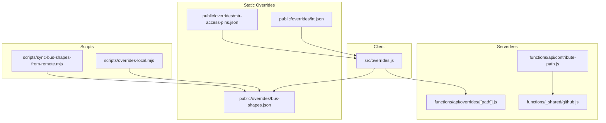
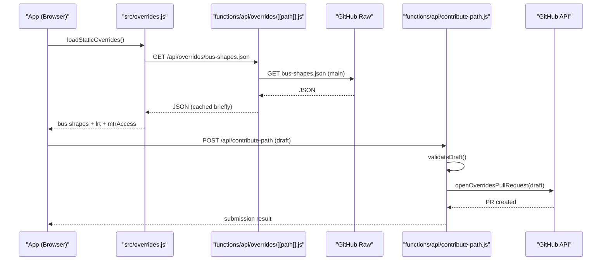
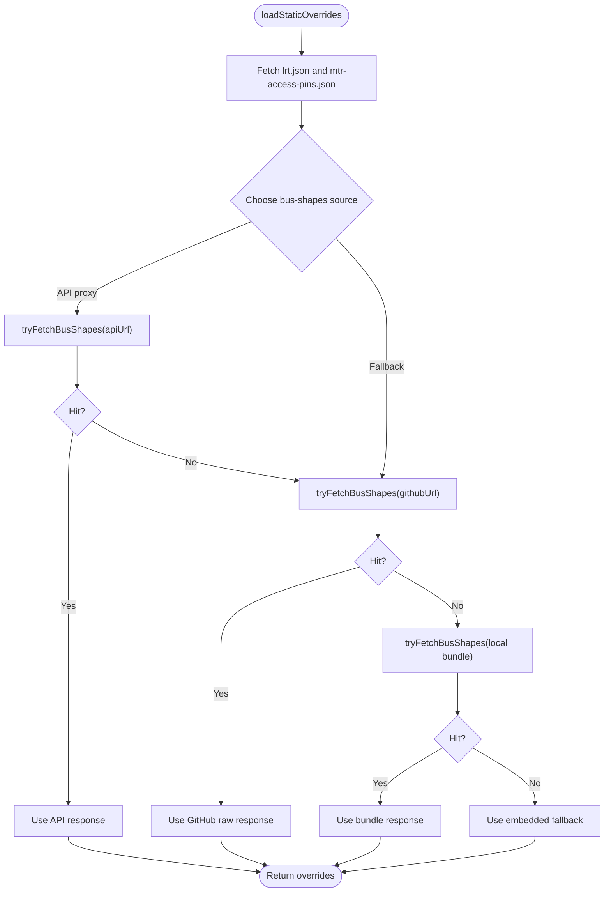
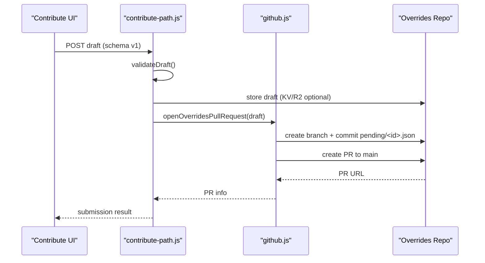
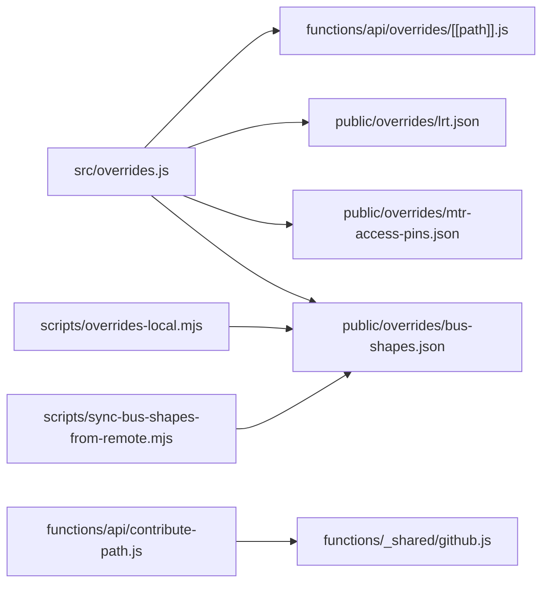

# Override System

<cite>
**Referenced Files in This Document**
- [overrides.js](file://src/overrides.js)
- [[path]].js](file://functions/api/overrides/[[path]].js)
- [contribute-path.js](file://functions/api/contribute-path.js)
- [github.js](file://functions/_shared/github.js)
- [lrt.json](file://public/overrides/lrt.json)
- [mtr-access-pins.json](file://public/overrides/mtr-access-pins.json)
- [bus-shapes.json](file://public/overrides/bus-shapes.json)
- [README.md](file://public/overrides/README.md)
- [local-overrides.md](file://docs/local-overrides.md)
- [overrides-local.mjs](file://scripts/overrides-local.mjs)
- [sync-bus-shapes-from-remote.mjs](file://scripts/sync-bus-shapes-from-remote.mjs)
</cite>

## Table of Contents
1. [Introduction](#introduction)
2. [Project Structure](#project-structure)
3. [Core Components](#core-components)
4. [Architecture Overview](#architecture-overview)
5. [Detailed Component Analysis](#detailed-component-analysis)
6. [Dependency Analysis](#dependency-analysis)
7. [Performance Considerations](#performance-considerations)
8. [Troubleshooting Guide](#troubleshooting-guide)
9. [Conclusion](#conclusion)
10. [Appendices](#appendices)

## Introduction
This document explains the community-driven override system that allows corrections to routes, schedules, and station information without code changes. It covers:
- JSON-based override formats for LRT shapes/platforms, MTR access pins, and bus route paths
- Validation rules enforced by the contribution endpoint
- Merging strategies with official data sources and how overrides are applied at runtime
- GitHub integration workflow for submitting, reviewing, and deploying contributions
- Client-side caching and server-side processing details
- Version management via published files and environment configuration
- Common override scenarios with examples

## Project Structure
The override system spans client modules, serverless functions, static assets, and scripts:
- Client module loads overrides from public files or a live remote source and provides cache invalidation helpers
- Serverless proxy serves the latest published bus shapes from a dedicated GitHub repository
- Contribution intake validates drafts and optionally opens a PR into a pending folder
- Static overrides include LRT geometry and MTR access pin locks
- Scripts support local testing, merging, and syncing published shapes into the app bundle

**Diagram sources**
- [overrides.js:168-239](file://src/overrides.js#L168-L239)
- [[path]].js:23-119](file://functions/api/overrides/[[path]].js#L23-L119)
- [contribute-path.js:202-334](file://functions/api/contribute-path.js#L202-L334)
- [github.js:137-409](file://functions/_shared/github.js#L137-L409)
- [lrt.json:1-56](file://public/overrides/lrt.json#L1-L56)
- [mtr-access-pins.json:1-39](file://public/overrides/mtr-access-pins.json#L1-L39)
- [bus-shapes.json:1-800](file://public/overrides/bus-shapes.json#L1-L800)
- [overrides-local.mjs:63-127](file://scripts/overrides-local.mjs#L63-L127)
- [sync-bus-shapes-from-remote.mjs:33-59](file://scripts/sync-bus-shapes-from-remote.mjs#L33-L59)

**Section sources**
- [overrides.js:168-239](file://src/overrides.js#L168-L239)
- [README.md:1-132](file://public/overrides/README.md#L1-L132)
- [local-overrides.md:1-182](file://docs/local-overrides.md#L1-L182)

## Core Components
- Client override loader: fetches LRT and MTR access pins from bundled JSON and bus shapes from a live source (API proxy or GitHub raw), with fallbacks and cache invalidation
- Serverless bus-shapes proxy: same-origin endpoint that proxies to the overrides repository’s main branch file with short CDN caching
- Contribution intake: validates draft payloads, stores them (optional KV/R2), notifies webhooks, and opens PRs via GitHub
- GitHub helpers: OAuth session handling and PR creation for pending contributions
- Static overrides: hand-maintained LRT shapes/platforms and MTR access pins that are never overwritten by automated pipelines
- Local tooling: CLI and dev endpoints to list, merge, and sync overrides during development

**Section sources**
- [overrides.js:168-239](file://src/overrides.js#L168-L239)
- [[path]].js:23-119](file://functions/api/overrides/[[path]].js#L23-L119)
- [contribute-path.js:36-133](file://functions/api/contribute-path.js#L36-L133)
- [github.js:137-409](file://functions/_shared/github.js#L137-L409)
- [lrt.json:1-56](file://public/overrides/lrt.json#L1-L56)
- [mtr-access-pins.json:1-39](file://public/overrides/mtr-access-pins.json#L1-L39)
- [overrides-local.mjs:63-127](file://scripts/overrides-local.mjs#L63-L127)

## Architecture Overview
The system separates concerns between client loading, serverless serving, and community contribution workflows:
- The client loads static overrides (LRT, MTR pins) from the app bundle and bus shapes from a live source
- The serverless proxy ensures CORS-safe access to the latest published bus shapes from GitHub
- Contributors submit path corrections via a validated endpoint; approved entries are merged into the published file
- Scripts and dev endpoints enable local review and merge cycles

**Diagram sources**
- [overrides.js:168-239](file://src/overrides.js#L168-L239)
- [[path]].js:23-119](file://functions/api/overrides/[[path]].js#L23-L119)
- [contribute-path.js:202-334](file://functions/api/contribute-path.js#L202-L334)
- [github.js:137-409](file://functions/_shared/github.js#L137-L409)

## Detailed Component Analysis

### Client Override Loader
Responsibilities:
- Load LRT shapes/platforms and MTR access pins from public/overrides
- Fetch bus shapes from a prioritized source: same-origin API proxy → GitHub raw → local bundle
- Provide cache invalidation and reload helpers

Key behaviors:
- Uses no-store/no-cache headers to avoid stale data for critical updates
- Falls back to embedded defaults if network requests fail
- Exposes getters for LRT, MTR access pins, and bus shape overrides

**Diagram sources**
- [overrides.js:168-239](file://src/overrides.js#L168-L239)
- [overrides.js:138-163](file://src/overrides.js#L138-L163)

**Section sources**
- [overrides.js:168-239](file://src/overrides.js#L168-L239)
- [overrides.js:247-259](file://src/overrides.js#L247-L259)

### Serverless Bus Shapes Proxy
Responsibilities:
- Serve bus-shapes.json from the overrides repository’s main branch
- Ensure CORS and COEP compatibility for cross-origin use
- Apply short edge caching to balance freshness and performance

Behavior:
- Validates method and path
- Proxies to GitHub raw with appropriate headers
- Returns error responses when upstream fails

**Section sources**
- [[path]].js:23-119](file://functions/api/overrides/[[path]].js#L23-L119)

### Contribution Intake and Validation
Responsibilities:
- Validate incoming draft payloads against a strict schema
- Store drafts optionally in KV/R2 and notify webhooks
- Open a PR into the overrides repository’s pending folder using either OAuth or bot mode

Validation highlights:
- Requires schema version, agency, route identifier, and coordinate arrays
- Enforces HK geographic bounds and point limits
- Cleans and normalizes fields before storage

**Diagram sources**
- [contribute-path.js:36-133](file://functions/api/contribute-path.js#L36-L133)
- [contribute-path.js:202-334](file://functions/api/contribute-path.js#L202-L334)
- [github.js:137-409](file://functions/_shared/github.js#L137-L409)

**Section sources**
- [contribute-path.js:36-133](file://functions/api/contribute-path.js#L36-L133)
- [contribute-path.js:202-334](file://functions/api/contribute-path.js#L202-L334)
- [github.js:137-409](file://functions/_shared/github.js#L137-L409)

### GitHub Integration Workflow
Modes:
- OAuth: contributor logs in; PR is opened from their fork
- Bot: site token opens PR directly on upstream

Workflow:
- Draft is committed to pending/<id>.json on a feature branch
- A PR is created targeting main with metadata and notes
- Moderators review and merge; published bus-shapes.json is updated
- Clients pick up new shapes on next load

**Section sources**
- [github.js:137-409](file://functions/_shared/github.js#L137-L409)
- [local-overrides.md:22-68](file://docs/local-overrides.md#L22-L68)
- [README.md:63-86](file://public/overrides/README.md#L63-L86)

### Static Overrides: LRT and MTR Access Pins
LRT overrides:
- Define corrected stop/platform coordinates and shape segments
- Include approach rules to force specific final approaches

MTR access pins:
- Lock station pins to ensure reliable routing and walking connections
- Not overwritten by automated merges

**Section sources**
- [lrt.json:1-56](file://public/overrides/lrt.json#L1-L56)
- [mtr-access-pins.json:1-39](file://public/overrides/mtr-access-pins.json#L1-L39)
- [overrides.js:47-120](file://src/overrides.js#L47-L120)

### Local Development and Merge Tooling
Capabilities:
- List status, pending drafts, and published route counts
- Merge pending contributions into published bus-shapes.json
- Sync published shapes into the app’s public bundle for offline use

Commands:
- npm run overrides:status
- npm run overrides:pending
- npm run overrides:merge -- pending/<id>.json

**Section sources**
- [overrides-local.mjs:63-127](file://scripts/overrides-local.mjs#L63-L127)
- [local-overrides.md:101-139](file://docs/local-overrides.md#L101-L139)

### Version Management and Sync
- Published bus shapes reside in a dedicated GitHub repository under main
- The app prefers the same-origin API proxy for fresh content; falls back to GitHub raw or local bundle
- Scripts can pull the latest published file into public/overrides for bundling

Environment variables:
- VITE_OVERRIDES_BUS_SHAPES_URL to force fetch URL
- OVERRIDES_REPO and OVERRIDES_BRANCH for proxy behavior
- OVERRIDES_GITHUB_TOKEN for bot-mode submissions

**Section sources**
- [overrides.js:24-41](file://src/overrides.js#L24-L41)
- [sync-bus-shapes-from-remote.mjs:33-59](file://scripts/sync-bus-shapes-from-remote.mjs#L33-L59)
- [local-overrides.md:156-182](file://docs/local-overrides.md#L156-L182)

## Dependency Analysis
Component relationships:
- Client depends on serverless proxy and static overrides
- Contribution intake depends on GitHub helpers for PR creation
- Scripts depend on filesystem and optional external repo structure

**Diagram sources**
- [overrides.js:168-239](file://src/overrides.js#L168-L239)
- [[path]].js:23-119](file://functions/api/overrides/[[path]].js#L23-L119)
- [contribute-path.js:202-334](file://functions/api/contribute-path.js#L202-L334)
- [github.js:137-409](file://functions/_shared/github.js#L137-L409)
- [overrides-local.mjs:63-127](file://scripts/overrides-local.mjs#L63-L127)
- [sync-bus-shapes-from-remote.mjs:33-59](file://scripts/sync-bus-shapes-from-remote.mjs#L33-L59)

**Section sources**
- [overrides.js:168-239](file://src/overrides.js#L168-L239)
- [contribute-path.js:202-334](file://functions/api/contribute-path.js#L202-L334)
- [github.js:137-409](file://functions/_shared/github.js#L137-L409)

## Performance Considerations
- Client uses no-store/no-cache for critical override fetches to ensure freshness
- Serverless proxy applies short edge caching (e.g., 60 seconds) to reduce upstream load while keeping updates timely
- Fallback chain minimizes latency and improves resilience: API proxy → GitHub raw → local bundle
- Large coordinate arrays are validated and bounded to prevent excessive payload sizes

[No sources needed since this section provides general guidance]

## Troubleshooting Guide
Common issues and resolutions:
- Bus shapes not updating:
  - Check that the API proxy returns 200 and points to the correct repository and branch
  - Clear browser cache or force reload; use invalidate/reload helpers
- Submission fails:
  - Ensure schema version matches expected value
  - Verify coordinates are within HK bounds and meet point limits
  - Confirm OAuth or bot token is configured correctly
- Local merge errors:
  - Ensure overrides repository exists and merge script is present
  - Use dry-run to preview changes before applying

**Section sources**
- [[path]].js:77-119](file://functions/api/overrides/[[path]].js#L77-L119)
- [contribute-path.js:36-133](file://functions/api/contribute-path.js#L36-L133)
- [overrides-local.mjs:105-127](file://scripts/overrides-local.mjs#L105-L127)

## Conclusion
The override system enables community-driven corrections to transit data without requiring code changes. It combines robust validation, flexible merging, and resilient fetching to keep the application accurate and responsive. The GitHub workflow ensures transparent review and deployment, while local tooling supports rapid iteration.

[No sources needed since this section summarizes without analyzing specific files]

## Appendices

### JSON Override Formats

#### Bus Shape Entry
Fields:
- schema: fixed version string
- id: unique identifier
- status: pending_review until approved
- agency: operator name
- route_short_name: route identifier
- route_id_match: array of identifiers used to match official routes
- from_match/to_match: arrays of strings matching origin/destination names or codes
- direction: optional direction label
- notes: free-form text
- coordinates: array of [lon, lat] pairs forming the path
- visual_stops: optional map pin adjustments per stop
- contributor/submitted_at/app_version/received_at: metadata

Validation constraints:
- Coordinates must be numeric and within HK bounds
- Maximum points and visual stops enforced
- Required fields validated strictly

**Section sources**
- [contribute-path.js:36-133](file://functions/api/contribute-path.js#L36-L133)
- [README.md:96-132](file://public/overrides/README.md#L96-L132)

#### LRT Overrides
Structure:
- updated_at: last update timestamp
- stops: corrected stop entries with coordinates and codes
- platforms: platform centroids and references
- shapes: corrected route segments with from/to matches and coordinates
- approach_rules: rules forcing specific final approaches

**Section sources**
- [lrt.json:1-56](file://public/overrides/lrt.json#L1-L56)

#### MTR Access Pins
Structure:
- updated_at: last update timestamp
- locked: array of station pins with coordinates and codes
- Optional notes explaining why pins are locked

**Section sources**
- [mtr-access-pins.json:1-39](file://public/overrides/mtr-access-pins.json#L1-L39)

### Common Override Scenarios

- Route correction:
  - Submit a bus shape entry with corrected coordinates and matching from/to terms
  - Reviewers approve and merge into published bus-shapes.json
  - Clients fetch updated shapes on next load

- Schedule adjustment:
  - While schedule data is typically sourced externally, route geometry corrections can influence ETA calculations by improving path accuracy
  - Use from_match/to_match to target specific segments

- New station addition:
  - Add or adjust MTR access pins to ensure reliable walking connections
  - Update LRT stops/platforms where necessary

**Section sources**
- [README.md:17-26](file://public/overrides/README.md#L17-L26)
- [README.md:96-132](file://public/overrides/README.md#L96-L132)
- [lrt.json:1-56](file://public/overrides/lrt.json#L1-L56)
- [mtr-access-pins.json:1-39](file://public/overrides/mtr-access-pins.json#L1-L39)