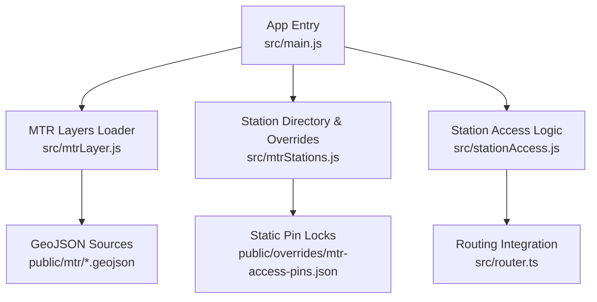
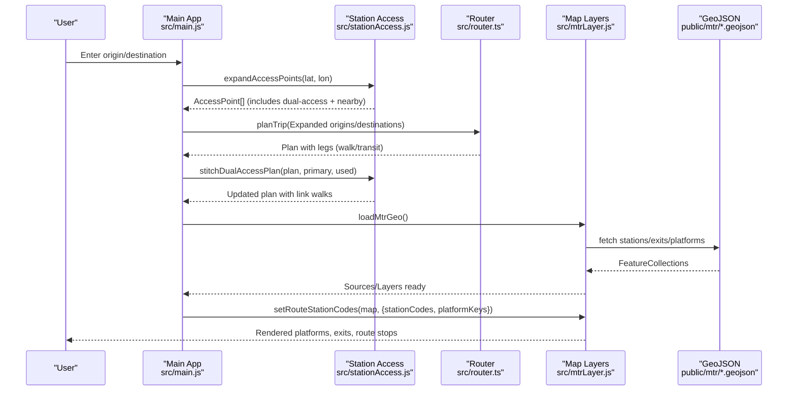
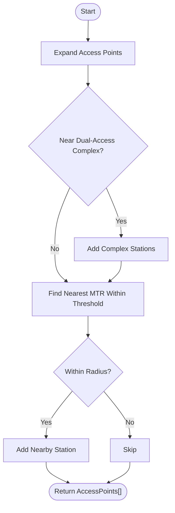
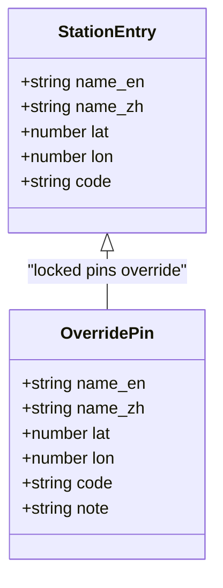
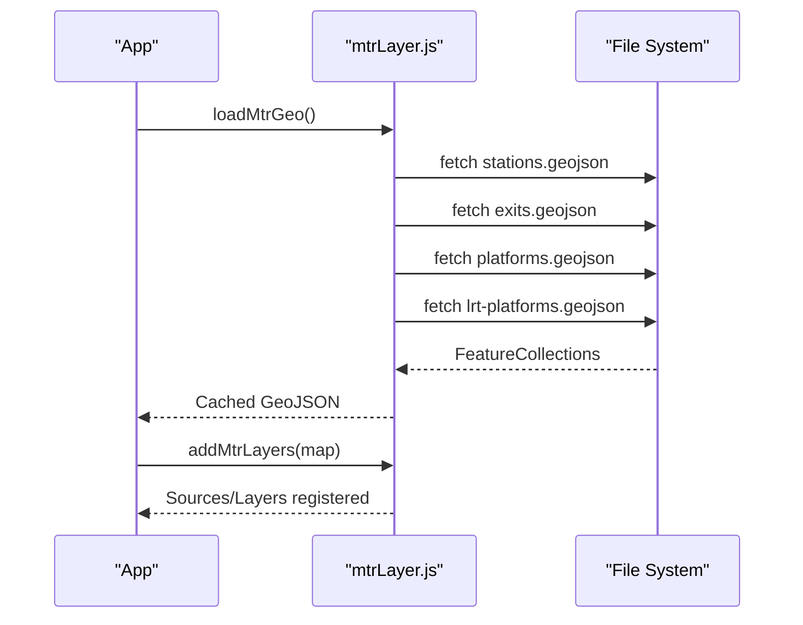
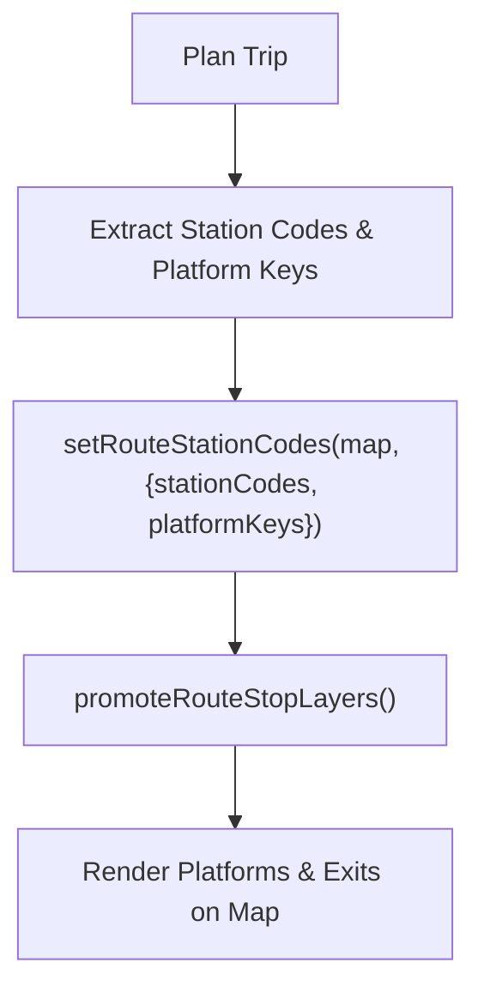
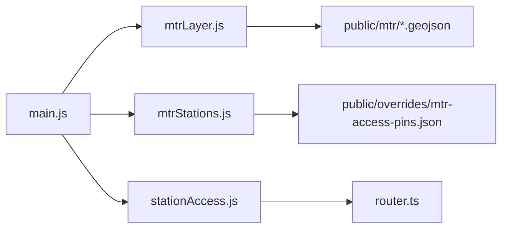

# Station Access Data

<cite>
**Referenced Files in This Document**
- [stationAccess.js](file://src/stationAccess.js)
- [mtrStations.js](file://src/mtrStations.js)
- [main.js](file://src/main.js)
- [mtrLayer.js](file://src/mtrLayer.js)
- [exits.geojson](file://public/mtr/exits.geojson)
- [platforms.geojson](file://public/mtr/platforms.geojson)
- [lrt-platforms.geojson](file://public/mtr/lrt-platforms.geojson)
- [stations.geojson](file://public/mtr/stations.geojson)
- [mtr-access-pins.json](file://public/overrides/mtr-access-pins.json)
- [local-overrides.md](file://docs/local-overrides.md)
</cite>

## Table of Contents
1. [Introduction](#introduction)
2. [Project Structure](#project-structure)
3. [Core Components](#core-components)
4. [Architecture Overview](#architecture-overview)
5. [Detailed Component Analysis](#detailed-component-analysis)
6. [Dependency Analysis](#dependency-analysis)
7. [Performance Considerations](#performance-considerations)
8. [Troubleshooting Guide](#troubleshooting-guide)
9. [Conclusion](#conclusion)
10. [Appendices](#appendices)

## Introduction
This document explains the station access information system for Hong Kong transit stations, focusing on wheelchair accessibility support, exit locations, and platform details. It documents the GeoJSON data structures used for exits, platforms, and station facilities; describes how dual-access station complexes are handled to improve routing accuracy; and outlines map rendering and interactive navigation assistance. It also covers data maintenance procedures and community contribution workflows for updating station information.

## Project Structure
The station access system is composed of:
- Static GeoJSON datasets under public/mtr for stations, exits, and platforms (including Light Rail).
- A runtime module that expands origin/destination pins to nearby or dual-access stations and stitches free interchange walks where applicable.
- Map integration that loads and renders MTR layers, including platform markers and route-specific stops.
- Overrides for precise station pin placement when automatic data is insufficient.

**Diagram sources**
- [main.js:18-29](file://src/main.js#L18-L29)
- [mtrLayer.js:28-54](file://src/mtrLayer.js#L28-L54)
- [mtrStations.js:279-333](file://src/mtrStations.js#L279-L333)
- [stationAccess.js:92-141](file://src/stationAccess.js#L92-L141)

**Section sources**
- [main.js:18-29](file://src/main.js#L18-L29)
- [mtrLayer.js:28-54](file://src/mtrLayer.js#L28-L54)
- [mtrStations.js:279-333](file://src/mtrStations.js#L279-L333)
- [stationAccess.js:92-141](file://src/stationAccess.js#L92-L141)

## Core Components
- Station directory and overrides: Provides a curated list of MTR stations with coordinates and codes, plus static pin locks to ensure reliable routing connectivity.
- Station access expansion: Expands user-origin/destination pins into multiple boarding/alighting options, including dual-access complexes and nearby MTR stations within a threshold distance.
- Dual-access stitching: Adds explicit walk legs between paired stations (e.g., Central ↔ Hong Kong, Tsim Sha Tsui ↔ East Tsim Sha Tsui, Airport ↔ AsiaWorld-Expo) to reflect real indoor/outdoor interchange paths.
- Map layer loading: Fetches and caches GeoJSON for stations, exits, and platforms, then registers MapLibre sources and layers for visualization.

Key responsibilities:
- Accurate routing via correct station pins and access points.
- Clear presentation of platform locations and exits on the map.
- Support for complex station layouts through dual-access handling.

**Section sources**
- [mtrStations.js:14-118](file://src/mtrStations.js#L14-L118)
- [mtrStations.js:279-333](file://src/mtrStations.js#L279-L333)
- [stationAccess.js:92-141](file://src/stationAccess.js#L92-L141)
- [stationAccess.js:155-235](file://src/stationAccess.js#L155-L235)
- [mtrLayer.js:28-54](file://src/mtrLayer.js#L28-L54)

## Architecture Overview
The system integrates routing, mapping, and static datasets to provide accessible navigation around MTR stations.

**Diagram sources**
- [stationAccess.js:92-141](file://src/stationAccess.js#L92-L141)
- [stationAccess.js:155-235](file://src/stationAccess.js#L155-L235)
- [mtrLayer.js:28-54](file://src/mtrLayer.js#L28-L54)
- [main.js:18-29](file://src/main.js#L18-L29)

## Detailed Component Analysis

### Station Access Expansion and Stitching
- Purpose: Ensure users can board/alight at the most convenient station point, including dual-access complexes and nearby stations when the original pin is not directly routable.
- Behavior:
  - ExpandAccessPoints returns the original pin plus potential alternatives from dual-access complexes and the nearest MTR station within a defined radius.
  - StitchDualAccessPlan inserts explicit walk legs between paired stations when the planner used a sibling station, adjusting total duration and distance accordingly.
  - Walk leg metadata indicates whether it is a free interchange, indoor interchange, or outdoor access walk.

**Diagram sources**
- [stationAccess.js:92-141](file://src/stationAccess.js#L92-L141)

**Section sources**
- [stationAccess.js:92-141](file://src/stationAccess.js#L92-L141)
- [stationAccess.js:155-235](file://src/stationAccess.js#L155-L235)
- [stationAccess.js:247-338](file://src/stationAccess.js#L247-L338)
- [stationAccess.js:347-380](file://src/stationAccess.js#L347-L380)

### Station Directory and Overrides
- Purpose: Provide accurate station coordinates and codes, with locked pins for critical stations to avoid incorrect routing due to centroid inaccuracies.
- Behavior:
  - The station array includes names, coordinates, and codes aligned with MTR open data.
  - Static overrides lock specific pins (e.g., Hong Kong, Airport, AsiaWorld-Expo) to ensure RAPTOR graph connectivity.
  - Merge logic updates station entries from GeoJSON unless a pin is locked.

**Diagram sources**
- [mtrStations.js:14-118](file://src/mtrStations.js#L14-L118)
- [mtrStations.js:279-333](file://src/mtrStations.js#L279-L333)
- [mtr-access-pins.json:1-39](file://public/overrides/mtr-access-pins.json#L1-L39)

**Section sources**
- [mtrStations.js:14-118](file://src/mtrStations.js#L14-L118)
- [mtrStations.js:279-333](file://src/mtrStations.js#L279-L333)
- [mtr-access-pins.json:1-39](file://public/overrides/mtr-access-pins.json#L1-L39)

### Map Rendering of Station Layouts
- Purpose: Visualize platforms, exits, and route-specific stops for clarity during navigation.
- Behavior:
  - LoadMtrGeo fetches stations, exits, and platforms GeoJSON once and caches them.
  - addMtrLayers registers MapLibre sources and layers for MTR overlays.
  - Route plans promote platform markers and exit visibility based on selected routes.

**Diagram sources**
- [mtrLayer.js:28-54](file://src/mtrLayer.js#L28-L54)

**Section sources**
- [mtrLayer.js:28-54](file://src/mtrLayer.js#L28-L54)
- [main.js:18-29](file://src/main.js#L18-L29)

### Interactive Navigation Assistance
- Purpose: Enhance route guidance by showing exact platform locations and relevant exits for planned trips.
- Behavior:
  - After planning, the app sets route station codes and promotes stop layers to highlight platforms and exits along the itinerary.
  - Platform snapping ensures markers align with actual platform geometry rather than generic station centroids.

**Diagram sources**
- [main.js:3978-4022](file://src/main.js#L3978-L4022)

**Section sources**
- [main.js:3978-4022](file://src/main.js#L3978-L4022)

## Dependency Analysis
- main.js orchestrates initialization, loading overrides, and integrating routing and mapping modules.
- mtrLayer.js depends on public/mtr GeoJSON files for station, exit, and platform data.
- mtrStations.js depends on public/overrides/mtr-access-pins.json for locked station pins.
- stationAccess.js depends on mtrStations.js for station codes and names, and integrates with router.ts for walk-leg constraints.

**Diagram sources**
- [main.js:18-29](file://src/main.js#L18-L29)
- [mtrLayer.js:28-54](file://src/mtrLayer.js#L28-L54)
- [mtrStations.js:279-333](file://src/mtrStations.js#L279-L333)
- [stationAccess.js:92-141](file://src/stationAccess.js#L92-L141)

**Section sources**
- [main.js:18-29](file://src/main.js#L18-L29)
- [mtrLayer.js:28-54](file://src/mtrLayer.js#L28-L54)
- [mtrStations.js:279-333](file://src/mtrStations.js#L279-L333)
- [stationAccess.js:92-141](file://src/stationAccess.js#L92-L141)

## Performance Considerations
- GeoJSON caching: Station, exit, and platform data are loaded once and cached to reduce network overhead.
- Efficient filtering: Access point expansion uses proximity checks and regex matching to minimize unnecessary computations.
- Routing constraints: Walk-leg thresholds prevent excessive egress/access distances, improving plan quality and reducing invalid results.

[No sources needed since this section provides general guidance]

## Troubleshooting Guide
- Incorrect station pins: Verify locked pins in the overrides file and ensure merge logic does not overwrite locked entries.
- Missing platform markers: Confirm that platform GeoJSON is loaded and that route station codes are set after planning.
- Unexpected long walks: Check dual-access stitching and nearby station thresholds; adjust if necessary based on local conditions.

**Section sources**
- [mtrStations.js:279-333](file://src/mtrStations.js#L279-L333)
- [main.js:3978-4022](file://src/main.js#L3978-L4022)

## Conclusion
The station access system combines curated station data, dynamic access expansion, and robust map rendering to deliver accurate and accessible navigation across Hong Kong’s transit network. Dual-access handling and pinned station coordinates address common routing pitfalls, while platform and exit visualizations enhance user experience. Community contributions and static overrides enable ongoing maintenance and improvement.

[No sources needed since this section summarizes without analyzing specific files]

## Appendices

### GeoJSON Data Structures
- Stations (public/mtr/stations.geojson): Point features with properties such as station_code, name_en, name_zh, lines, interchange, exits, platforms, venue_id, bbox.
- Exits (public/mtr/exits.geojson): Point features representing station exits with associated identifiers and metadata.
- Platforms (public/mtr/platforms.geojson): Point features for heavy rail platforms with platform_key, ref, mode, station_code.
- LRT Platforms (public/mtr/lrt-platforms.geojson): Point features for light rail platforms with similar structure to heavy rail platforms.

These datasets provide the spatial foundation for map rendering and route-specific highlighting.

**Section sources**
- [stations.geojson:1-1](file://public/mtr/stations.geojson#L1-L1)
- [exits.geojson:1-1](file://public/mtr/exits.geojson#L1-L1)
- [platforms.geojson:1-1](file://public/mtr/platforms.geojson#L1-L1)
- [lrt-platforms.geojson:1-1](file://public/mtr/lrt-platforms.geojson#L1-L1)

### Accessibility Features and Maintenance
- Wheelchair accessibility: While the current dataset focuses on exits and platforms, dual-access stitching and precise station pins help users navigate complex stations more reliably.
- Elevators and ramps: Information can be added to station facility attributes in future dataset updates; maintainers should ensure consistency with existing property schemas.
- Tactile guidance systems: Similarly, tactile features can be represented via additional properties in station or exit features.

Community contribution workflow:
- Use the local overrides testing flow to submit changes, review drafts, and merge published updates.
- Follow documented API endpoints and environment variables for OAuth or bot-mode submissions.

**Section sources**
- [local-overrides.md:1-182](file://docs/local-overrides.md#L1-L182)