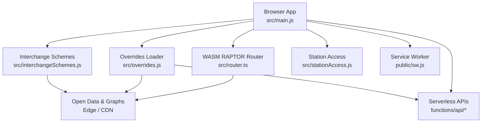
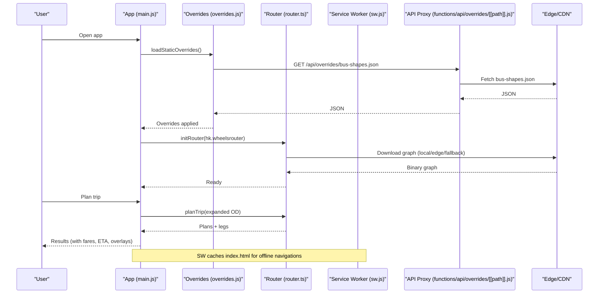
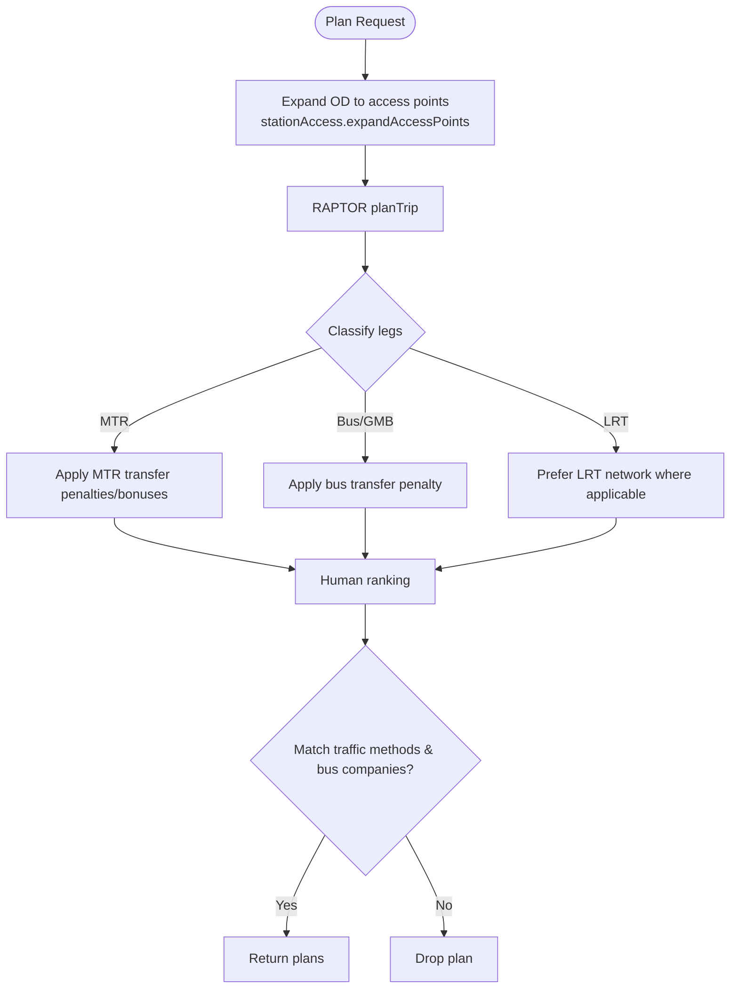
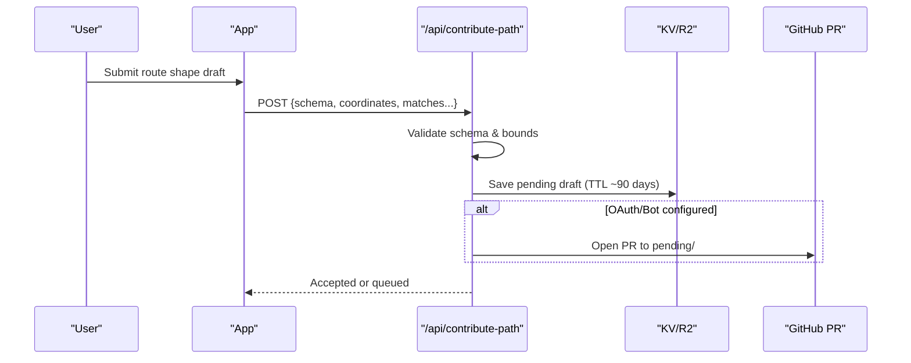
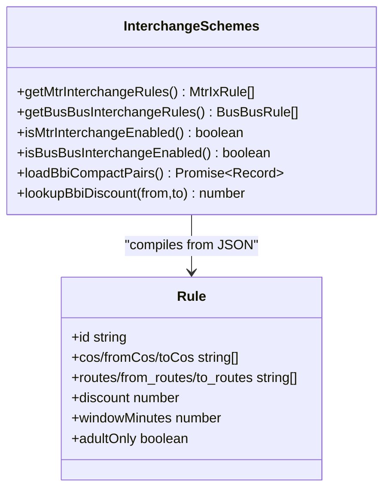
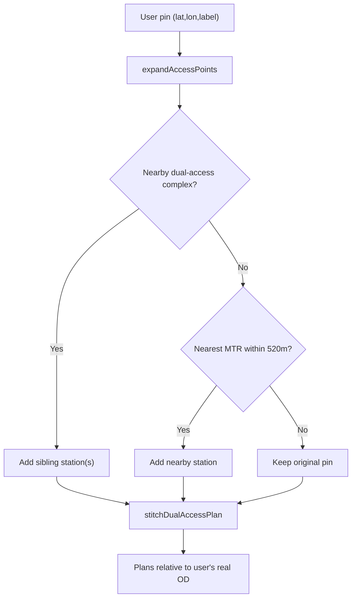
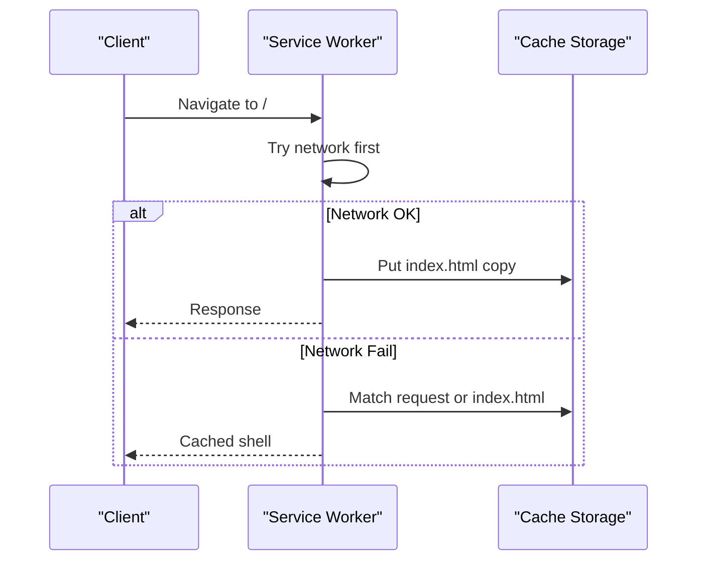
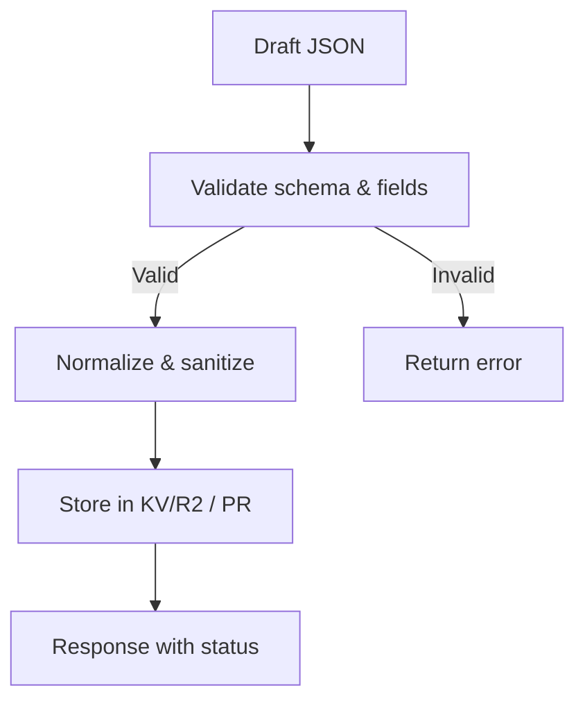
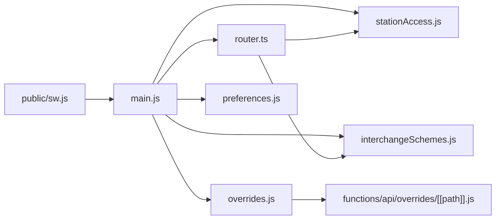

# Transit Data Management

<cite>
**Referenced Files in This Document**
- [main.js](file://src/main.js)
- [overrides.js](file://src/overrides.js)
- [interchangeSchemes.js](file://src/interchangeSchemes.js)
- [stationAccess.js](file://src/stationAccess.js)
- [router.ts](file://src/router.ts)
- [preferences.js](file://src/preferences.js)
- [mtrStations.js](file://src/mtrStations.js)
- [sw.js](file://public/sw.js)
- [collect-open-data.mjs](file://scripts/collect-open-data.mjs)
- [contribute-path.js](file://functions/api/contribute-path.js)
- [[path]].js](file://functions/api/overrides/[[path]].js)
- [README.md](file://public/overrides/README.md)
- [interchange-schemes.json](file://src/data/interchange-schemes.json)
</cite>

## Table of Contents
1. [Introduction](#introduction)
2. [Project Structure](#project-structure)
3. [Core Components](#core-components)
4. [Architecture Overview](#architecture-overview)
5. [Detailed Component Analysis](#detailed-component-analysis)
6. [Dependency Analysis](#dependency-analysis)
7. [Performance Considerations](#performance-considerations)
8. [Troubleshooting Guide](#troubleshooting-guide)
9. [Conclusion](#conclusion)
10. [Appendices](#appendices)

## Introduction
This document explains how MorganTraveler processes and integrates GTFS-based transit data for multiple operators across Hong Kong, including MTR Corporation, Light Rail (LRT), buses, green minibuses (GMB), and ferries. It details:
- Operator-specific integrations and data handling
- Community-driven override system for routes, schedules, and station information without code changes
- Caching strategies using browser storage and a service worker for offline access
- Data validation, schema versioning, and migration processes
- Interchange schemes enabling seamless transfers between modes
- Station access enhancements for wheelchair accessibility and navigation assistance

## Project Structure
The application is a client-side web app with serverless functions and scripts to collect and sync open data. Key areas:
- src/: Core runtime modules (routing, overrides, interchange schemes, station access, preferences, operator data loaders)
- public/: Static assets, PWA service worker, hand-maintained overrides, map tiles, and fare data
- functions/: Cloudflare Pages Functions for API endpoints (overrides proxy, contribution intake)
- scripts/: Data collection and synchronization utilities

**Diagram sources**
- [main.js:18-29](file://src/main.js#L18-L29)
- [router.ts:207-249](file://src/router.ts#L207-L249)
- [overrides.js:168-239](file://src/overrides.js#L168-L239)
- [interchangeSchemes.js:118-158](file://src/interchangeSchemes.js#L118-L158)
- [stationAccess.js:92-141](file://src/stationAccess.js#L92-L141)
- [sw.js:42-86](file://public/sw.js#L42-L86)
- [[path]].js:23-119](file://functions/api/overrides/[[path]].js#L23-L119)

**Section sources**
- [main.js:18-29](file://src/main.js#L18-L29)
- [sw.js:1-86](file://public/sw.js#L1-L86)

## Core Components
- Routing engine: WASM RAPTOR wrapper that loads the HK transit graph and plans trips with human-centric ranking rules across MTR, LRT, bus, GMB, AEL, and walk.
- Overrides system: Loads static corrections for LRT shapes/platforms, MTR access pins, and bus route shapes from local files or live GitHub via a same-origin API proxy.
- Interchange schemes: JSON-driven discount rules for MTR–PT and bus–bus interchanges, compiled at runtime.
- Station access: Dual-access complexes and nearby-MTR expansion to improve routing around POIs/hotels and enable free indoor/outdoor link stitching.
- Preferences: LocalStorage-backed user settings for traffic methods, bus companies, service day, and departure time.
- Data collection: Script to download open data and edge assets (GTFS, basemap, router graph).

**Section sources**
- [router.ts:1-120](file://src/router.ts#L1-L120)
- [overrides.js:1-120](file://src/overrides.js#L1-L120)
- [interchangeSchemes.js:1-120](file://src/interchangeSchemes.js#L1-L120)
- [stationAccess.js:1-141](file://src/stationAccess.js#L1-L141)
- [preferences.js:1-200](file://src/preferences.js#L1-L200)
- [collect-open-data.mjs:31-166](file://scripts/collect-open-data.mjs#L31-L166)

## Architecture Overview
The app initializes the map, loads static overrides, then initializes the WASM router with the HK transit graph. User queries are expanded into access points (including dual-access stations), routed through RAPTOR, ranked with human rules, and enriched with fares and ETA. Offline support is provided by a minimal service worker caching only the HTML shell.

**Diagram sources**
- [main.js:180-187](file://src/main.js#L180-L187)
- [overrides.js:168-239](file://src/overrides.js#L168-L239)
- [[path]].js:23-119](file://functions/api/overrides/[[path]].js#L23-L119)
- [router.ts:207-249](file://src/router.ts#L207-L249)
- [sw.js:42-86](file://public/sw.js#L42-L86)

## Detailed Component Analysis

### Multiple Operator Integrations and Data Handling
- Operators supported:
  - MTR heavy rail and Airport Express
  - Light Rail (LRT)
  - Buses (KMB/LWB, CTB, NLB)
  - Green minibuses (GMB)
  - Ferries (via mode filtering and GTFS)
- The router classifies leg types and applies penalties/bonuses to prefer direct buses, allow MTR interchanges, avoid impossible harbor walks, and favor MTR-only when both OD are stations.

**Diagram sources**
- [stationAccess.js:92-141](file://src/stationAccess.js#L92-L141)
- [router.ts:251-303](file://src/router.ts#L251-L303)
- [router.ts:468-563](file://src/router.ts#L468-L563)

**Section sources**
- [router.ts:251-303](file://src/router.ts#L251-L303)
- [router.ts:468-563](file://src/router.ts#L468-L563)

### Override System for Community Contributions
- Sources:
  - LRT shapes/platforms and MTR access pins loaded from public/overrides/*.json
  - Bus route shapes fetched live from GitHub via a same-origin API proxy; falls back to bundled file if unavailable
- Contribution workflow:
  - Users submit path drafts via POST /api/contribute-path
  - Server validates payload against schema morgan.travelers.bus-shape.v1
  - Drafts stored in KV/R2 and optionally opened as PRs to the overrides repo
  - Moderators merge approved contributions; app fetches updated bus-shapes.json on next load

**Diagram sources**
- [contribute-path.js:36-133](file://functions/api/contribute-path.js#L36-L133)
- [contribute-path.js:202-335](file://functions/api/contribute-path.js#L202-L335)
- [overrides.js:168-239](file://src/overrides.js#L168-L239)
- [README.md:28-86](file://public/overrides/README.md#L28-L86)

**Section sources**
- [overrides.js:168-239](file://src/overrides.js#L168-L239)
- [README.md:1-132](file://public/overrides/README.md#L1-L132)
- [contribute-path.js:36-133](file://functions/api/contribute-path.js#L36-L133)
- [contribute-path.js:202-335](file://functions/api/contribute-path.js#L202-L335)

### Interchange Schemes System
- Rules are defined in src/data/interchange-schemes.json with schema versioning and metadata.
- At runtime, rules are compiled into efficient structures for MTR–PT and bus–bus discounts.
- Sync script refreshes indexes and artifacts from operator websites.

**Diagram sources**
- [interchangeSchemes.js:118-171](file://src/interchangeSchemes.js#L118-L171)
- [interchangeSchemes.js:178-239](file://src/interchangeSchemes.js#L178-L239)
- [interchange-schemes.json:1-53](file://src/data/interchange-schemes.json#L1-L53)

**Section sources**
- [interchangeSchemes.js:118-171](file://src/interchangeSchemes.js#L118-L171)
- [interchangeSchemes.js:178-239](file://src/interchangeSchemes.js#L178-L239)
- [interchange-schemes.json:1-53](file://src/data/interchange-schemes.json#L1-L53)
- [sync-interchange-schemes.mjs:82-170](file://scripts/sync-interchange-schemes.mjs#L82-L170)

### Station Access Information and Dual-Access Complexes
- Expands origin/destination pins to include:
  - Dual-access complex stations (e.g., Central ↔ Hong Kong, TST ↔ East TST, Airport ↔ AsiaWorld-Expo)
  - Nearest MTR station within ~520 m for POIs/hotels
- Stitches free-link or access walks into plans so itineraries reflect the user’s actual start/end point.

**Diagram sources**
- [stationAccess.js:92-141](file://src/stationAccess.js#L92-L141)
- [stationAccess.js:155-235](file://src/stationAccess.js#L155-L235)

**Section sources**
- [stationAccess.js:92-141](file://src/stationAccess.js#L92-L141)
- [stationAccess.js:155-235](file://src/stationAccess.js#L155-L235)
- [mtrStations.js:13-118](file://src/mtrStations.js#L13-L118)

### Data Caching Strategies
- Browser storage:
  - Preferences, pinned routes, and service day/departure time persisted in localStorage
- Service worker:
  - Minimal SW caches only the HTML shell for offline navigation fallback
  - Clears old caches on activation and notifies clients

**Diagram sources**
- [sw.js:42-86](file://public/sw.js#L42-L86)
- [preferences.js:106-195](file://src/preferences.js#L106-L195)
- [main.js:412-498](file://src/main.js#L412-L498)

**Section sources**
- [sw.js:1-86](file://public/sw.js#L1-L86)
- [preferences.js:106-195](file://src/preferences.js#L106-L195)
- [main.js:412-498](file://src/main.js#L412-L498)

### Data Validation, Schema Versioning, and Migration
- Contribution payloads validated against schema morgan.travelers.bus-shape.v1 with strict checks on coordinates, bounds, and field lengths.
- Interchange schemes use schema morgan.travelers.interchange-schemes.v1 with metadata and source links.
- Migration:
  - Legacy single pinned route key migrated to multi-route list in localStorage
  - Preferences keys migrated on load

**Diagram sources**
- [contribute-path.js:36-133](file://functions/api/contribute-path.js#L36-L133)
- [interchange-schemes.json:1-5](file://src/data/interchange-schemes.json#L1-L5)
- [main.js:441-460](file://src/main.js#L441-L460)

**Section sources**
- [contribute-path.js:36-133](file://functions/api/contribute-path.js#L36-L133)
- [interchange-schemes.json:1-5](file://src/data/interchange-schemes.json#L1-L5)
- [main.js:441-460](file://src/main.js#L441-L460)

## Dependency Analysis
Key runtime dependencies and relationships:
- main.js orchestrates initialization and UI state, importing router, overrides, interchange schemes, station access, and preferences.
- router.ts depends on stationAccess for OD expansion and uses mtrInterchange and harbourWalk helpers for ranking.
- overrides.js provides LRT and bus shape corrections consumed by LRT and bus rendering modules.
- interchangeSchemes.js compiles rules from JSON and exposes lookup functions used by fare estimation and plan ranking.
- sw.js intercepts navigations to provide offline fallback.

**Diagram sources**
- [main.js:18-29](file://src/main.js#L18-L29)
- [router.ts:20-33](file://src/router.ts#L20-L33)
- [overrides.js:168-239](file://src/overrides.js#L168-L239)
- [interchangeSchemes.js:118-158](file://src/interchangeSchemes.js#L118-L158)
- [sw.js:42-86](file://public/sw.js#L42-L86)

**Section sources**
- [main.js:18-29](file://src/main.js#L18-L29)
- [router.ts:20-33](file://src/router.ts#L20-L33)
- [overrides.js:168-239](file://src/overrides.js#L168-L239)
- [interchangeSchemes.js:118-158](file://src/interchangeSchemes.js#L118-L158)
- [sw.js:42-86](file://public/sw.js#L42-L86)

## Performance Considerations
- Graph loading: Router tries local, edge, and compressed variants to minimize latency and bandwidth.
- Overrides fetching: Uses no-store cache headers and short-lived CDN caching for bus shapes to balance freshness and performance.
- Ranking penalties: Tuned to reduce unrealistic plans (e.g., long outdoor MTR line walks) and prioritize user-friendly itineraries.
- Offline shell: Lightweight SW avoids aggressive asset caching that could break styling or WASM loading.

[No sources needed since this section provides general guidance]

## Troubleshooting Guide
- Overrides not applying:
  - Check network requests to /api/overrides/bus-shapes.json and verify CORS and upstream availability
  - Confirm local bundle fallback exists under public/overrides/bus-shapes.json
- Plans missing expected operators:
  - Verify trafficMethods and busCompanies filters in preferences
  - Ensure router modes include required modes (subway,rail,tram,light_rail,...)
- Offline issues:
  - Clear SW caches via message handler and reload
  - Ensure index.html is cached after successful navigation

**Section sources**
- [overrides.js:168-239](file://src/overrides.js#L168-L239)
- [preferences.js:106-195](file://src/preferences.js#L106-L195)
- [sw.js:31-40](file://public/sw.js#L31-L40)

## Conclusion
MorganTraveler integrates multiple transit operators through a robust routing engine, community-driven overrides, and configurable interchange schemes. Its design emphasizes accurate, human-friendly plans with offline resilience and accessible station navigation. The modular architecture allows continuous updates to data sources and business rules without code changes.

[No sources needed since this section summarizes without analyzing specific files]

## Appendices

### Operator-Specific Notes
- MTR: Heavy rail and Airport Express; dual-access complexes stitched for seamless boarding/alighting
- LRT: Platform and shape overrides for precise alignment and stop mapping
- Buses/GMB: Shape corrections via community contributions; company filtering supported
- Ferries: Mode-aware filtering and GTFS integration

[No sources needed since this section provides general guidance]