# User Interface Components

<cite>
**Referenced Files in This Document**
- [index.html](file://index.html)
- [style.css](file://src/style.css)
- [main.js](file://src/main.js)
- [acrylic.js](file://src/acrylic.js)
- [manifest.webmanifest](file://public/manifest.webmanifest)
- [sw.js](file://public/sw.js)
- [vite.config.js](file://vite.config.js)
</cite>

## Table of Contents
1. [Introduction](#introduction)
2. [Project Structure](#project-structure)
3. [Core Components](#core-components)
4. [Architecture Overview](#architecture-overview)
5. [Detailed Component Analysis](#detailed-component-analysis)
6. [Dependency Analysis](#dependency-analysis)
7. [Performance Considerations](#performance-considerations)
8. [Troubleshooting Guide](#troubleshooting-guide)
9. [Conclusion](#conclusion)
10. [Appendices](#appendices)

## Introduction
This document describes the user interface components that power MorganTraveler’s progressive web app experience. It focuses on the map-centric application shell, route planning panels, station information displays, responsive design patterns across desktop/tablet/mobile, acrylic glass morphism effects, accessibility features for screen readers and keyboard navigation, service worker integration for offline functionality, PWA manifest configuration, cross-browser compatibility considerations, and performance optimizations for smooth animations and transitions.

## Project Structure
The UI is built around a full-bleed map with floating panels and sheets. The HTML defines the application shell, map container, and panel/sheet markup. CSS provides the acrylic glass aesthetic, responsive layout rules, and motion preferences. JavaScript initializes the map, wires up interactions, manages state (ETA mode vs Trip Plan), and integrates routing, ETA, fares, and contributions.

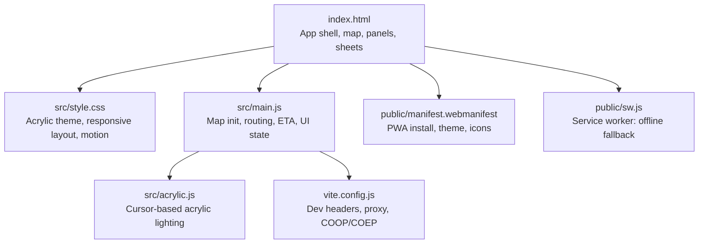

**Diagram sources**
- [index.html:1-120](file://index.html#L1-L120)
- [style.css:1-120](file://src/style.css#L1-L120)
- [main.js:1-180](file://src/main.js#L1-L180)
- [acrylic.js:1-87](file://src/acrylic.js#L1-L87)
- [manifest.webmanifest:1-28](file://public/manifest.webmanifest#L1-L28)
- [sw.js:1-87](file://public/sw.js#L1-L87)
- [vite.config.js:773-800](file://vite.config.js#L773-L800)

**Section sources**
- [index.html:1-120](file://index.html#L1-L120)
- [style.css:1-120](file://src/style.css#L1-L120)
- [main.js:1-180](file://src/main.js#L1-L180)

## Core Components
- Map-centric shell: Full-bleed map container with loading overlay and route badge.
- Panels and sheets: Left-side detail sidebar on desktop; bottom sheet on mobile with chrome, title row, and pages (search, trip plan, ETA list, pinned routes).
- Route planning: Origin/destination inputs, suggestions, preferences (fastest/simplest/cheapest), service day mode, departure time, bus company filters.
- Station information: ETA lists, route details, platform info, live status, and fare estimates.
- Acrylic glass morphism: Glass panels with backdrop blur, subtle borders, and cursor-driven border lighting.
- Accessibility: ARIA roles, labels, live regions, keyboard hints, and reduced motion support.
- Service worker: Minimal SW providing offline fallback for navigations and cache management.
- Manifest: PWA metadata, theme colors, display modes, and icons.

**Section sources**
- [index.html:76-120](file://index.html#L76-L120)
- [index.html:512-800](file://index.html#L512-L800)
- [style.css:228-358](file://src/style.css#L228-L358)
- [style.css:649-712](file://src/style.css#L649-L712)
- [style.css:5939-6145](file://src/style.css#L5939-L6145)
- [main.js:214-295](file://src/main.js#L214-L295)

## Architecture Overview
The application shell composes a map stage with overlays and a floating toolbar/panel. On mobile, the panel becomes a bottom sheet anchored to the viewport bottom with a fixed dock. The main script initializes the map, sets worker URLs, loads static overrides, and wires up UI state transitions between ETA and Trip Plan modes.

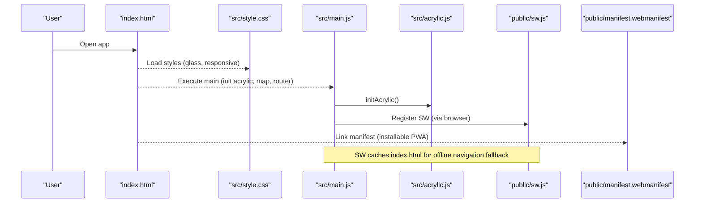

**Diagram sources**
- [index.html:24-27](file://index.html#L24-L27)
- [index.html:76-106](file://index.html#L76-L106)
- [main.js:177-211](file://src/main.js#L177-L211)
- [acrylic.js:6-86](file://src/acrylic.js#L6-L86)
- [sw.js:11-29](file://public/sw.js#L11-L29)
- [manifest.webmanifest:1-28](file://public/manifest.webmanifest#L1-L28)

## Detailed Component Analysis

### Application Shell and Map Stage
- Map container fills the viewport with a dark background and optional blur during route calculation.
- Loading overlay appears with a spinner and label while drawing routes.
- Route number badge floats near map tools/attribution for context.
- Status region exists for errors/router status but is visually hidden by default.

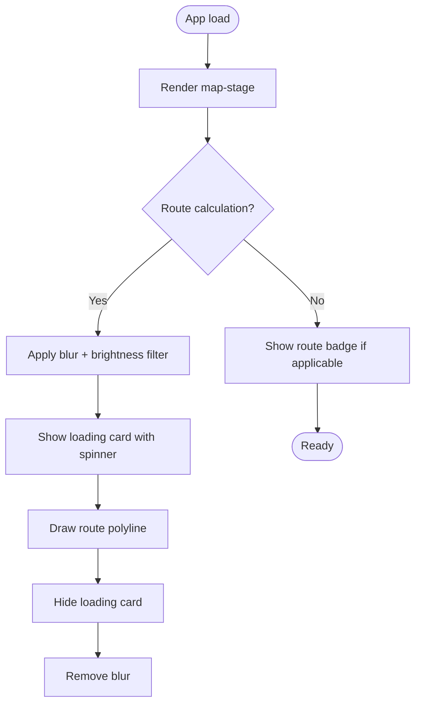

**Diagram sources**
- [index.html:78-106](file://index.html#L78-L106)
- [style.css:241-358](file://src/style.css#L241-L358)

**Section sources**
- [index.html:78-106](file://index.html#L78-L106)
- [style.css:241-358](file://src/style.css#L241-L358)

### Panels and Sheets (Desktop Sidebar / Mobile Bottom Sheet)
- Desktop: Left-floating glass panel with chrome (grabber, title, profile menu).
- Mobile: Bottom sheet anchored to viewport bottom with fixed dock; content height computed via JS and CSS variables.
- Pages inside the panel include ETA route list, trip plan form, settings/info, and pinned routes.

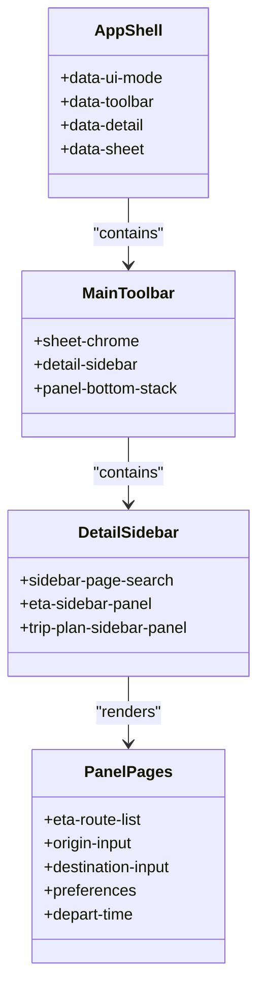

**Diagram sources**
- [index.html:76-120](file://index.html#L76-L120)
- [index.html:512-800](file://index.html#L512-L800)
- [style.css:649-712](file://src/style.css#L649-L712)
- [style.css:5939-6145](file://src/style.css#L5939-L6145)

**Section sources**
- [index.html:512-800](file://index.html#L512-L800)
- [style.css:649-712](file://src/style.css#L649-L712)
- [style.css:5939-6145](file://src/style.css#L5939-L6145)

### Route Planning Panels
- Inputs for origin and destination with autocomplete suggestions and location button.
- Preferences group for fastest/simplest/least fare, service day mode (usual/holiday), departure time (UTC+8), and bus company multi-select.
- Search mode hints and keyboard shortcuts are exposed inline.

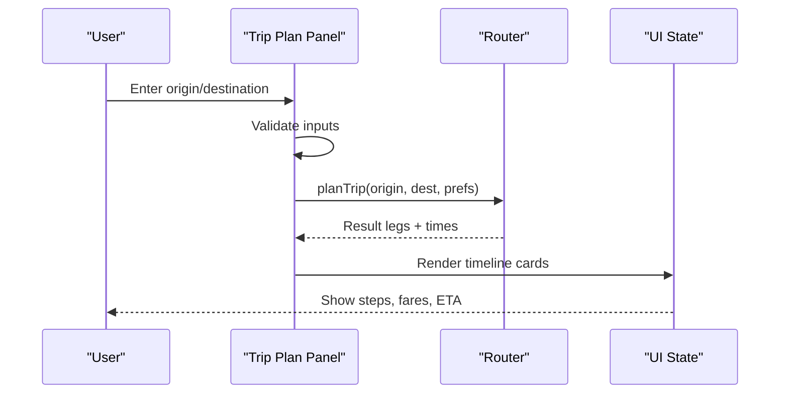

**Diagram sources**
- [index.html:616-800](file://index.html#L616-L800)
- [main.js:214-295](file://src/main.js#L214-L295)

**Section sources**
- [index.html:616-800](file://index.html#L616-L800)
- [main.js:214-295](file://src/main.js#L214-L295)

### Station Information Displays
- ETA route list with live or scheduled indicators.
- Route detail view with back/pin actions and stop-specific pins.
- Platform and interchange hints integrated into station data layers.

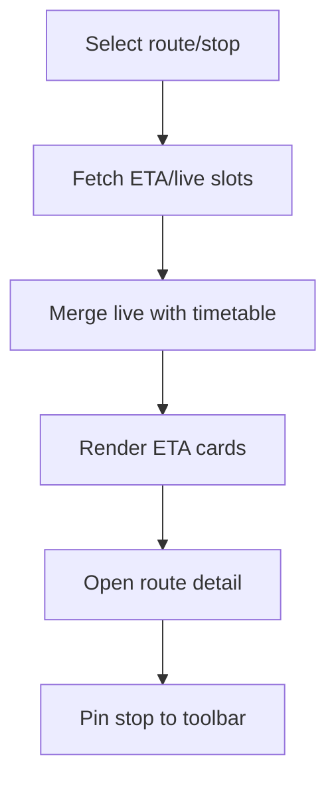

**Diagram sources**
- [index.html:574-614](file://index.html#L574-L614)
- [index.html:1156-1183](file://index.html#L1156-L1183)

**Section sources**
- [index.html:574-614](file://index.html#L574-L614)
- [index.html:1156-1183](file://index.html#L1156-L1183)

### Acrylic Glass Morphism Effects
- Glass panels use backdrop-filter blur and semi-transparent backgrounds with subtle borders.
- Cursor-driven Sayram lighting updates CSS custom properties for radial gradient highlights on hover.
- Mobile disables the ring effect to avoid unnecessary work.

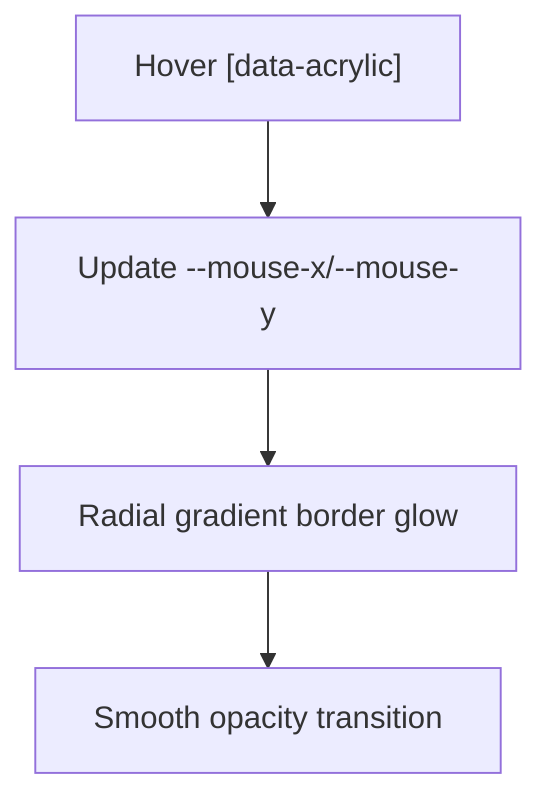

**Diagram sources**
- [style.css:181-227](file://src/style.css#L181-L227)
- [acrylic.js:6-86](file://src/acrylic.js#L6-L86)

**Section sources**
- [style.css:181-227](file://src/style.css#L181-L227)
- [acrylic.js:6-86](file://src/acrylic.js#L6-L86)

### Accessibility Features
- ARIA roles and labels on map, panels, menus, and buttons.
- Live regions announce status changes (e.g., router status).
- Keyboard hints displayed inline for quick access.
- Reduced motion media query disables animations and spinner rotation when requested.

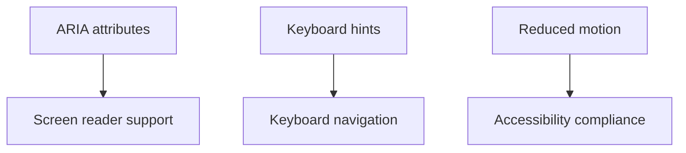

**Diagram sources**
- [index.html:76-120](file://index.html#L76-L120)
- [index.html:512-800](file://index.html#L512-L800)
- [style.css:343-358](file://src/style.css#L343-L358)

**Section sources**
- [index.html:76-120](file://index.html#L76-L120)
- [index.html:512-800](file://index.html#L512-L800)
- [style.css:343-358](file://src/style.css#L343-L358)

### Service Worker Integration (Offline Functionality)
- Minimal SW skips waiting on install and activates immediately.
- On activate, clears old caches and claims clients; notifies clients of activation.
- Intercepts only GET navigations to serve cached index.html when network fails.
- Does not intercept CSS/JS/WASM to avoid broken styling on mobile Safari.

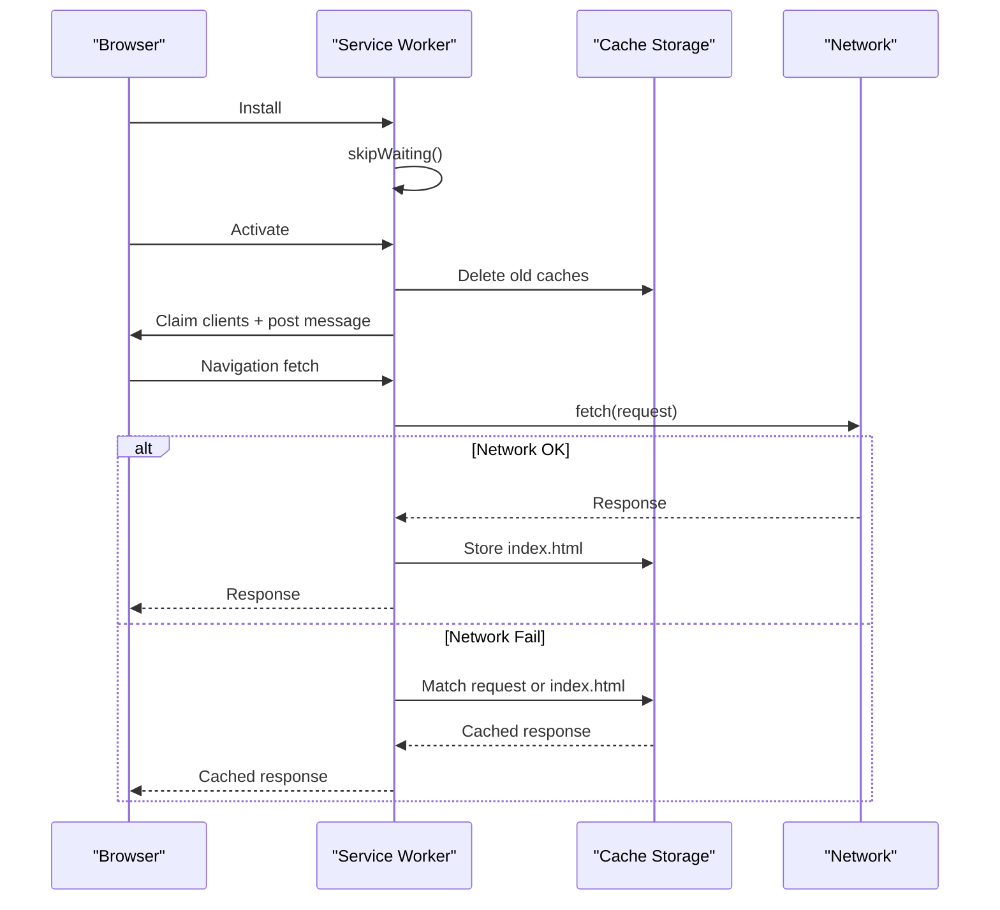

**Diagram sources**
- [sw.js:11-29](file://public/sw.js#L11-L29)
- [sw.js:42-86](file://public/sw.js#L42-L86)

**Section sources**
- [sw.js:11-29](file://public/sw.js#L11-L29)
- [sw.js:42-86](file://public/sw.js#L42-L86)

### PWA Manifest Configuration
- Name, short name, description, start URL, scope, and display modes (standalone/fullscreen/browser).
- Theme and background colors match the app’s glass palette.
- Icons defined for maskable usage at 192px and 512px.

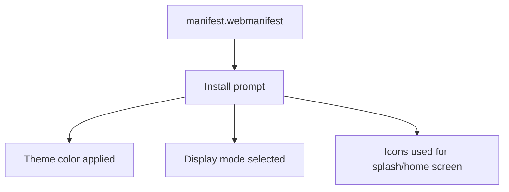

**Diagram sources**
- [manifest.webmanifest:1-28](file://public/manifest.webmanifest#L1-L28)

**Section sources**
- [manifest.webmanifest:1-28](file://public/manifest.webmanifest#L1-L28)

### Cross-Browser Compatibility Considerations
- Edge-to-edge rendering uses viewport-fit=cover and safe-area insets to avoid black bars under Dynamic Island/home indicator.
- Vite dev server sets COOP/COEP headers to enable cross-origin isolation required for WASM/SharedArrayBuffer.
- Proxy for edge assets ensures CORP headers in development.
- Service worker avoids intercepting non-navigation requests to prevent style/script caching issues on mobile Safari.

**Section sources**
- [index.html:5-18](file://index.html#L5-L18)
- [style.css:84-133](file://src/style.css#L84-L133)
- [vite.config.js:111-120](file://vite.config.js#L111-L120)
- [vite.config.js:773-800](file://vite.config.js#L773-L800)
- [sw.js:1-8](file://public/sw.js#L1-L8)

### Performance Optimization Techniques
- Map blur and brightness during route calculation reduce perceived latency.
- Backdrop-filter and will-change optimize GPU compositing for overlays.
- Acrylic lighting throttled via requestAnimationFrame and passive event listeners.
- Reduced motion media query disables animations for users who prefer it.
- Service worker caches only index.html for offline cold starts to minimize overhead.

**Section sources**
- [style.css:241-358](file://src/style.css#L241-L358)
- [acrylic.js:55-86](file://src/acrylic.js#L55-L86)
- [sw.js:42-86](file://public/sw.js#L42-L86)

## Dependency Analysis
The UI depends on:
- MapLibre GL for map rendering and controls.
- Protomaps basemaps for tile layers.
- PMTiles protocol for efficient tile serving.
- Local modules for routing, ETA, fares, stations, and contributions.
- Acrylic module for cursor lighting.
- Service worker for offline fallback.
- Manifest for PWA behavior.

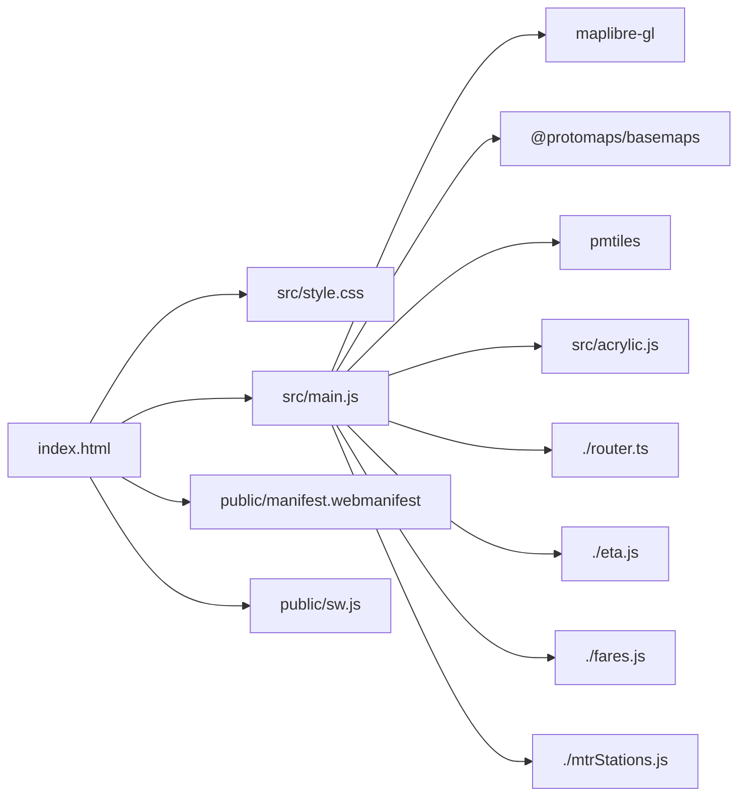

**Diagram sources**
- [main.js:1-180](file://src/main.js#L1-L180)
- [index.html:24-27](file://index.html#L24-L27)
- [manifest.webmanifest:1-28](file://public/manifest.webmanifest#L1-L28)
- [sw.js:1-87](file://public/sw.js#L1-L87)

**Section sources**
- [main.js:1-180](file://src/main.js#L1-L180)
- [index.html:24-27](file://index.html#L24-L27)

## Performance Considerations
- Prefer backdrop-filter and will-change for heavy visual effects to leverage GPU acceleration.
- Use requestAnimationFrame for frequent updates (acrylic lighting) to avoid layout thrashing.
- Keep service worker minimal to reduce parse/activation cost; only cache essential resources.
- Respect prefers-reduced-motion to improve UX for sensitive users.
- Avoid intercepting non-navigational fetches in SW to prevent caching pitfalls.

[No sources needed since this section provides general guidance]

## Troubleshooting Guide
- If the app loads without styles on mobile Safari, ensure the SW is not intercepting CSS/JS; the current SW only handles navigations.
- If the map worker fails to load, verify the worker URL points to public/maplibre/* and that COOP/COEP headers are set in dev.
- If offline fallback does not work, confirm the SW has activated and cached index.html; check client messages for SW_ACTIVATED.
- If acrylic lighting flickers, ensure passive listeners are used and RAF scheduling is active.

**Section sources**
- [sw.js:1-8](file://public/sw.js#L1-L8)
- [sw.js:11-29](file://public/sw.js#L11-L29)
- [main.js:190-211](file://src/main.js#L190-L211)
- [acrylic.js:55-86](file://src/acrylic.js#L55-L86)

## Conclusion
MorganTraveler’s UI combines a map-centric shell with flexible panels and sheets, delivering a modern acrylic glass aesthetic and robust accessibility. The service worker provides reliable offline fallbacks, while the manifest configures installation and theming. Responsive design ensures optimal experiences across devices, and performance techniques keep animations smooth and efficient.

[No sources needed since this section summarizes without analyzing specific files]

## Appendices

### Key UI Elements Reference
- Map stage and overlays: [index.html:78-106](file://index.html#L78-L106)
- Panel chrome and pages: [index.html:512-800](file://index.html#L512-L800)
- Route detail actions: [index.html:1156-1183](file://index.html#L1156-L1183)
- Acrylic styles: [style.css:181-227](file://src/style.css#L181-L227)
- Responsive sheet/dock: [style.css:5939-6145](file://src/style.css#L5939-L6145)
- Service worker logic: [sw.js:42-86](file://public/sw.js#L42-L86)
- Manifest config: [manifest.webmanifest:1-28](file://public/manifest.webmanifest#L1-L28)